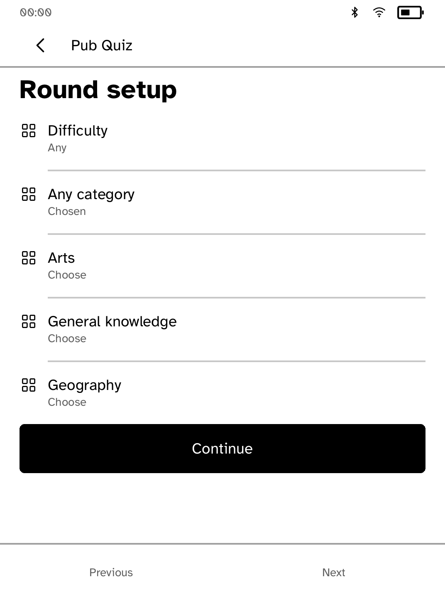
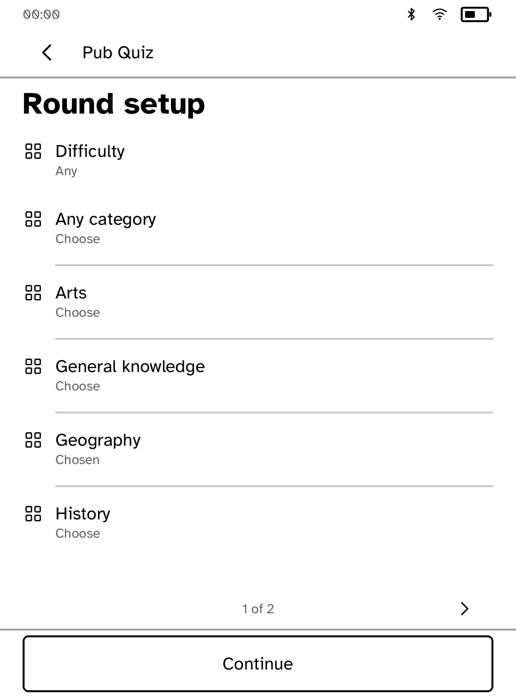
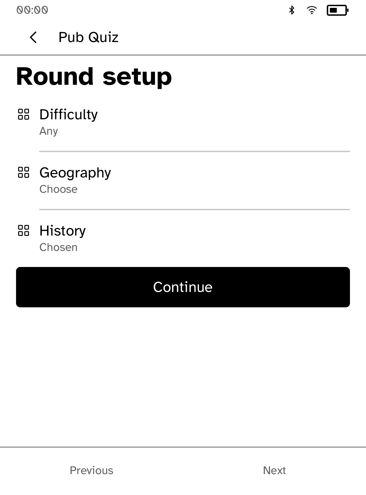
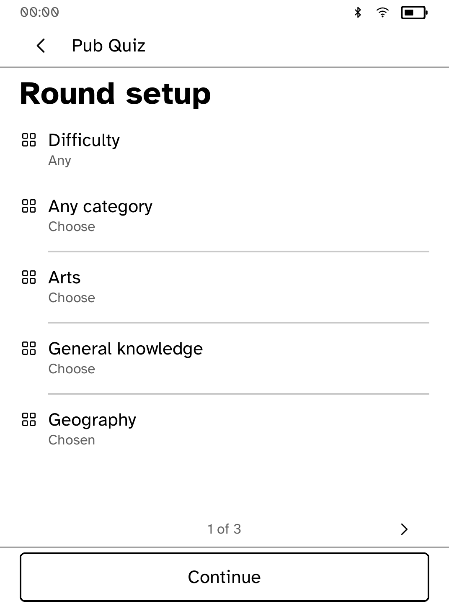

# Pub Quiz round-setup review

These are actual in-process Cobalt renderer snapshots, **not interactive
simulator captures or hardware photographs**. The app's original builders and
callbacks produced the before screens from Beta
`9715304831eae95566758fd0aa6b8e6fc87ee3ee`, before changing its implementation.
Only a test-only capture fixture was added for the before run.

The snapshots use `kobo_ui::render_all`, the font installed by `AppRunner`,
Clara BW 1072 × 1448 / 300 ppi metrics, `Chrome::for_screen`, and
`ensure_way_back`. The clock, battery, and radio strip are synthetic measurement
values. Raw grey8 pixels were saved to PGM and converted losslessly to PNG,
without compositing or retouching. The question categories are the app's bundled
question pack. The second comparison uses the Large interface text setting.

## Before and after tapping Geography

| Before | After |
| --- | --- |
|  |  |
|  |  |

The original handler ignored the last visible category on the first page. At
larger text sizes, it also multiplied the page by a different row count than
the renderer used, so a tap could select a different category.

Category actions now have stable absolute identities. Pagination measures the
actual category titles below the difficulty row, including the Any category
choice. Continue has a reserved bottom control, and standard page arrows show
the position in the list. Long category names are measured instead of clipped
at an arbitrary character count.

Back now moves from players to round setup, from setup to the home screen,
and cancels an open name editor without changing the player's name.

## Verification and limits

The app's tests hit-test every category on every measured page at all nine
interface sizes in both Clara BW poses, repeat selections, exercise page edges
and physical page turns, and verify the chosen category reaches the round.
They also cover long names, no matching questions, and Back/cancel retention.

The executor refused the interactive simulator's AF_UNIX socket with
`Operation not permitted`, including a reviewed elevated launch. Interactive
`kobo drive` and physical reader verification remain pending. No simulator or
runtime transport was changed.

## Reproduce after snapshots

```sh
COBALT_REVIEW_OUT="$PWD/target/ui-review" COBALT_REVIEW_PHASE=after \
  cargo test -p kobo-pubquiz capture_review_screens -- --ignored
python3 - <<'PY'
from pathlib import Path
from PIL import Image
for source in Path('target/ui-review/pubquiz/after').glob('*.pgm'):
    Image.open(source).save(source.with_suffix('.png'))
PY
```

The ignored fixture is `src/review_capture.rs`; the helper is `render.rs` in
this directory. Normal tests do not write screenshots.
