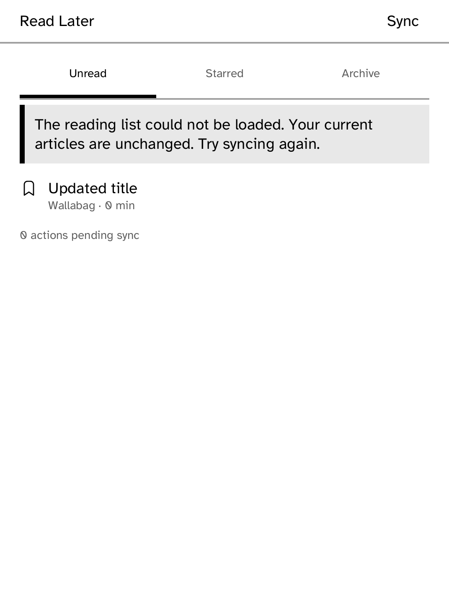

# Read Later

A Wallabag reading app for the Kobo. Save links from Wallabag's phone or
browser tools, then sync their extracted articles to the reader.

Fetched article bodies survive metadata refreshes during the current session.
Unreadable list responses leave current articles unchanged, and replies from a
previous server or credential cannot replace the current list. The queue's
**Sync** control retries a failed refresh.

Durable article storage, acknowledged archive/star replay, filtering and reading
pagination are still tracked under LATER-01 through LATER-06. The current app
must not be treated as a complete offline Wallabag client yet.

Configure an HTTPS server in Settings and install its daemon-owned credential:
`kobo secret set wallabag`. The app only names that credential; it never puts a
password, client secret, or token in a request body.

## Dependencies

| Dependency | License | Nature |
| --- | --- | --- |
| [Wallabag](https://wallabag.org/) | MIT | Remote read-later service; not vendored |
| `kobo-sdk`, `kobo-html`, `kobo-json` | Platform | Device UI, storage, rendering and parsing |

`drive.kobo` exercises the setup and offline surface. Wallabag OAuth
password-grant exchange requires kobod's `oauth2-password` credential kind;
this MVP expects that runtime credential and cannot provision it itself.

