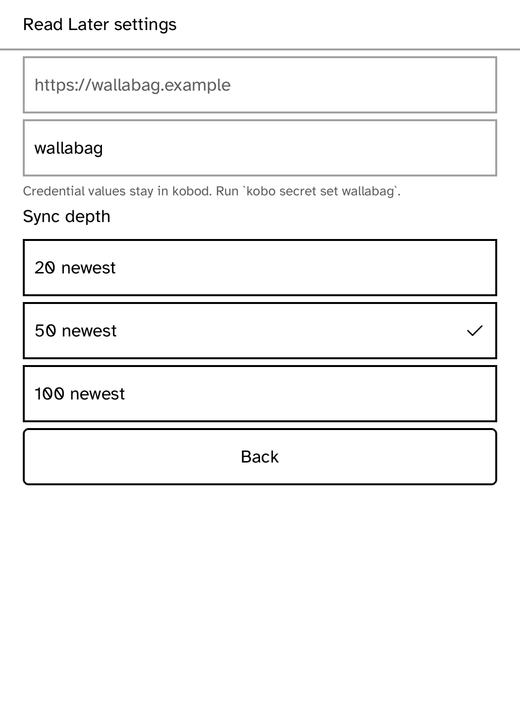

# Read Later

An offline Wallabag queue for the Kobo. Save links from Wallabag's phone or
browser tools, then sync their extracted articles to the reader. Archive and
star actions made off the air are retained and replayed when the next sync can
reach the server.

Configure an HTTPS server in Settings and install its daemon-owned credential:
`kobo secret set wallabag`. The app only names that credential; it never puts a
password, client secret, or token in a request body.

## Dependencies

| Dependency | License | Nature |
| --- | --- | --- |
| [Wallabag](https://wallabag.org/) | MIT | Remote read-later service; not vendored |
| `kobo-sdk`, `kobo-html`, `kobo-json` | Platform | Device UI, storage, rendering and parsing |

`drive.kobo` exercises the setup and offline surface. Wallabag OAuth
password-grant exchange requires kobod's `oauth2-password` credential kind;
this MVP expects that runtime credential and cannot provision it itself.
