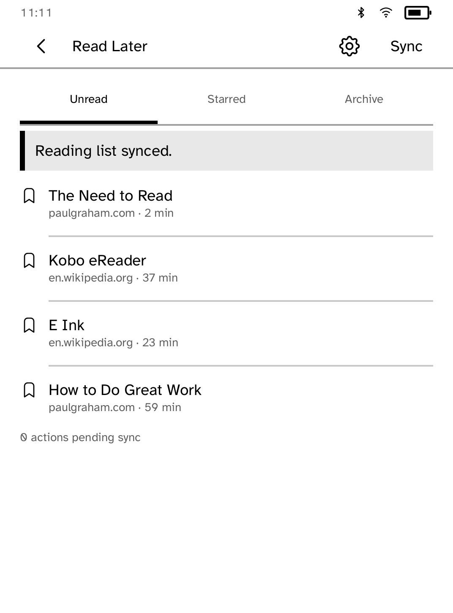
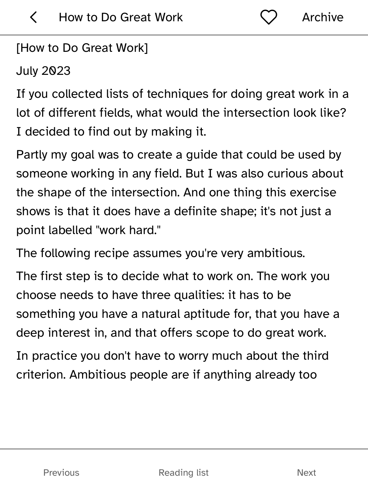
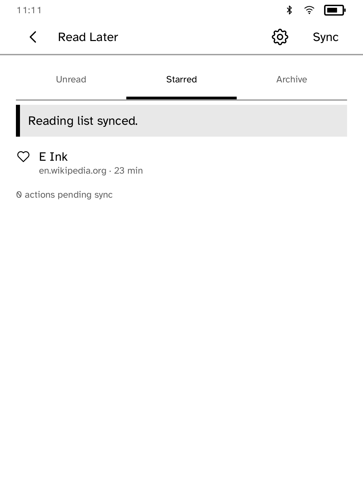

# Read Later

Read your [Wallabag](https://wallabag.org/) articles on your Kobo, online or
off.

<table>
<tr>
<td width="50%" valign="top"><br>The unread list after a sync</td>
<td width="50%" valign="top"><br>An article, with star and archive controls</td>
</tr>
<tr>
<td width="50%" valign="top"><br>The Starred tab</td>
<td width="50%" valign="top"><br>Setup</td>
</tr>
</table>

## Features

- Unread, Starred and Archive tabs.
- Articles are saved on the reader for offline reading, with Unicode and
  paragraph breaks intact. The collection is capped at 8 MiB.
- Star and archive articles offline. The changes sync to Wallabag next time.
- A failed refresh keeps the current list and offers **Sync** to retry. A
  failed save keeps the previous copy and offers **Retry saving**.

Save links with Wallabag's own browser or phone tools, then sync them here.

## Setup

1. On your Wallabag server, create an API client (on wallabag.it: **Settings →
   API clients**) and save its client secret to a private file.
2. Sign in from your computer. The password is read from
   `KOBO_WALLABAG_PASSWORD`, or from `--password-env VAR` or
   `--password-file PATH`, and never appears on the command line.

   ```sh
   kobo readlater login --server https://wallabag.example \
     --client-id ID --client-secret-file SECRET_FILE \
     --username you@example.com --device IP
   ```

This completes Wallabag's sign-in and sends the session to the reader, which
renews it on its own. The token can only be sent to your Wallabag server, and
no password or client secret is stored on the reader. Run it again only if you
revoke access.

Alternatively, install a bearer token with
`kobo secret set wallabag --from TOKEN_FILE --device IP` and enter your HTTPS
server address in Settings.

## Permissions

- `network`: syncs with your Wallabag server.

## Development

```sh
cargo test -p kobo-readlater
python3 scripts/check-apps-sim.py readlater
```

The simulator check builds the app, opens it in a fresh simulator and plays
`drive.kobo`.

## Credits

Read Later is unofficial and not affiliated with or endorsed by the Wallabag
project. Wallabag is MIT-licensed.
