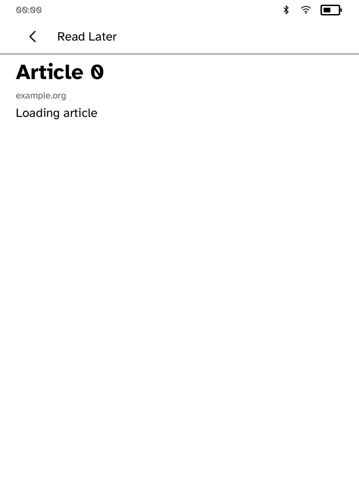
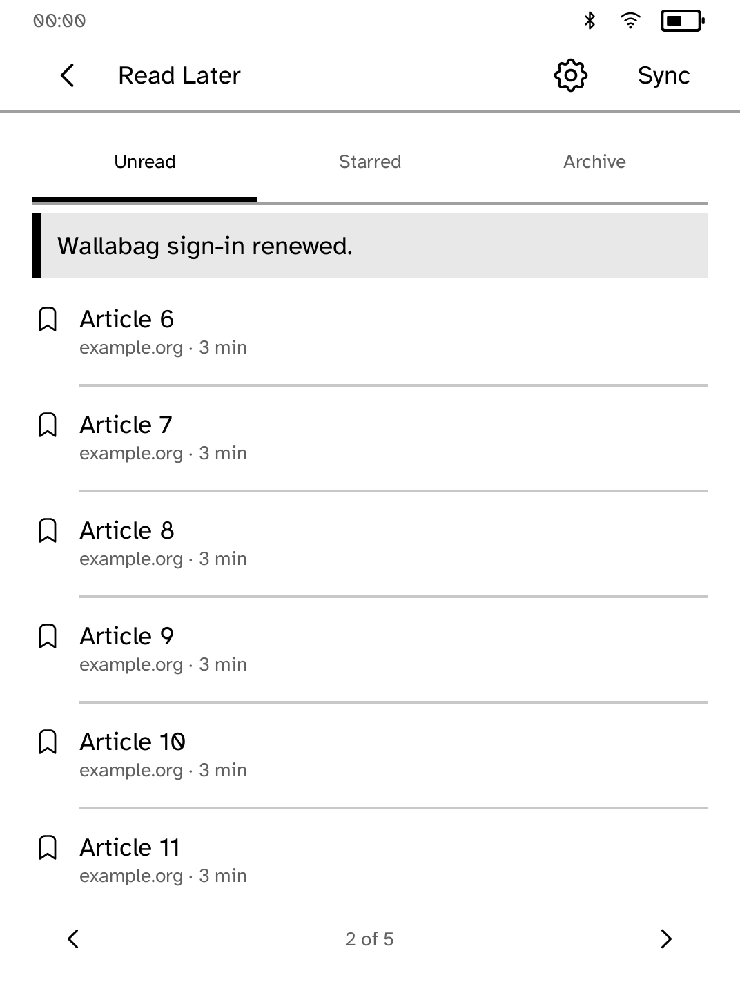
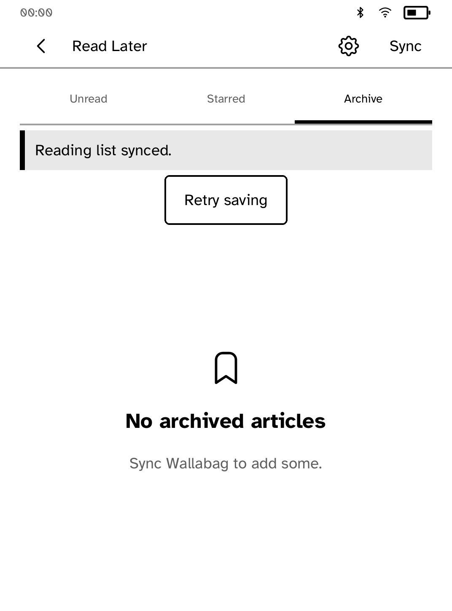
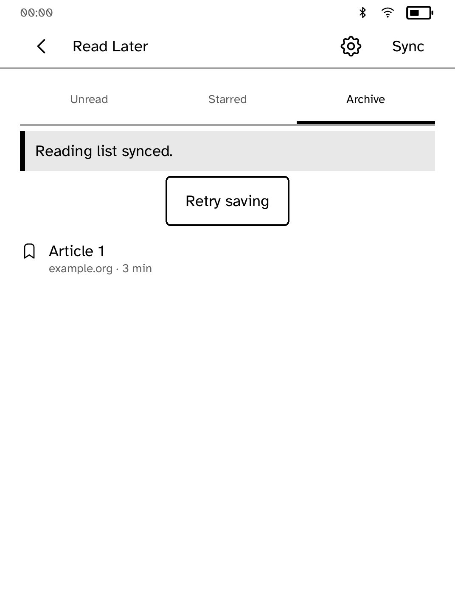

# Reading-list reachability review

These are **native renderer snapshots, not interactive simulator or device
screenshots**. The unchanged app's screen builders feed the real shared
`kobo_ui::render_with` renderer with installed Cobalt fonts, Clara BW metrics,
and `Chrome::for_screen` / `ensure_way_back`. The status strip is the SDK's
representative measuring strip, not live device data. The 50 articles are
original synthetic fixtures; no account or live service was used.

The original list rendered all 50 rows onto one panel, with no page turns.
The renderer reported `InteractiveOffscreen`, clipping and content overflow.
The updated list measures its rows below the actual tabs, notices and recovery
controls, and gives every row a page. A saved article or settings screen now
claims runtime Back, returning to the list instead of leaving the app.

<table>
<tr>
<td><br>Before: entries continue beyond the panel</td>
<td><br>After: page one of nine</td>
<td><br>Largest text size: page one of seventeen</td>
</tr>
</table>

## Reproduce the native snapshots

After building this checkout's locked dependencies:

```sh
python3 apps/readlater/screenshots/ui-review/capture.py --output target/readlater-native-review
```

The script creates a temporary audit crate, includes the app source unchanged,
uses the checkout's Cargo.lock, invokes native callbacks, and writes the pixels,
layout/diagnostic dumps and hashes. To render the baseline, pass `--checkout`
pointing at a detached checkout of
`9715304831eae95566758fd0aa6b8e6fc87ee3ee`. The committed before image was
captured from that revision before app edits. See `provenance.json` for hashes.

## Validation and limits

- App tests cover 100 articles at every supported text size, long titles,
  failed-save notices and recovery controls, hit-testing every visible row,
  pagination boundaries, filtering, and Back from editing/settings/articles
- Existing cache, offline outbox and article reflow tests still pass
- All captured updated screens have no layout diagnostics
- App tests, workspace formatting and strict app clippy pass
- Interactive simulator proof remains pending: this execution environment
  refuses the simulator's Unix-domain socket with `Operation not permitted`,
  including a reviewed escalated launch. No transport workaround was used
- Native callback tests do not prove simulator process transport, touch
  coordinate transformation, live Wallabag traffic or physical E Ink behavior


## Interrupted sync and sign-in follow-up

Two AppRunner regressions reproduced on the first draft commit
`cc0f5aa7ec36607ce7744c83675432dbaacf5891`:

1. Open an uncached article, receive Unauthorized, press Back, advance the
   reading list, then complete token refresh and credential installation.
   The late replay reopened the dismissed article. Replays now fetch by
   stable article identity without changing the view or list page; the
   sign-in banner also stops claiming renewal is still in progress.
2. Start an Unread sync, switch to Archive, then finish the Unread request.
   The completion used the current tab when pruning entries and erased the
   cached Archive. Each queue request and token retry now retains its own tab.

<table>
<tr>
<td><br>Before: dismissed loader reopens</td>
<td><br>After: reading-list page two stays open</td>
</tr>
<tr>
<td><br>Before: Archive becomes empty</td>
<td><br>After: Archive entry stays available</td>
</tr>
</table>

These matching pairs use the same callback sequence and 30 synthetic articles,
with the same native renderer and representative status strip described above.
The Archive capture intentionally has no initialized snapshot, so its existing
Retry saving control is shown; separate callback tests initialize and acknowledge
real snapshot writes and verify that other-tab entries survive on disk.
Default and largest text-size PNGs are included; every updated capture has no
layout diagnostics. `interrupted-provenance.json` records each source and image
hash. The before captures use the unmodified first-draft source; the after
source hash identifies the edited source before its final commit.

Reproduce with:

```sh
python3 apps/readlater/screenshots/ui-review/capture-interrupted.py --output target/readlater-interrupted-review
```

For the before capture, pass `--root` pointing to a checkout of the first-draft
commit above. The self-contained `interrupted-scenario.rs` is appended to a
temporary audit crate; the app source is not rewritten except for absolute
module paths. AppRunner deduplicates unchanged screens, so the harness renders
the app's current screen after each callback rather than requiring a redundant
SetScreen command.

The app now has 32 tests. Added coverage includes every requested/current tab
combination with and without token renewal, acknowledged snapshot contents,
Back before and after the token response, Settings and a newer cached article,
late article completion, reordered cache entries, and repeated open/Back cycles.
A newer uncached reading choice waits for the existing renewal and replaces only
the refused request; it cannot overwrite the renewal task or race token
installation. Repeated Sync during installation stays bounded, and terminal
renewal failures release that guard for an explicit retry.
The original two repros failed before this follow-up and pass afterward.
Interactive simulator and physical-device proof remain pending for the same
socket restriction described above.
