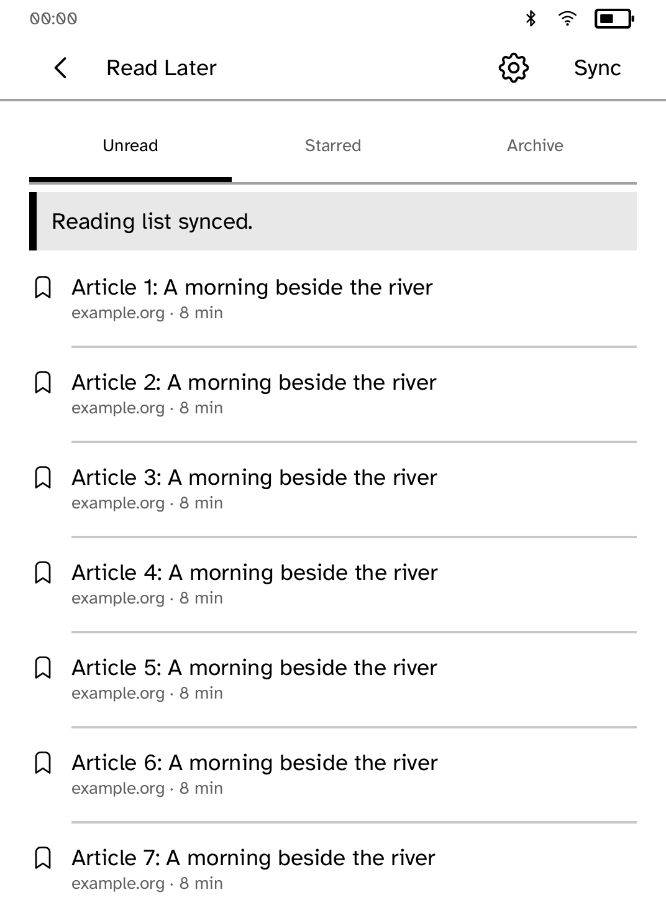
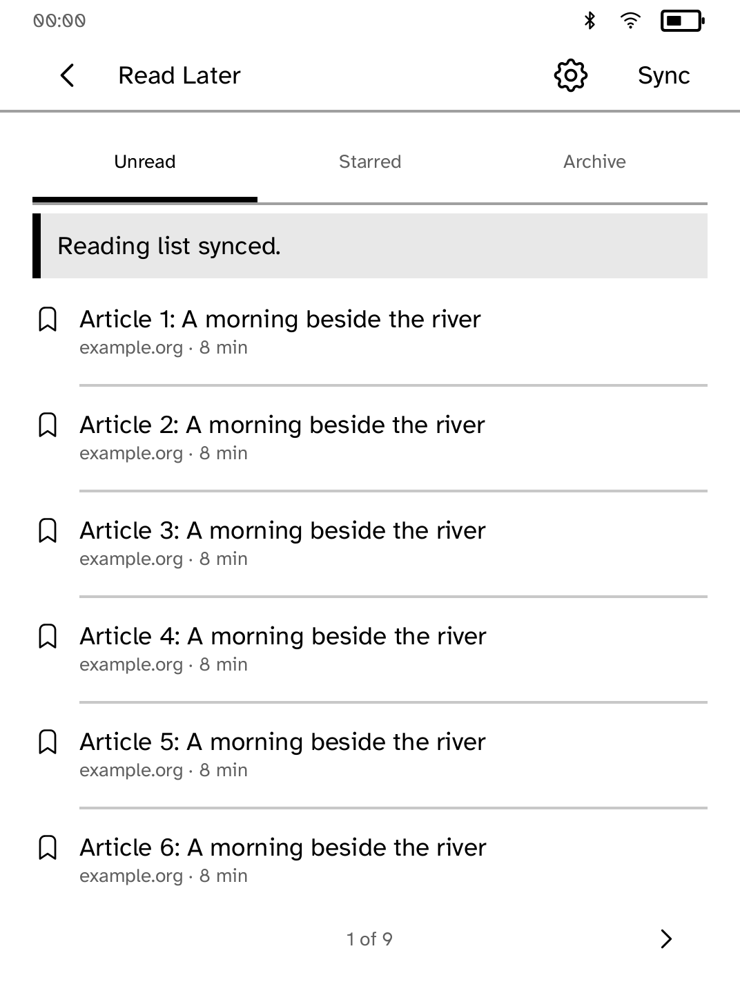
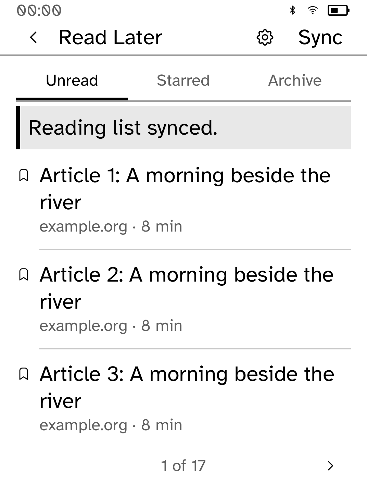

# Reading-list reachability review

These are **native renderer snapshots, not interactive simulator or device
screenshots**. The unchanged app's screen builders feed the real shared
`kobo_ui::render_with` renderer with installed Cobalt fonts, Clara BW metrics,
and `Chrome::for_screen` / `ensure_way_back`. The status strip is the SDK's
representative measuring strip, not live device data. The 50 articles are
original synthetic fixtures; no account or live service was used.

The original list rendered all 50 rows onto one panel, with no page turns.
The renderer reported `InteractiveOffscreen`, clipping and content overflow.
The updated list measures its rows below the actual tabs, notices and recovery
controls, and gives every row a page. A saved article or settings screen now
claims runtime Back, returning to the list instead of leaving the app.

<table>
<tr>
<td><br>Before: entries continue beyond the panel</td>
<td><br>After: page one of nine</td>
<td><br>Largest text size: page one of seventeen</td>
</tr>
</table>

## Reproduce the native snapshots

After building this checkout's locked dependencies:

```sh
python3 apps/readlater/screenshots/ui-review/capture.py --output target/readlater-native-review
```

The script creates a temporary audit crate, includes the app source unchanged,
uses the checkout's Cargo.lock, invokes native callbacks, and writes the pixels,
layout/diagnostic dumps and hashes. To render the baseline, pass `--checkout`
pointing at a detached checkout of
`9715304831eae95566758fd0aa6b8e6fc87ee3ee`. The committed before image was
captured from that revision before app edits. See `provenance.json` for hashes.

## Validation and limits

- App tests cover 100 articles at every supported text size, long titles,
  failed-save notices and recovery controls, hit-testing every visible row,
  pagination boundaries, filtering, and Back from editing/settings/articles
- Existing cache, offline outbox and article reflow tests still pass
- All captured updated screens have no layout diagnostics
- App tests, workspace formatting and strict app clippy pass
- Interactive simulator proof remains pending: this execution environment
  refuses the simulator's Unix-domain socket with `Operation not permitted`,
  including a reviewed escalated launch. No transport workaround was used
- Native callback tests do not prove simulator process transport, touch
  coordinate transformation, live Wallabag traffic or physical E Ink behavior
