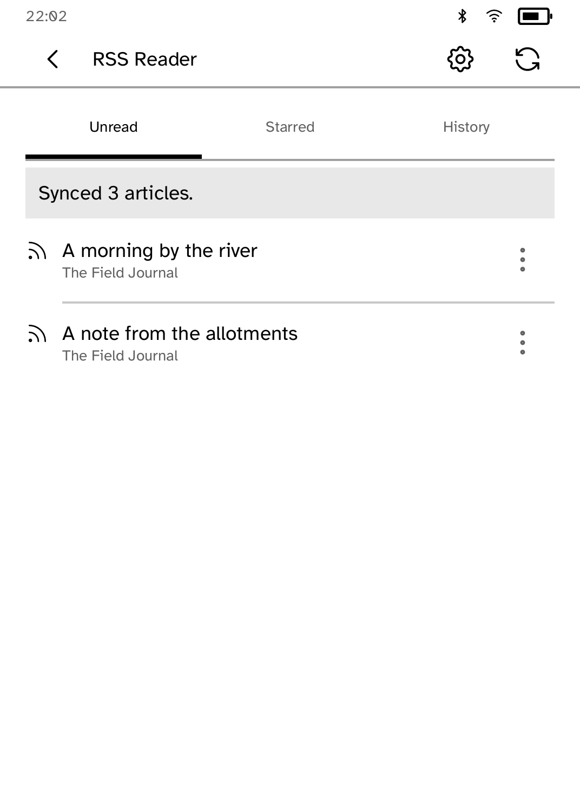
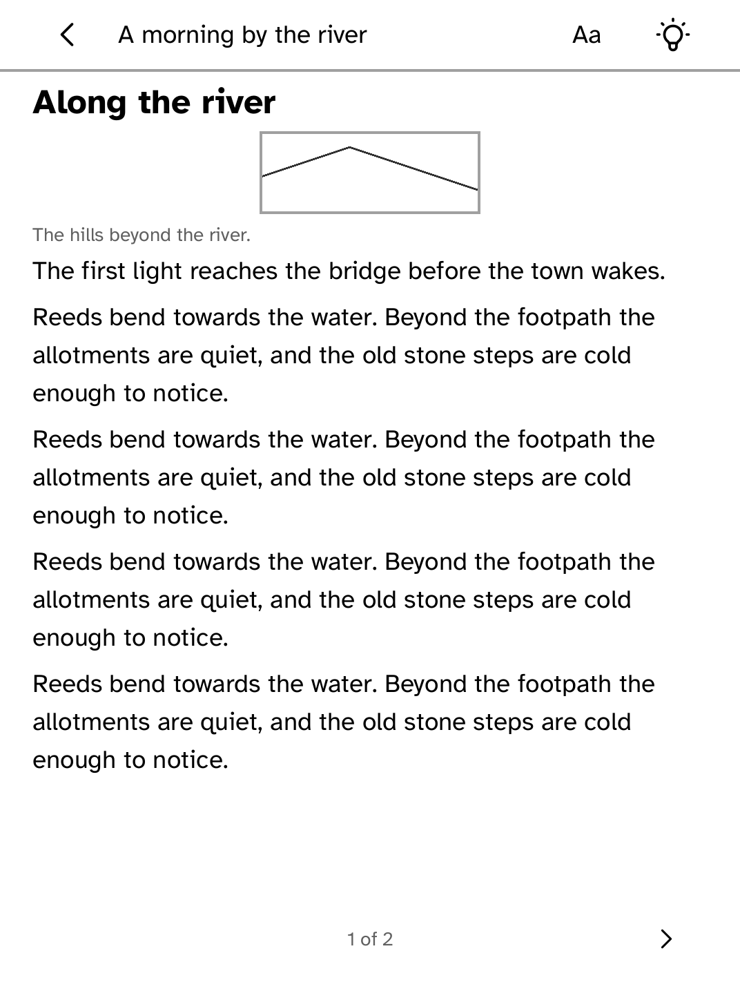

# RSS Reader — Miniflux

Read the articles in your [Miniflux](https://miniflux.app/) account on a Kobo,
including where there is no Wi-Fi. The API token stays in the runtime and is
attached as `X-Auth-Token`; this application only ever knows its name.

Install the token from your computer and enter the same HTTPS address in
Settings:

```sh
kobo secret set miniflux --device <address>
```

## Three tabs, one download

A sync collects the unread, starred and recently read lists and merges them into
one saved batch, so all three tabs work with the radio off. Miniflux takes one
status per query, which is why this is three requests rather than a clever one;
an article you starred and then read belongs in two tabs and is in both.



Long titles show up to two measured lines; the article keeps its whole title and
body. Every article in a saved batch is reachable at each supported text size.

## Reading

Articles open in the shared document reader, with headings, quotes, tables and
figures. A picture the feed named but did not carry is fetched once, saved, and
read from that saved copy afterwards, including after a restart with no network.
A missing or damaged copy leaves the caption in its place and is repaired the
next time the article is opened with a connection. Reading positions are kept
per article and survive restarts.



Where a feed carries only a summary, **Load full article** asks Miniflux to
fetch the page. What comes back replaces the summary in the saved batch, so it
is there offline afterwards. The account's own copy is left alone.

## Changes made away from Wi-Fi

Opening an article marks it read. The row menu stars, keeps unread, archives and
fetches full articles. Every change is written down before it is sent, survives
a restart, and is shown immediately whether or not it has reached the server.

Each change is sent as the state the article should end in rather than as a
toggle. The runtime sends an update exactly once and never replays it, because a
reply can go missing after the change has already been applied; a queue of
assignments can simply be sent again, which is what happens on the next sync.
Unsent changes go out before a sync downloads anything, so a sync never shows a
reader their own tap undone.

Changing the account is refused while changes or saves are outstanding.

## Suggested feeds

Settings ▸ Suggested feeds offers two public feeds. Choosing one reads the
categories on your account and files the feed under the first of them. Nothing
is requested until you choose.


## Limits

Responses are capped at 768 KiB, a saved batch at 100 articles (60 unread, 20
starred, 20 read) and one article body at 256 KiB. An invalid or oversized
response leaves the articles you already have untouched. The application does
not claim to have downloaded content a feed did not supply.

| Dependency | License | Nature |
| --- | --- | --- |
| [Miniflux v2](https://github.com/miniflux/v2) | Apache-2.0 | Remote service; not vendored |
| `kobo-sdk`, `kobo-bookview`, `kobo-doc`, `kobo-json` | Platform | Device UI, storage, reading and parsing |

Standalone Feedsearch and OPML mode remain in `examples/rss`; this application
is the account-backed Miniflux reader.
