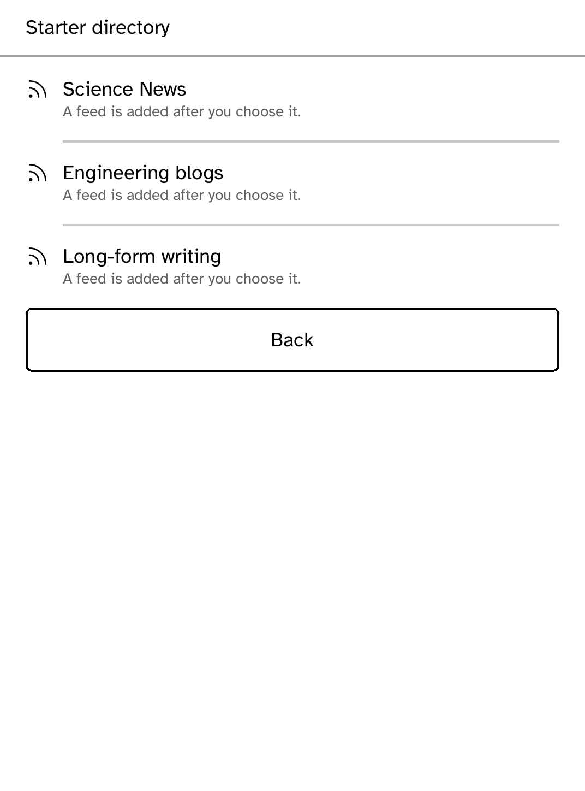

# RSS Reader — Miniflux

This Store app reads an HTTPS [Miniflux](https://miniflux.app/) account in one
unread-entry batch, retains cached articles for offline reading, and queues
read-state changes until sync returns. Configure its server in Settings and
run `kobo secret set miniflux`; the API token is runtime-attached as
`X-Auth-Token`, never held by the app.

The starter-directory screen is intentionally small in this MVP. It supplies a
place for the curated release data and device-side subscribe flow without
pretending that unreviewed directory entries are reliable.

| Dependency | License | Nature |
| --- | --- | --- |
| [Miniflux v2](https://github.com/miniflux/v2) | Apache-2.0 | Remote service; not vendored |
| `kobo-sdk`, `kobo-html`, `kobo-json` | Platform | Device UI, storage, rendering and parsing |

Standalone Feedsearch and OPML mode remain in `examples/rss`; this app is the
account-backed Miniflux MVP.
