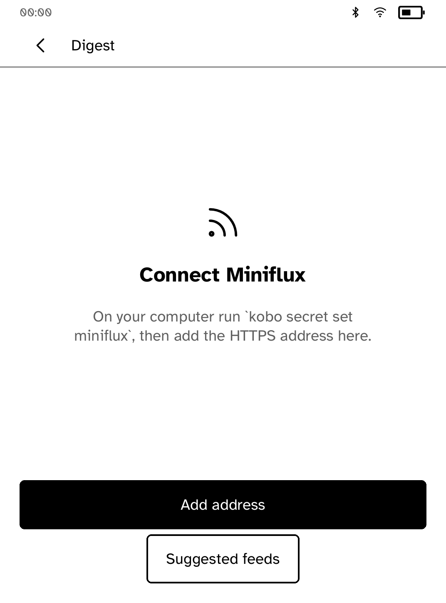
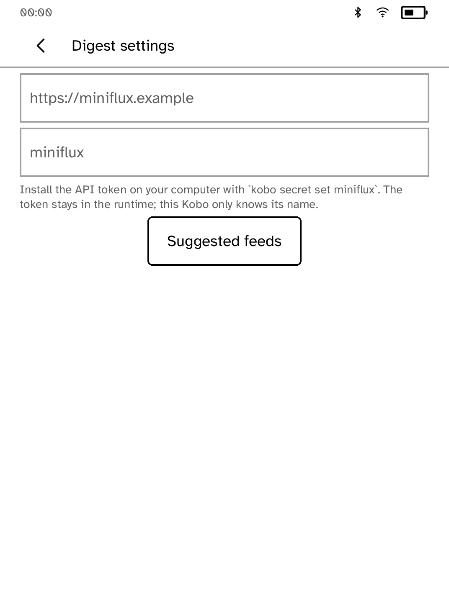
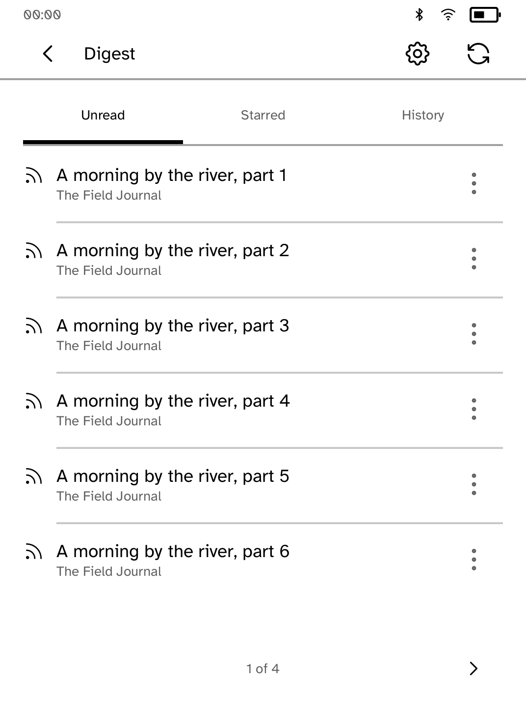
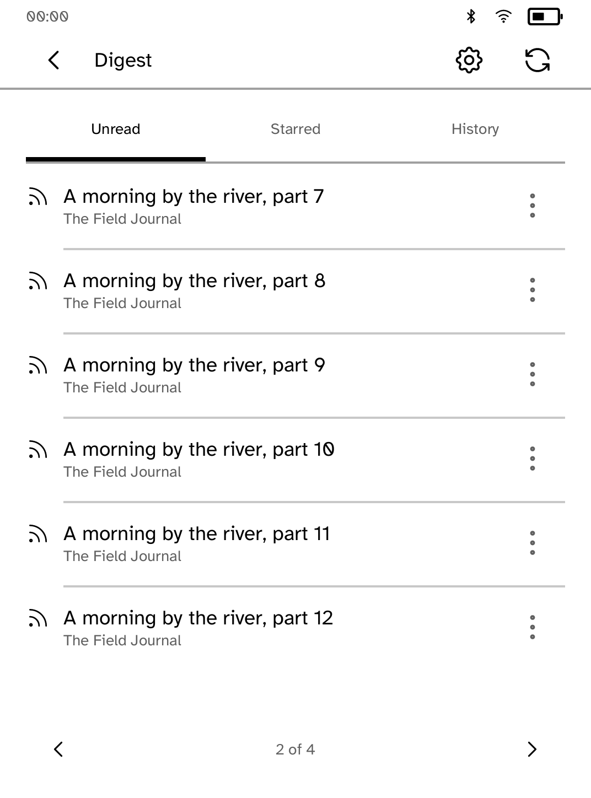

# Settings navigation review

These are **native renderer snapshots, not interactive simulator or device
screenshots**. The original app screen builders and callbacks run in a temporary
audit crate, with the real shared renderer, Cobalt fonts and Clara BW metrics.
The status strip uses representative SDK measuring values. Fixtures contain
20 original articles and no live account, secret token or network traffic.

Opening Suggested feeds from Settings and pressing Back used to jump to the
article shelf or first-run setup. Returning from Settings also reset the shelf
to page one. The fix remembers the directory's entry point and preserves the
article page. Settings and Suggested feeds now use only runtime Back; the
redundant in-page Back buttons triggered `AmbiguousBack` diagnostics before.

<table>
<tr><td><br>Before: Settings → Suggested feeds → Back</td><td><br>After: returns to Settings</td></tr>
<tr><td><br>Before: list position is lost</td><td><br>After: page two is preserved</td></tr>
</table>

## Reproduce

Build the checkout normally first, then run:

```sh
python3 apps/rss-miniflux/screenshots/ui-review/capture.py \
  --root . --app rss-miniflux \
  --scenario apps/rss-miniflux/screenshots/ui-review/scenario.rs \
  --output target/digest-native-review
```

The harness copies the app source without changing UI logic; it only makes
module and fixture paths absolute for a temporary crate. It uses the checkout's
Cargo.lock. `--root` may instead point to a detached baseline checkout at
`9715304831eae95566758fd0aa6b8e6fc87ee3ee`. Original source and image hashes are
recorded in `provenance.json`.

## Coverage and remaining limits

- Default and largest-size captures cover setup, settings, Suggested feeds,
  Back, list pagination and return to the list
- Unit tests repeat both directory entry paths, preserve page position, and
  verify exactly one Back target at every supported text size
- All updated captured screens have zero layout diagnostics
- Native callback tests do not exercise simulator transport, transformed touch
  coordinates, live Miniflux requests or E Ink hardware
- Interactive simulator proof remains pending: the environment refuses its
  Unix-domain socket with EPERM even after a reviewed escalated launch
