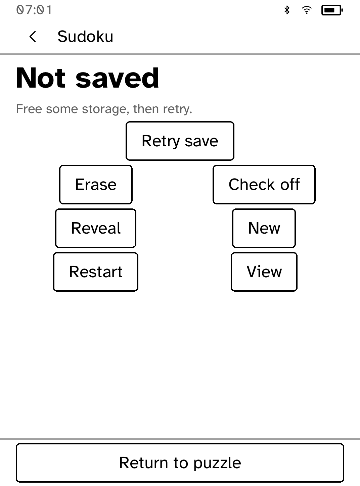

# Sudoku

36 original Sudoku puzzles with pencil notes, undo and saved games, playable
offline.

<table>
<tr>
<td width="50%" valign="top"><br>A Hard puzzle with pencil notes</td>
<td width="50%" valign="top"><br>A completed puzzle</td>
</tr>
<tr>
<td width="50%" valign="top"><br>The same puzzle in landscape</td>
<td width="50%" valign="top"><br>Retrying a save that failed</td>
</tr>
</table>

## Features

- Twelve puzzles each at Easy, Medium and Hard. Every puzzle has exactly one
  solution.
- Tap a square, then a number. The selected row and column are shaded, and
  the 3×3 boxes are spaced apart.
- **Notes** switches to pencil notes. **Digits** switches back. To replace an
  answer with notes, use **More → Erase** first.
- **Undo** reverses one edit, including an erase, reveal or restart, and keeps
  the last 64 edits after reopening.
- Checking is off by default. **More → Check off** turns it on, so a wrong
  answer shows "Check this answer" without changing it.
- **More → Reveal** fills the selected square after asking, and can be
  undone.
- **More → New** starts the next puzzle at Easy, Medium or Hard, replacing the
  current game. After the twelfth puzzle, a difficulty starts again from the
  first.
- **More → View → Use landscape** shows the grid in two overlapping halves.
- Answers, notes, selection, orientation and settings are saved.

## Difficulty

- **Easy**: each step has a square with only one possible number.
- **Medium**: also needs a number with only one possible place in a row,
  column or box.
- **Hard**: needs more than those two techniques.

This is a guide to technique, not solving time.

## Saving

Changes save automatically. **Saving…** means the save has not finished yet.
If a save fails, your game stays in memory and **More → Retry save** tries
again. Closing the app before a successful retry can lose those edits. A save
that cannot be read is kept, and the app offers to retry rather than starting
a blank game.

## The puzzles

[assets/puzzles.txt](assets/puzzles.txt) was generated for this app by
`scripts/quality/make-sudoku-pack.py` from a fixed seed. The generator grades
each puzzle and checks it has one solution, and a separate Rust test checks
all 36 again.

## Permissions

None. Sudoku runs offline.

## Development

```sh
cargo test -p kobo-sudoku
python3 scripts/check-apps-sim.py sudoku
```

The simulator check builds the app, opens it in a fresh simulator and plays
`drive.kobo`. `scripts/quality/check-sudoku-sim.py --output /tmp/sudoku-check --scale extra-large` runs a longer check covering notes, undo, save failures, restarts and landscape. See [screenshots/README.md](screenshots/README.md) for how the screenshots were made.
