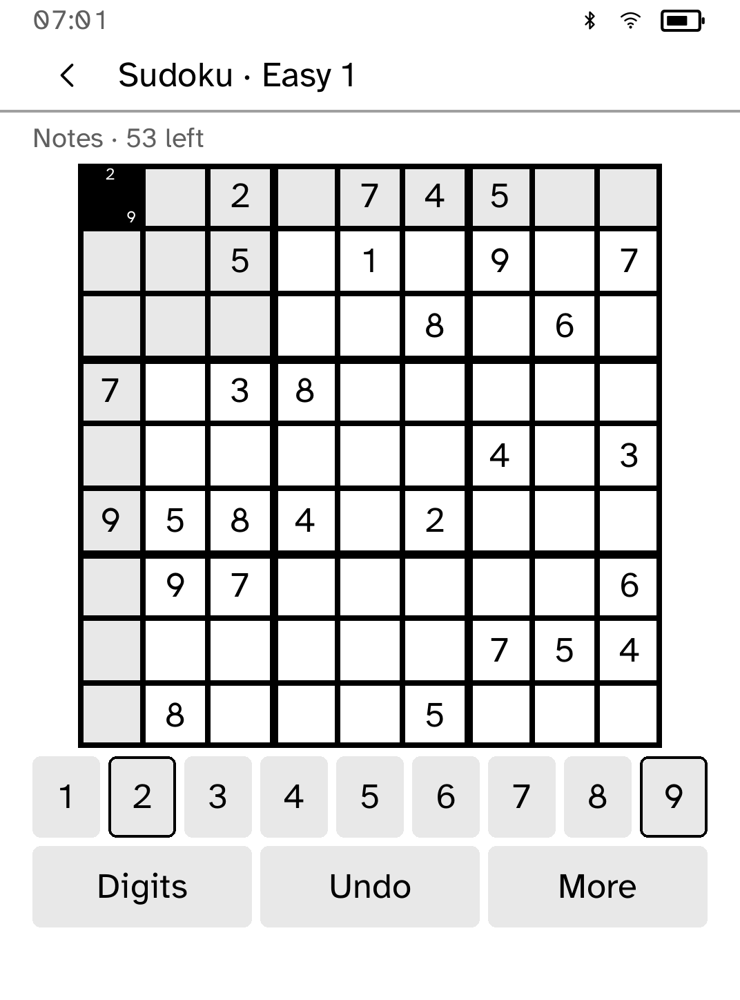
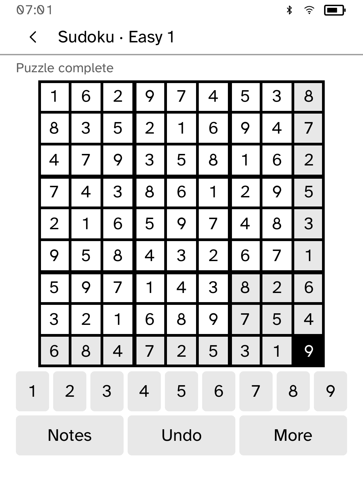
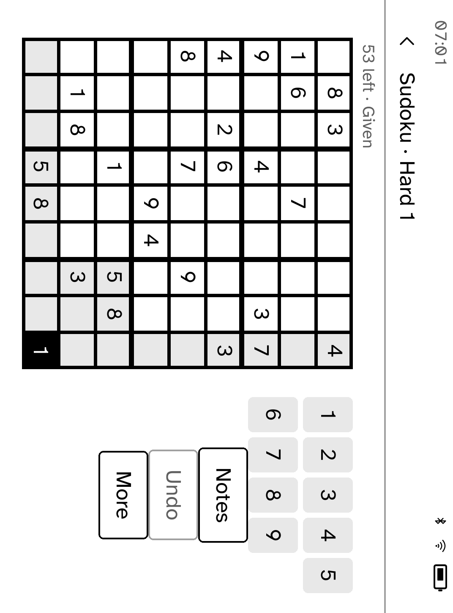
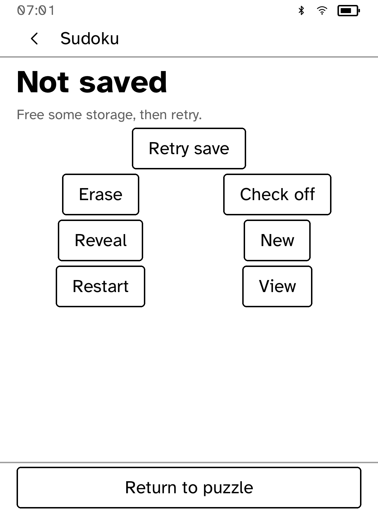

# Sudoku

36 original Sudoku puzzles and local SDM imports with pencil notes, undo and
saved games, playable offline.

<table>
<tr>
<td width="50%" valign="top"><br>A Hard puzzle with pencil notes</td>
<td width="50%" valign="top"><br>A completed puzzle</td>
</tr>
<tr>
<td width="50%" valign="top"><br>The same puzzle in landscape</td>
<td width="50%" valign="top"><br>Retrying a save that failed</td>
</tr>
</table>

## Features

- Twelve puzzles each at Easy, Medium and Hard. Every puzzle has exactly one
  solution.
- Tap a square, then a number. The selected row and column are shaded, and
  the 3×3 boxes are spaced apart.
- **Notes** switches to pencil notes. **Digits** switches back. To replace an
  answer with notes, use **More → Erase** first.
- **Undo** reverses one edit, including an erase, reveal or restart, and keeps
  the last 64 edits after reopening.
- Checking is off by default. **More → Check off** turns it on, so a wrong
  answer shows "Check this answer" without changing it.
- **More → Reveal** fills the selected square after asking, and can be
  undone.
- **More → New** starts the next puzzle at Easy, Medium or Hard, replacing the
  current game. After the twelfth puzzle, a difficulty starts again from the
  first.
- **More → View → Use landscape** shows the grid in two overlapping halves.
- Answers, notes, selection, orientation and settings are saved.

## Import downloaded puzzles locally

1. Download an **SDM (`.sdm`)** puzzle file on your computer. The
   [Open Sudoku project](https://opensudoku.moire.org/#about-puzzles) offers
   [QQWing SDM downloads](https://opensudoku.moire.org/sdm/qqwing_simple.sdm)
   and documents their generation: one 81-digit puzzle per line, with `0`
   for blank squares.
2. Connect the Kobo by USB. In the reader's drive, create
   `.adds/cobalt/data/sudoku` if necessary (show hidden files to see `.adds`).
   Copy your file there under the name **`puzzles.sdm`**. Do not change files
   under `.adds/cobalt/state`. Eject the reader after the copy finishes.
3. Open **More → New → Import SDM → Read file**. Choose a puzzle with
   **Previous / Next**, then **Start puzzle**. Starting replaces the current
   game and its undo history; **Keep playing** leaves them intact.

Import reads only that local file through Cobalt's app shelf. It never fetches
URLs, modifies the source file, or requests Internet permission. To use another
file, replace `puzzles.sdm` by USB and choose **Reload file**. Only the selected
game is saved; this is not a persistent multi-pack library or an export feature.

The supported subset is plain ASCII digits, exactly 81 per line, with LF or
CRLF line endings and an optional final newline. Limits are **96 KiB and 1000
puzzles**. Blank lines, spaces, dots, BOMs, XML `.opensudoku` exports and other
formats are refused. The complete file must parse before selection is offered.
No XML parser or new dependency is needed.

**Start puzzle** checks the selected puzzle for conflicting clues and exactly
one solution. It refuses unsolvable or ambiguous puzzles and stops after
100,000 solver visits (depth at most 81). A valid but exceptionally difficult
puzzle may exceed this work limit; it is refused rather than accepted with an
unproven solution. Other entries are checked only when selected. Imported games
are labeled **Imported**, without guessing their difficulty.

The active import's clues, answers, notes, settings and last 64 undo steps are
stored together. Reopening does not need `puzzles.sdm`; clues are revalidated
and the solution is reconstructed with the same work limit. Save schema 2
continues to read bundled-game schema 1 records, including history. Older app
versions cannot read schema 2 saves. Read failures preserve the stored record,
and write failures retain edits in memory with the usual **Retry save** action.

## Difficulty

- **Easy**: each step has a square with only one possible number.
- **Medium**: also needs a number with only one possible place in a row,
  column or box.
- **Hard**: needs more than those two techniques.

This is a guide to technique, not solving time.

## Saving

Changes save automatically. **Saving…** means the save has not finished yet.
If a save fails, your game stays in memory and **More → Retry save** tries
again. Closing the app before a successful retry can lose those edits. A save
that cannot be read is kept, and the app offers to retry rather than starting
a blank game.

## The puzzles

[assets/puzzles.txt](assets/puzzles.txt) was generated for this app by
`scripts/quality/make-sudoku-pack.py` from a fixed seed. The generator grades
each puzzle and checks it has one solution, and a separate Rust test checks
all 36 again.

## Permissions

None. Sudoku runs offline.

## Development

```sh
cargo test -p kobo-sudoku
python3 scripts/check-apps-sim.py sudoku
```

The simulator check builds the app, opens it in a fresh simulator and plays
`drive.kobo`. `scripts/quality/check-sudoku-sim.py --output /tmp/sudoku-check --scale extra-large` runs a longer check covering notes, undo, save failures, restarts and landscape. See [screenshots/README.md](screenshots/README.md) for how the screenshots were made.
