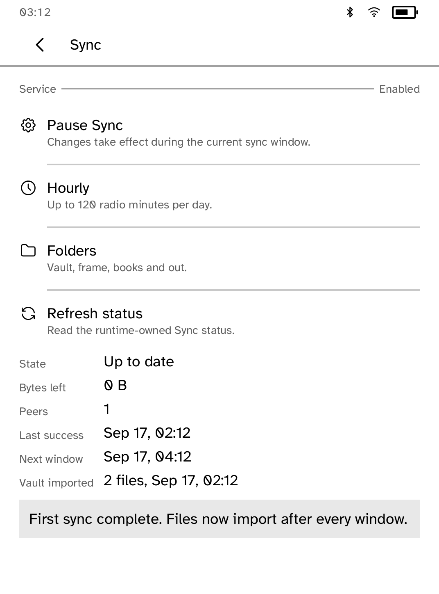
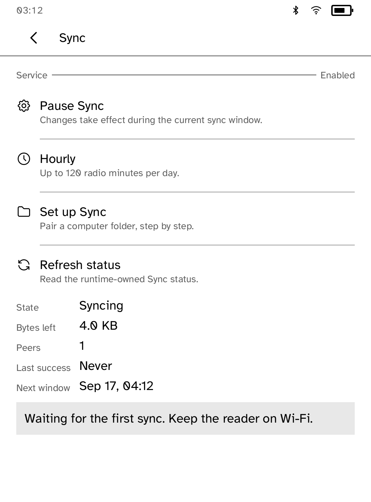
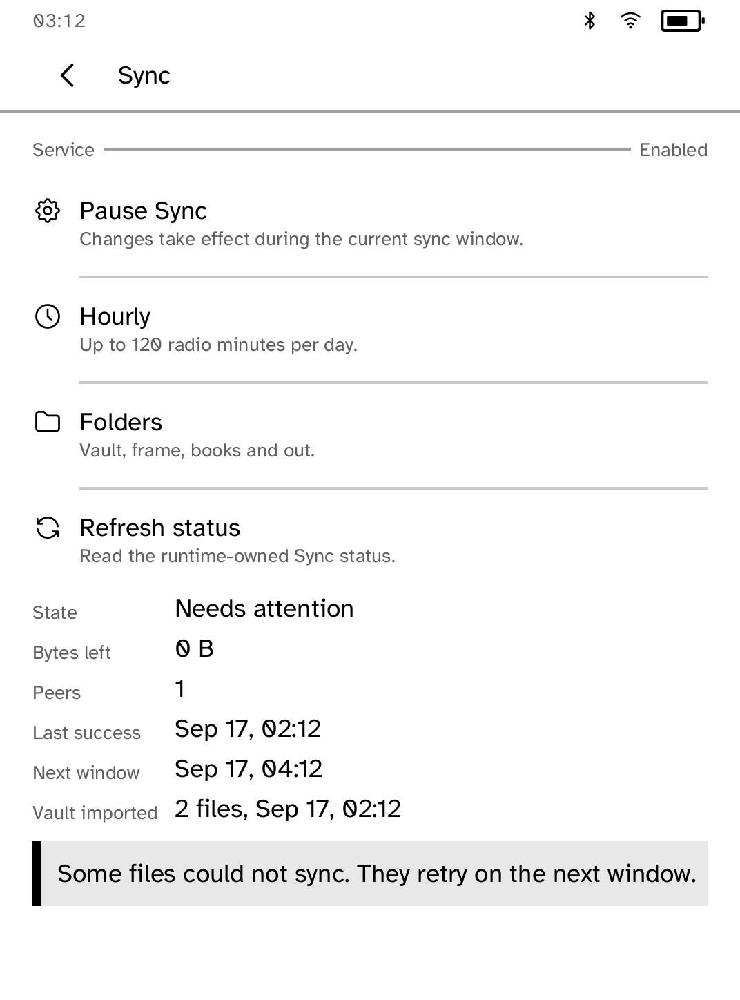

# Sync

Sync folders between your computer and your Kobo with Syncthing, on a
battery-friendly schedule.

<table>
<tr>
<td width="50%" valign="top"><br>The four sync folders</td>
<td width="50%" valign="top"><br>The first sync, with what it imported</td>
</tr>
<tr>
<td width="50%" valign="top"><br>A sync in progress</td>
<td width="50%" valign="top"><br>A conflict, retried on the next sync</td>
</tr>
</table>

## Features

- Four fixed folders. `vault`, `frame` and `books` come to the Kobo, and `out`
  goes to the computer.
- Sync manually, hourly, every four hours or daily. Pause stops scheduled
  syncs.
- The status screen shows transfer state, bytes left, peers online, the last
  successful sync and the next one.
- Files in `vault` open in [Vault](../vault/) and files in `frame` appear as a
  [Frame](../frame/) album. Deletions are not carried over, and each sync
  lists what it imported.
- Conflicts are shown separately and retried on the next sync.

## Setup

1. Install Syncthing on your computer with its package manager.
2. Wake the Kobo on Wi-Fi.
3. Link one directory to one Kobo folder:

   ```sh
   kobo sync setup ~/Documents/notes --folder vault --device 192.168.1.2
   kobo sync run
   kobo sync status
   kobo sync stop
   ```

`kobo sync` runs its own Syncthing identity under `~/.config/kobo/syncthing`
and never changes another Syncthing installation. The directory for `out`
must be empty the first time. Setup refuses symlinked or overlapping folders.

## How it runs on the reader

The Syncthing engine is not in the platform package. The reader downloads it
the first time Sync is turned on and checks it against a digest built into
Cobalt before running it. Its API listens on the reader only, and apps cannot
add folders or supply keys.

`build-armv7.sh` rebuilds the engine from the pinned Syncthing v2.0.9 source
and checks the result against the same digest. It downloads nothing. The same
rebuild runs in `.github/workflows/syncthing-engine.yml`.

## Permissions

- `scheduled-wake`: wakes the reader for scheduled syncs.

## Development

```sh
cargo test -p kobo-syncthing
python3 scripts/check-apps-sim.py syncthing
```

The simulator check builds the app, opens it in a fresh simulator and plays
`drive.kobo`.

## Credits

[Syncthing](https://github.com/syncthing/syncthing) is licensed under MPL-2.0.
Sync is unofficial and not affiliated with or endorsed by the Syncthing
Foundation. See [THIRD-PARTY.md](THIRD-PARTY.md).
