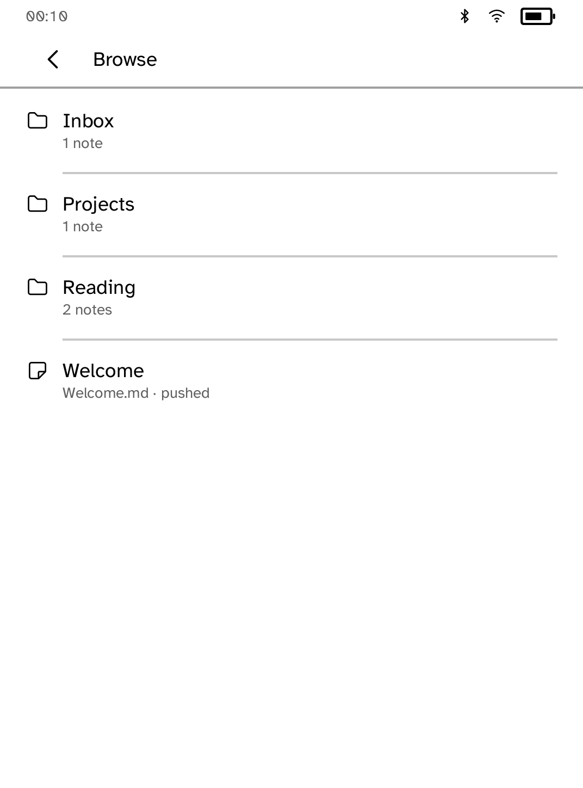
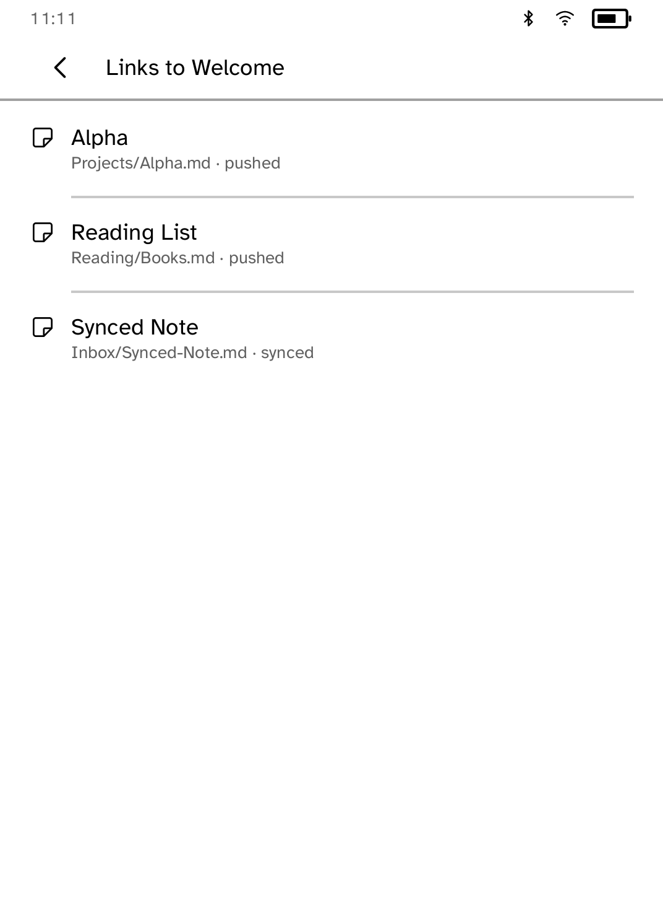

# Vault

A read-only, offline reader for your Obsidian notes.

<table>
<tr>
<td width="50%" valign="top"><br>Home: Browse, Tags, Recent and Search</td>
<td width="50%" valign="top"><br>Folders with note counts</td>
</tr>
<tr>
<td width="50%" valign="top"><br>A long note, paged</td>
<td width="50%" valign="top"><br>Tags with note counts</td>
</tr>
<tr>
<td width="50%" valign="top"><br>A search result opened at the matching line</td>
<td width="50%" valign="top"><br>Notes linking to the open note</td>
</tr>
</table>

## Features

- Browse folders, filter by tag, see recent notes and search every note's
  text.
- Wiki links (`[[Note]]` and `[[Note|label]]`) show as text and build a
  backlinks view for each note.
- Long notes are paged, and each note reopens where you left off.

## Setup

Send a folder of notes from your computer:

```sh
kobo vault init --device 192.168.1.42
kobo vault push ~/Notes --device 192.168.1.42
```

Use `--sim` instead of `--device` to send notes to the simulator.

Folders placed in the reader's sync folder, for example by [Sync](../syncthing/),
are added with `kobo vault ingest DIR`. They appear alongside pushed notes,
labelled with their source.

Pushing is one way. The next push or ingest replaces that set of notes.

## Permissions

None. Vault runs offline.

## Development

```sh
cargo test -p kobo-vault
python3 scripts/check-apps-sim.py vault
```

The simulator check builds the app, opens it in a fresh simulator and plays
`drive.kobo`.

## Credits

Markdown is parsed with `pulldown-cmark` (MIT). Vault is unofficial and not
affiliated with Obsidian or Dynalist Inc.
