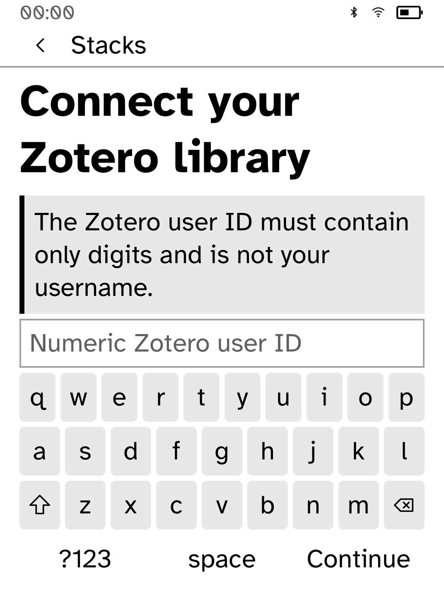
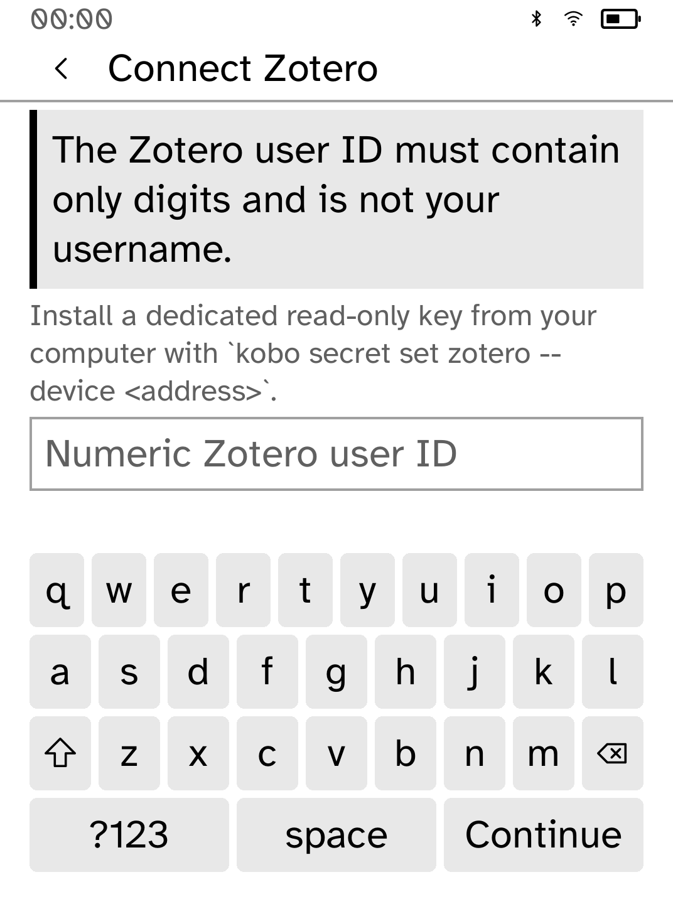
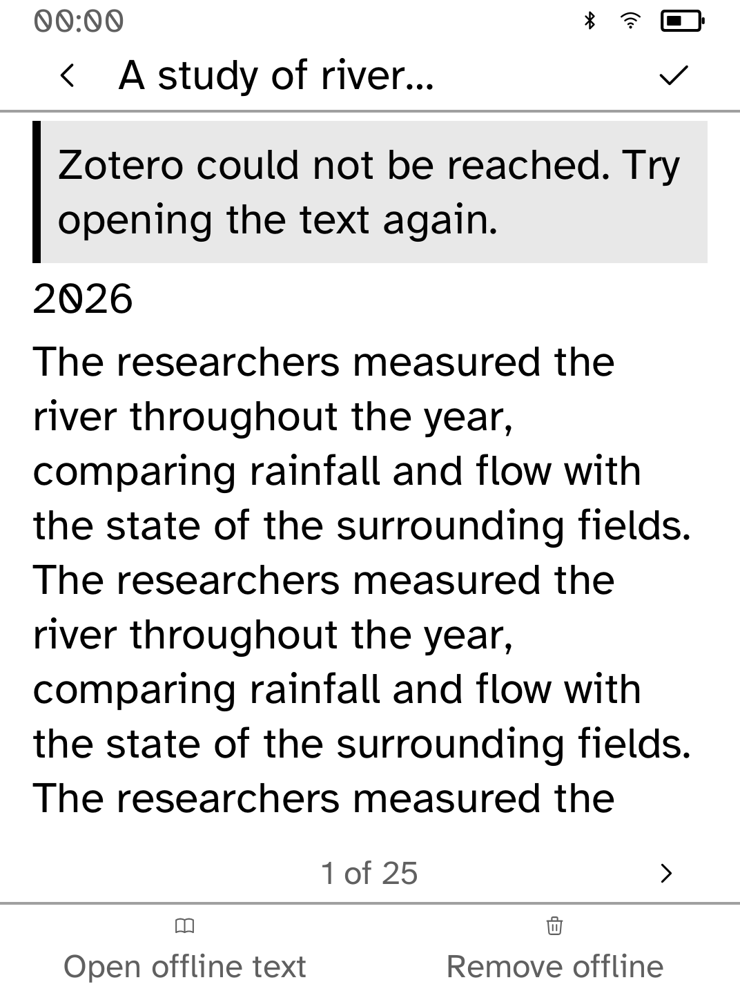

# Setup and recovery layout review

These are **native renderer snapshots, not interactive simulator or device
screenshots**. Original app builders/callbacks run with the real shared
renderer, Cobalt fonts and Clara BW metrics. The clock and device status are
representative SDK measuring values. The collections and papers are synthetic;
no Zotero account, real secret or live network was used.

Before the changes, setup instructions were clipped at the largest text size.
Adding a notice to a collection, paper or offline list pushed rows into the
page controls. Long paper details also lost prose after a failed text request.
The fixed layouts measure the actual notice and action area. Paper details use
the same interface face they are drawn in, and retain every word across pages.

<table>
<tr><td><br>Before: invalid user ID at largest type</td><td><br>After: clear cause and complete setup command</td></tr>
<tr><td><br>Before: paper row overlaps the pager</td><td><br>After: complete rows with space reserved</td></tr>
<tr><td><br>Before: detail prose is clipped</td><td><br>After: more pages preserve all words</td></tr>
</table>

## Reproduce

Build the checkout's normal locked dependencies first, then run:

```sh
python3 apps/zotero-reader/screenshots/ui-review/capture.py \
  --root . --app zotero-reader \
  --scenario apps/zotero-reader/screenshots/ui-review/scenario.rs \
  --output target/stacks-native-review
```

The temporary audit crate copies original app logic, changes only module and
fixture paths to absolute paths, and appends the synthetic scenario. It uses
the checkout's Cargo.lock. Baseline captures came from detached revision
`9715304831eae95566758fd0aa6b8e6fc87ee3ee`; pass that checkout as `--root` to
reproduce them. Source and image hashes are in `provenance.json`.

## Coverage and remaining limits

- Setup, invalid ID, collections, lists, last-opened and error notices, offline
  recovery, search/no results, and long paper details at default/largest type
- Unit tests check setup and every list page at all supported text sizes,
  hit-test every visible row, retain all detail words, and clamp repeated page
  turns so one Previous tap immediately leaves the final page
- All updated captured screens have zero layout diagnostics
- App tests, workspace formatting and strict app clippy pass
- Interactive simulator proof is pending: this environment refuses the required
  Unix-domain socket with EPERM even after a reviewed escalated launch
- Native callbacks do not prove process transport, transformed touch coordinates,
  live Zotero access, or physical E Ink behavior
