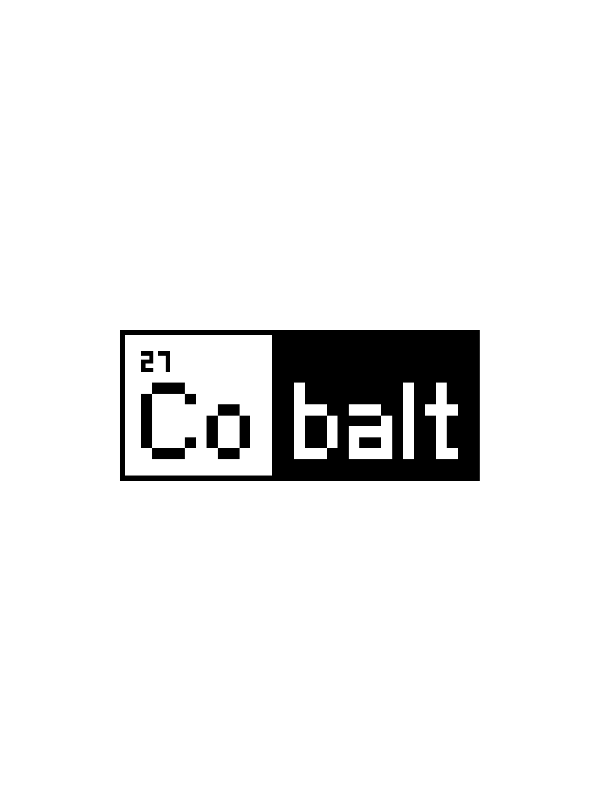

# Full-screen launch feedback

The 9 September 2026 device report described a 7–8 second blank interval after
selecting Cobalt in NickelMenu. The older logo splash existed on
`feature/crisp-beta-ux` (`fddb5bb`) but was absent from current beta (`c22c946`).

The launch path now paints a full white screen with the centered Cobalt mark
immediately after Nickel stops and releases the screen. It precedes font loading,
Wi-Fi restoration and app startup. There is no toast, header, loading message,
progress animation or artificial minimum display time. Monochrome readers use
solid ink; colour readers retain the existing brand colour. The logo geometry
comes from Cobalt's own earlier implementation and SVG, not a reference project.

This preview is rendered by the actual device splash function at 1072×1448;
it is not a hardware capture. The tests check four panel geometries and colour
versus monochrome rendering. The preview export test and launch-chain regression
pass, along with strict runtime Clippy. Device compilation is checked separately.

The existing takeover safeguards remain in place. Cobalt must validate the
hardware, capture the old display and prepare recovery before stopping Nickel;
it cannot safely draw over a still-running stock reader. The splash does not
hide time before that takeover. Trace lines now record elapsed time to takeover,
splash paint and completion of network recovery. A Clara BW timing capture is
still required before claiming that the whole reported blank interval is fixed.

The menu definition is unchanged. Updating the runtime delivers this splash;
there is no new NickelMenu action, copied plugin code or menu toast to install.
