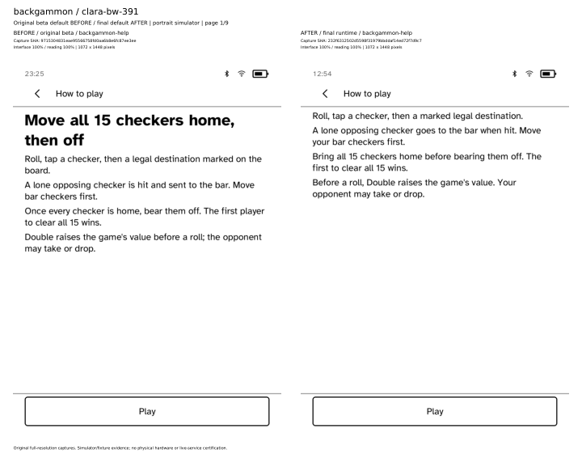

# backgammon: refreshed nine-profile evidence

[Original beta BEFORE / final default AFTER](all-nine-profiles-before-after.pdf) · [Final 170% captures](all-nine-profiles-final-170.pdf) · [Validation and provenance](validation.json) · [Durable full captures and results](capture-evidence.zip)

Primary comparison: original beta `9715304831eae95566758fd0aa6b8e6fc87ee3ee` at 100% interface versus final combined runtime `232f6312502d5598f31979bbddaf14ed72f7d9c7` at 100% interface. Scene: `backgammon-help`. The separate 170% PDF contains actual final-runtime captures with interface and reading scales printed independently. Both PDFs preserve full-resolution image pixels.

All 18 final app routes (nine profiles × default/170%) passed. Specialized results, when available, are retained with their original scope and fixture caveats in the durable archive.

Supplemental matrix BEFORE captures use `218b5172262767be2fd25265d2b35f7f9337b8c6`, not the original beta baseline. Capture-to-consolidated source bindings are documented in the consolidated PR comments and verified source objects are recorded here.

Source runs: [original beta](https://github.com/BandarLabs/Cobalt/actions/runs/36939992697), [final matrix](https://github.com/BandarLabs/Cobalt/actions/runs/37008549549). CI artifacts expire; the capture archive above preserves these app images, metadata and results in Git.

Simulator and fixture evidence only; no physical hardware or live-service certification.

## Profile index

- Page 1: clara-bw-391
- Page 2: clara-bw-395
- Page 3: clara-hd-376
- Page 4: clara-colour-393
- Page 5: elipsa-2e-389
- Page 6: libra-2-388
- Page 7: libra-colour-390
- Page 8: libra-colour-390-4.46.23836
- Page 9: libra-h2o-384
