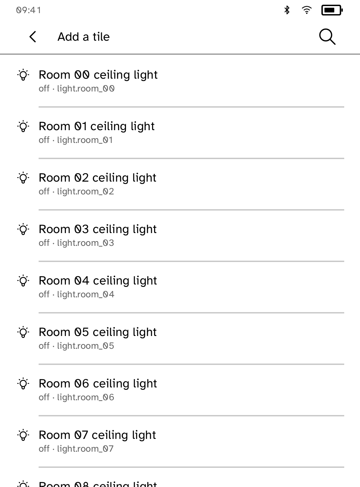
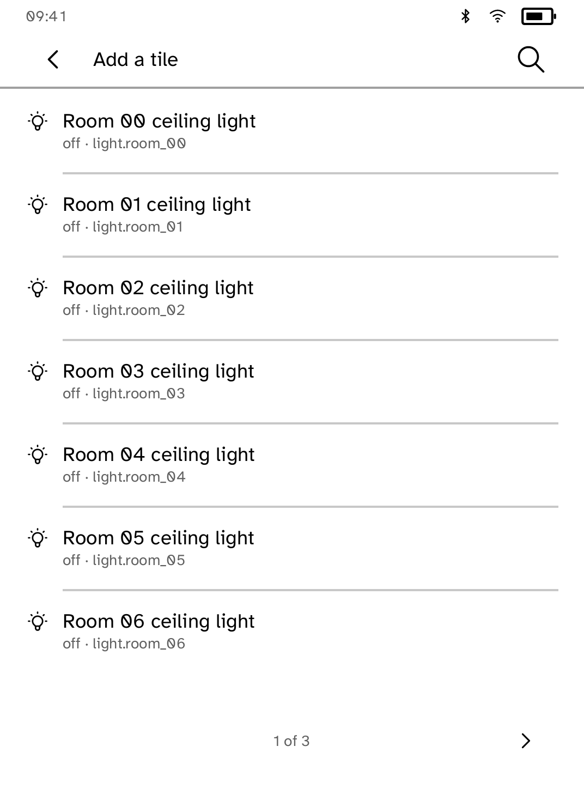
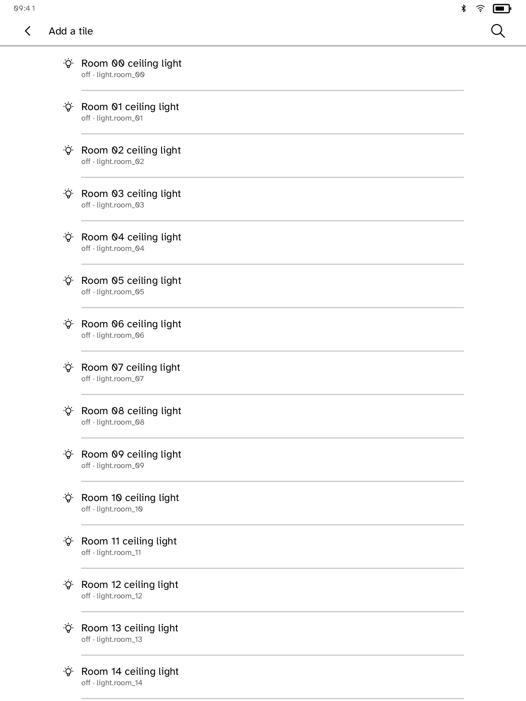
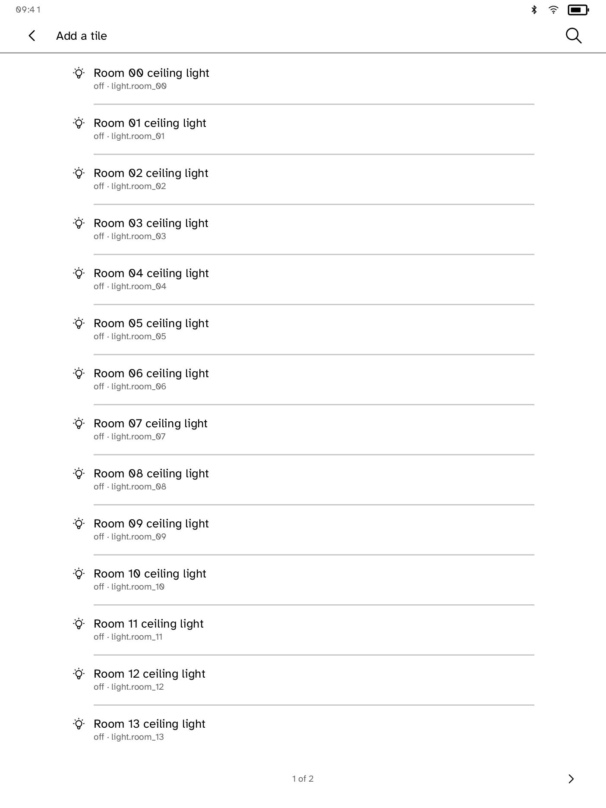
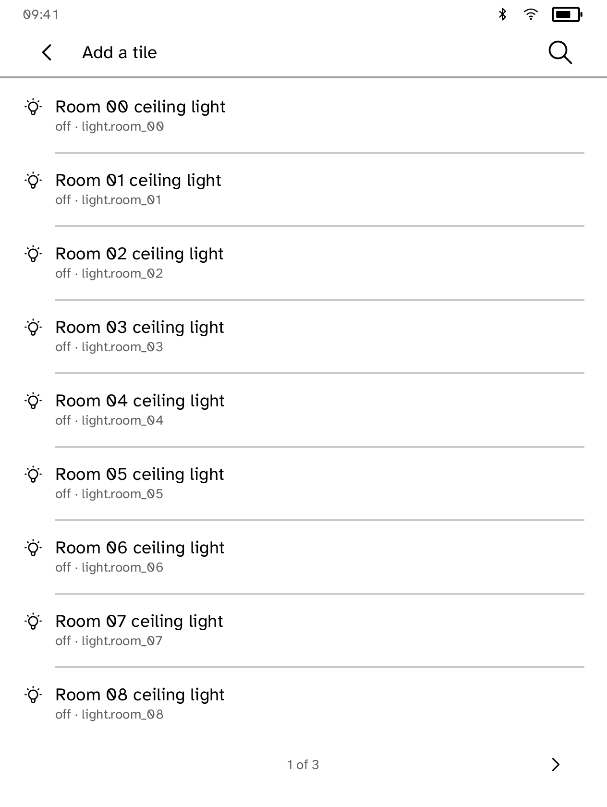
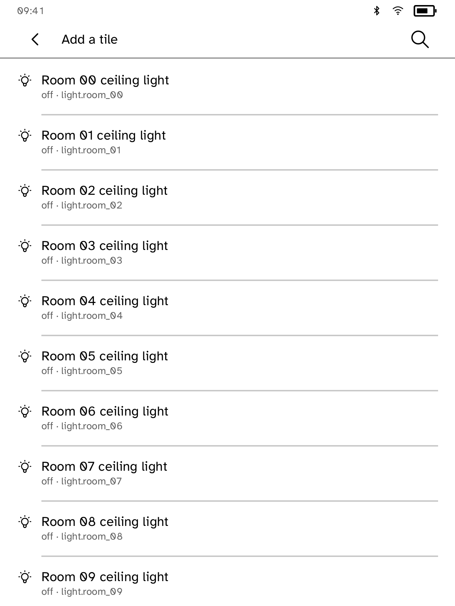

# homepanel: all nine device profiles

These are genuine native Cobalt app-renderer snapshots with actual app screen builders, callbacks, hit tests, bundled fonts, and runtime chrome. They are **not full interactive simulator captures or hardware photographs**. Each profile starts in a separate process so Elipsa uses its real 227 PPI font metrics.

Before: `9715304831eae95566758fd0aa6b8e6fc87ee3ee`. After: independent PR #247 head `35edc1a101f728283a29f21c864568fd9b57fb3a` (source tree `6ee71bd7cf8d068f9dea147b2f77ab6ea91df09d`). No combined-integration source was substituted.

## Verification

- Nine supported profile identities; portrait at 80%, 100%, and 170% text
- Additional swapped logical framebuffer landscape stress at the same sizes; this does not verify physical rotation, touch transforms, or firmware
- 54 native cases per phase; all after functional case runs pass; no after assertion failures and no after layout-error images
- 0 after images carry non-error diagnostics; these are not reported as errors or hidden
- Total generated evidence: 270 before and 324 after snapshots; representative default portrait and largest landscape pairs are published here
- Full simulator baseline profile run: [GitHub Actions](https://github.com/BandarLabs/Cobalt/actions/runs/36914679526), pending when this evidence was prepared
- Exact provenance, SHA-256 hashes, and counts: [validation.json](validation.json)

## Matched portrait comparisons, 100% text

| Profile | Before | After |
| --- | --- | --- |
| clara-bw-391 |  |  |
| clara-bw-395 |  |  |
| clara-hd-376 |  |  |
| clara-colour-393 |  |  |
| elipsa-2e-389 |  |  |
| libra-2-388 |  |  |
| libra-colour-390 |  |  |
| libra-colour-390-4.46.23836 |  |  |
| libra-h2o-384 |  |  |

## Additional largest-text logical landscape stress

| Profile | Before | After |
| --- | --- | --- |
| clara-bw-391 | [Before](clara-bw-391/before-landscape-stress-170.png) | [After](clara-bw-391/after-landscape-stress-170.png) |
| clara-bw-395 | [Before](clara-bw-395/before-landscape-stress-170.png) | [After](clara-bw-395/after-landscape-stress-170.png) |
| clara-hd-376 | [Before](clara-hd-376/before-landscape-stress-170.png) | [After](clara-hd-376/after-landscape-stress-170.png) |
| clara-colour-393 | [Before](clara-colour-393/before-landscape-stress-170.png) | [After](clara-colour-393/after-landscape-stress-170.png) |
| elipsa-2e-389 | [Before](elipsa-2e-389/before-landscape-stress-170.png) | [After](elipsa-2e-389/after-landscape-stress-170.png) |
| libra-2-388 | [Before](libra-2-388/before-landscape-stress-170.png) | [After](libra-2-388/after-landscape-stress-170.png) |
| libra-colour-390 | [Before](libra-colour-390/before-landscape-stress-170.png) | [After](libra-colour-390/after-landscape-stress-170.png) |
| libra-colour-390-4.46.23836 | [Before](libra-colour-390-4.46.23836/before-landscape-stress-170.png) | [After](libra-colour-390-4.46.23836/after-landscape-stress-170.png) |
| libra-h2o-384 | [Before](libra-h2o-384/before-landscape-stress-170.png) | [After](libra-h2o-384/after-landscape-stress-170.png) |
