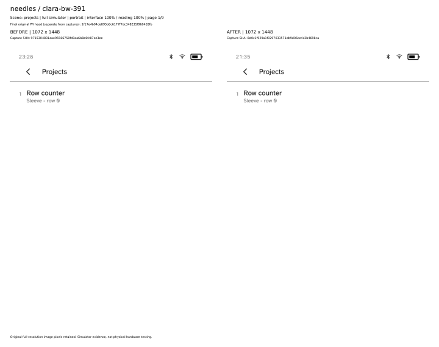

# needles all device profile comparison

[Open all nine full-resolution BEFORE/AFTER pages](all-nine-profiles-before-after.pdf). Embedded screenshots retain their original dimensions and decoded pixels. [Capture metadata, archive hashes and source-object proof](validation.json).

Full Cobalt simulator screenshots at interface 100% / reading 100%. Scene: `projects`. BEFORE source: `9715304831eae95566758fd0aa6b8e6fc87ee3ee`. Final original PR source: `1f17e4b04da895b8c6177f7dc348235f960483fb`. Actual capture revisions are printed on each page and retained in validation.json.

## Provenance and scope

- Simulator captures with fixture services; no physical hardware or live-service certification.
- interface 100% / reading 100% in portrait only; no 170% completion claim.
- One representative scene per profile; complete routes remain in source artifacts.
- Capture revisions are retained separately from original PR and consolidated source heads.

AFTER routes report pass on all nine profiles. This packet displays one selected scene, not the entire route.

Source-object comparisons record matching app source, manifests, renderer crates and assets against an observed consolidated head; this does not relabel captures or assert full-build identity. The consolidated Cargo.lock differs and is recorded separately. Capture-to-consolidated source bindings are documented in the consolidated PR comments.

Sources: [run 36921083042](https://github.com/BandarLabs/Cobalt/actions/runs/36921083042), [run 36939992697](https://github.com/BandarLabs/Cobalt/actions/runs/36939992697).

## Profile index

- Page 1: clara-bw-391
- Page 2: clara-bw-395
- Page 3: clara-hd-376
- Page 4: clara-colour-393
- Page 5: elipsa-2e-389
- Page 6: libra-2-388
- Page 7: libra-colour-390
- Page 8: libra-colour-390-4.46.23836
- Page 9: libra-h2o-384
