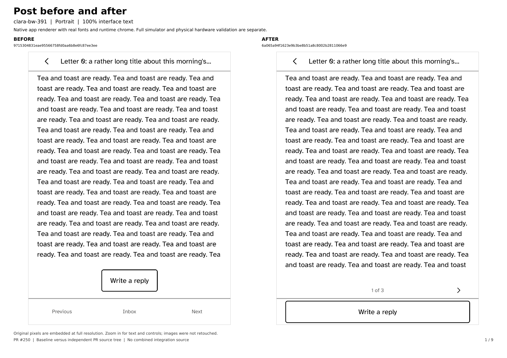

# post all device profile comparison

[Open the nine-page full-resolution BEFORE/AFTER evidence PDF](all-nine-profiles-before-after.pdf). Each page contains untouched original-resolution screenshots for one supported device profile. [Exact commits, image hashes, and validation details](validation.json).

These are real native Cobalt app-renderer captures with bundled fonts and runtime chrome, not full interactive simulator captures or physical hardware photographs. Profile PPI is initialized in separate processes. Full-simulator CI is tracked independently.

Before source: `9715304831eae95566758fd0aa6b8e6fc87ee3ee`. Independent PR after source: `6a065a94f1623e9b3be8b51a8c8002b2811066e9`.

## Profile index

- Page 1: clara-bw-391
- Page 2: clara-bw-395
- Page 3: clara-hd-376
- Page 4: clara-colour-393
- Page 5: elipsa-2e-389
- Page 6: libra-2-388
- Page 7: libra-colour-390
- Page 8: libra-colour-390-4.46.23836
- Page 9: libra-h2o-384

## Validation boundaries

- AF_UNIX denied; no full simulator socket/rendering loop used
- Network/device service outcomes supplied by fixtures; no live service, radio or touch-controller validation
- Logical landscape stress does not certify physical device rotations
- Baseline errors are preserved and labeled, not counted as successful changed-flow fixes

## Final companion CLI verification

The final PR head is `a8b498664d93e518a22bf375834c380b102f1f68`. The captures retain their original source commit, while app source, renderer, simulator, font assets and lockfile hashes are unchanged. The final commit only changes `crates/kobo-cli/src/post.rs`; object hashes and changed paths are recorded in validation.json. Final-head CI is green.
