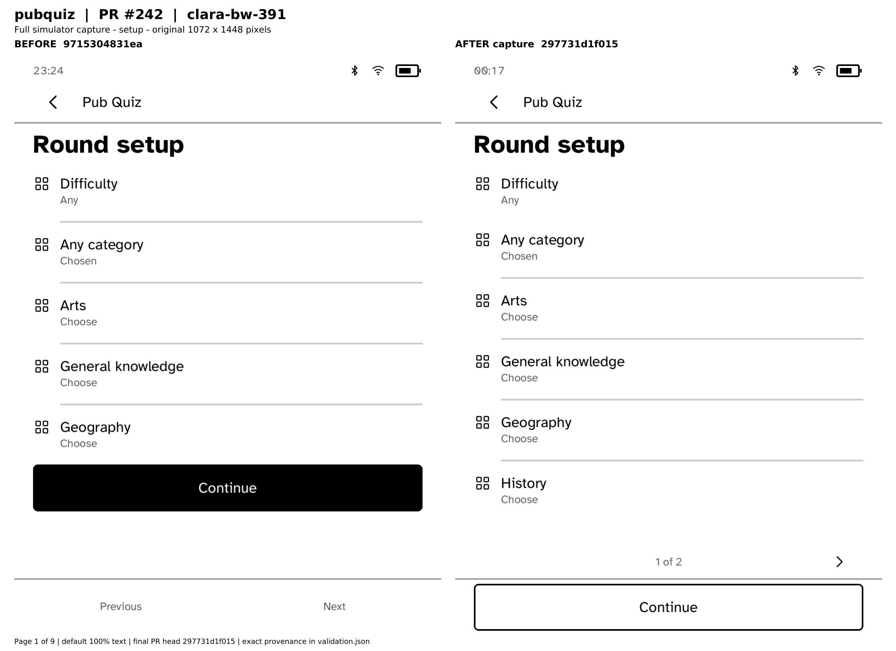

# pubquiz all device profile comparison

[Open all nine full-resolution BEFORE/AFTER pages](all-nine-profiles-before-after.pdf). Each embedded screenshot retains its original pixel dimensions and decoded pixel hash. [Exact capture metadata and validation](validation.json).

These are real full Cobalt simulator screenshots at default 100% text size. Scene: `setup`. BEFORE source: `9715304831eae95566758fd0aa6b8e6fc87ee3ee`. Final PR source: `297731d1f01556f5845a0f4c0abf5aaf84861016`.

## Functional checks

The AFTER simulator route passed on all nine profiles. The complete routes and all captures are in [run 36945124902](https://github.com/BandarLabs/Cobalt/actions/runs/36945124902). [BEFORE workflow](https://github.com/BandarLabs/Cobalt/actions/runs/36939992697). This packet shows one representative scene per profile; the earlier focused review remains relevant for changed-flow and large-font coverage.

## Profile index

- Page 1: clara-bw-391
- Page 2: clara-bw-395
- Page 3: clara-hd-376
- Page 4: clara-colour-393
- Page 5: elipsa-2e-389
- Page 6: libra-2-388
- Page 7: libra-colour-390
- Page 8: libra-colour-390-4.46.23836
- Page 9: libra-h2o-384

## Boundaries

- Simulator fixture services are used; these are not physical hardware photographs or live-service certification
- This packet covers default portrait rendering at 100% text
- Original capture commits are retained separately from final PR heads
