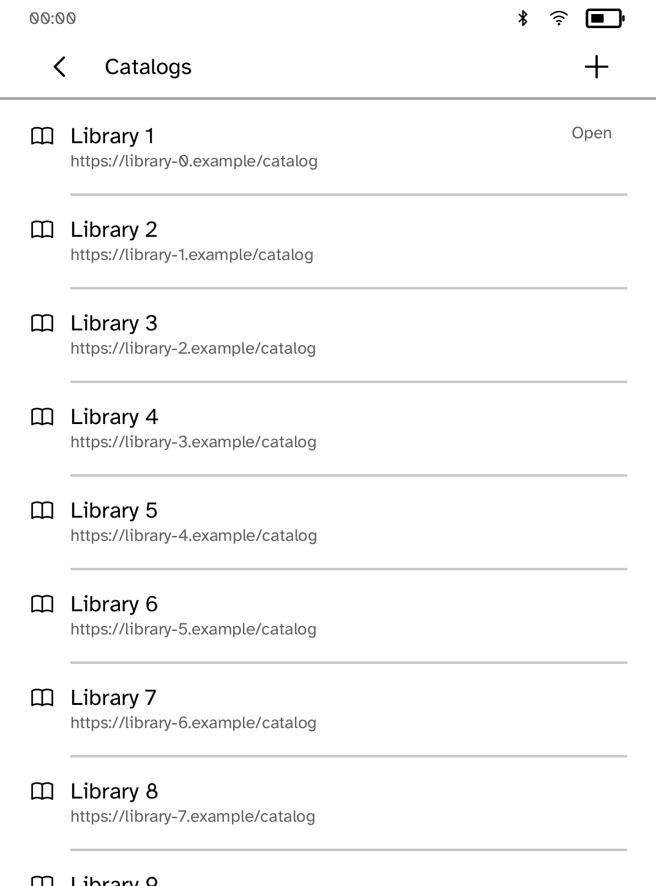
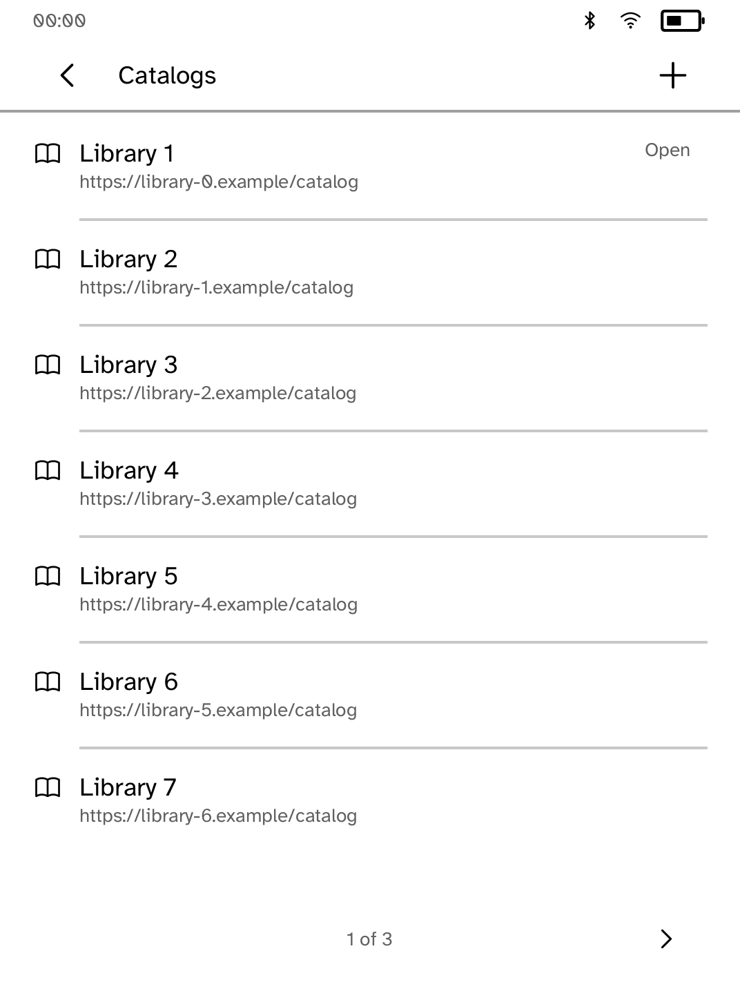
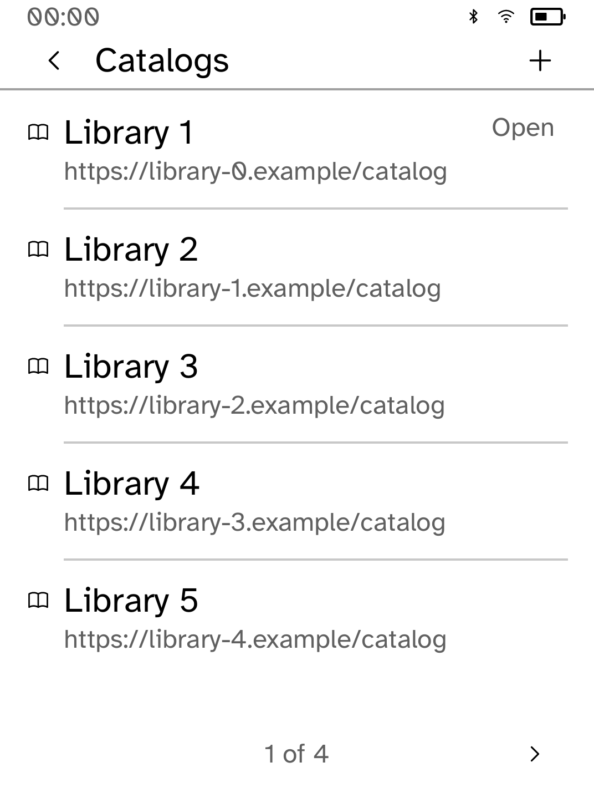

# Reachable added catalogs

These are **native renderer snapshots, not interactive simulator or device
screenshots**. Original app builders/callbacks and repository OPDS fixtures feed
the real Cobalt renderer/fonts at Clara BW metrics, with representative SDK
status. The 20 libraries use synthetic example domains; no network is used.

The catalog list originally drew every added catalog onto one panel, without
page controls. Later catalogs had no reachable touch target. The list now
measures both its trailing Open marker and any notice, keeps rows on the panel,
and exposes page controls. Catalog IDs remain original indices; returning from
a shelf preserves the catalog-list page.

<table><tr>
<td><br>Before: later catalogs are hidden</td>
<td><br>After: every catalog has a page</td>
<td><br>Largest text size</td>
</tr></table>

## Reproduce and validate

After building the checkout's locked dependencies:

```sh
python3 examples/gutenbird/screenshots/ui-review/capture.py --root . --app gutenbird \
  --scenario examples/gutenbird/screenshots/ui-review/scenario.rs --scope-tests \
  --output target/gutenbird-native-review
```

For baseline evidence, point `--root` at detached revision
`9715304831eae95566758fd0aa6b8e6fc87ee3ee`. The audit crate only adapts original
module/fixture paths and appends a scenario to reuse existing fixture helpers.
Source and image hashes are in `provenance.json`.

The journey covers built-in and added catalogs, an OPDS shelf, book details and
return to a cached shelf at default/largest type. Added tests hit-test every
catalog at every text size, including a notice, and check page boundaries and
return from a shelf. All 101 app tests, formatting and strict clippy pass.
Updated catalog captures have no layout diagnostics. The existing cached-shelf
ToneBudget warning is unchanged; the shared renderer was not edited.

Interactive simulator proof is pending because the environment denies its
Unix-domain socket with EPERM, including reviewed escalation. Native callbacks
do not prove simulator transport, transformed touch coordinates, live catalog
requests, EPUB downloads, or physical E Ink behavior.
