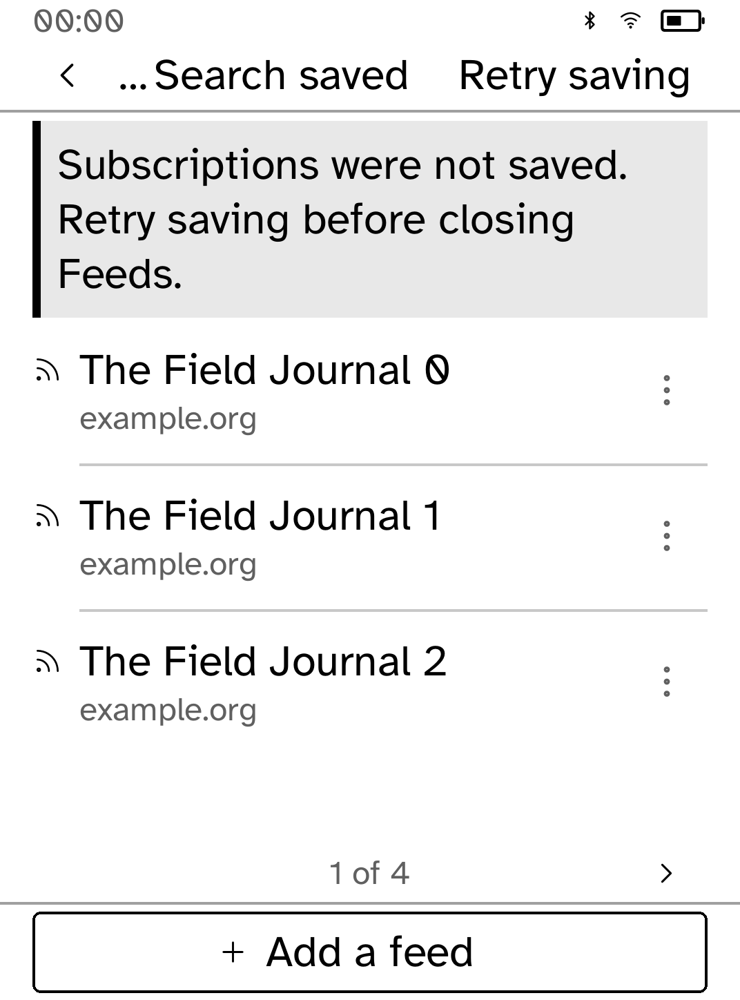
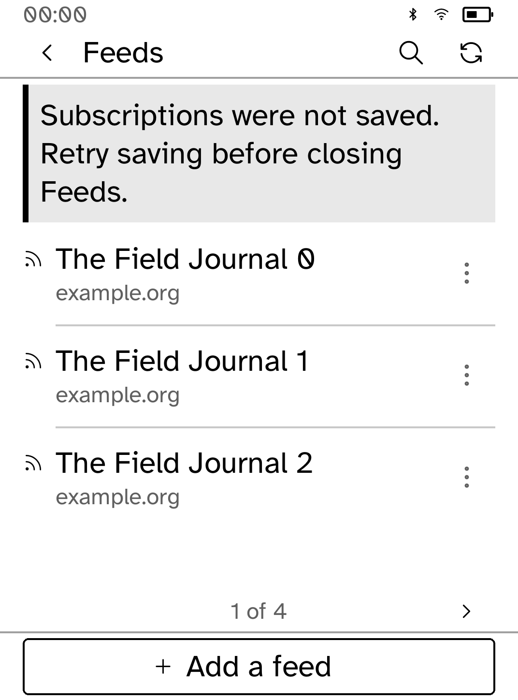

# Recovery controls at large text sizes

These are **native renderer snapshots, not interactive simulator or device
screenshots**. The unchanged app builders and native callbacks were rendered
with the real Cobalt fonts/renderer, Clara BW metrics, and a representative SDK
status strip. The subscriptions and articles are synthetic and no live network
or user account was used.

A failed subscription save put “Retry saving” and “Search saved” together in
the top bar. At the largest text size they left only five pixels for the title,
which became an ellipsis and produced `TextOverflow`. Standard Search and
Refresh glyphs keep both original action labels and their touch targets while
leaving the title readable. The same fix covers failed refresh-history saves.

<table><tr>
<td><br>Before: title squeezed out</td>
<td><br>After: title and both controls remain visible</td>
</tr></table>

## Reproduce and validate

After building the checkout's locked dependencies:

```sh
python3 examples/rss/screenshots/ui-review/capture.py --root . --app rss \
  --scenario examples/rss/screenshots/ui-review/scenario.rs \
  --output target/feeds-native-review
```

Use a detached `9715304831eae95566758fd0aa6b8e6fc87ee3ee` checkout as `--root`
for the baseline. The temporary audit crate only adapts original module/fixture
paths and appends the scenario. Source and image hashes are in `provenance.json`.

The capture journey covers empty state, adding/browsing feeds, subscription and
article lists, failed saves and refresh errors at default/largest type. Updated
captures have no layout diagnostics. A regression test checks the complete
title and hit-tests both controls at every supported text size, for each save
failure. All 90 app tests, formatting and strict clippy pass.

The simulator's Unix-domain socket is denied with EPERM in this environment,
including a reviewed escalated launch. Native callbacks do not prove simulator
transport, transformed touch coordinates, live requests or E Ink refresh.
Interactive simulator and hardware proof therefore remain pending.
