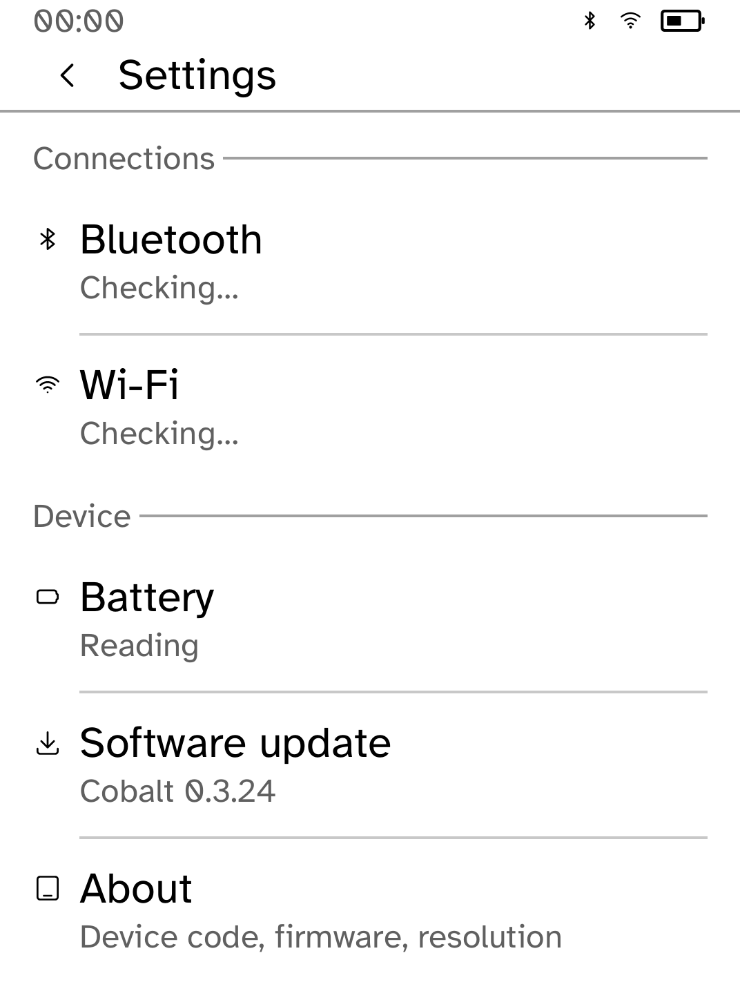
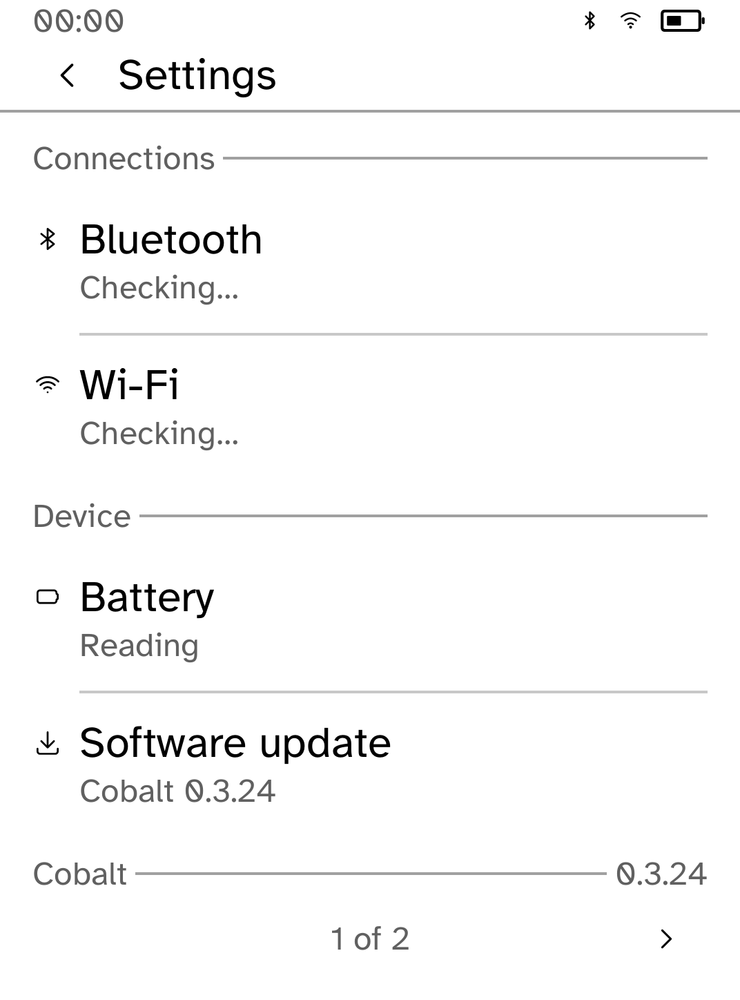
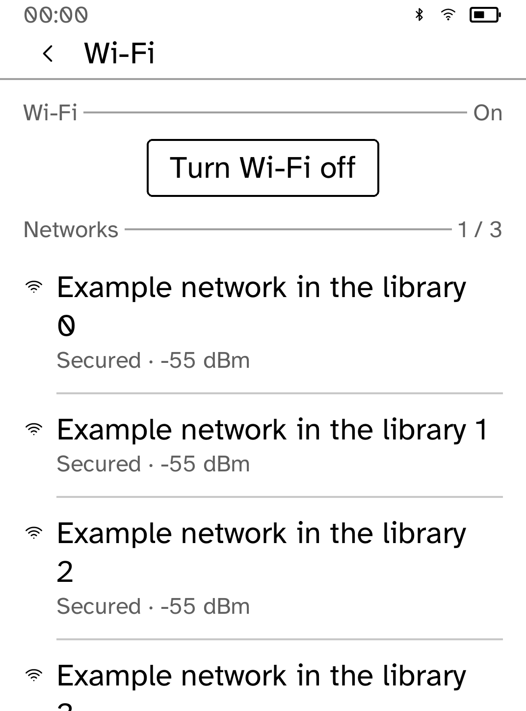
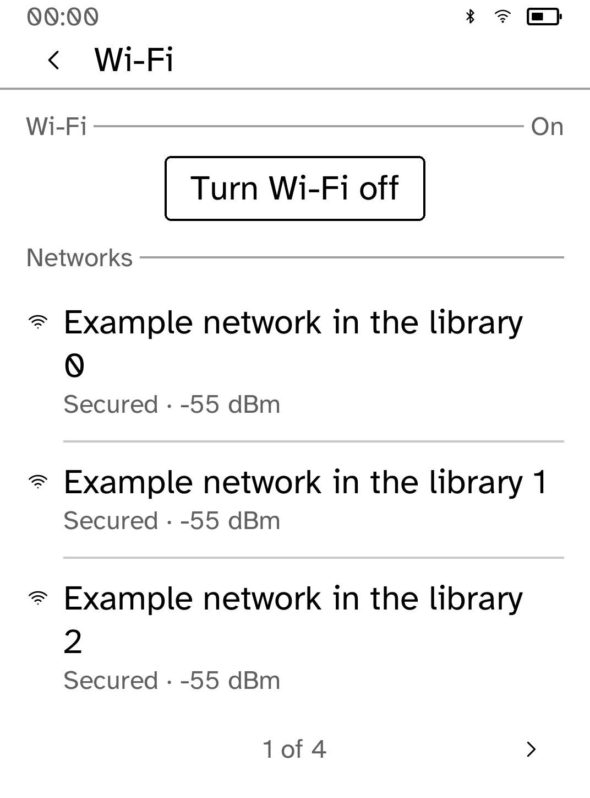
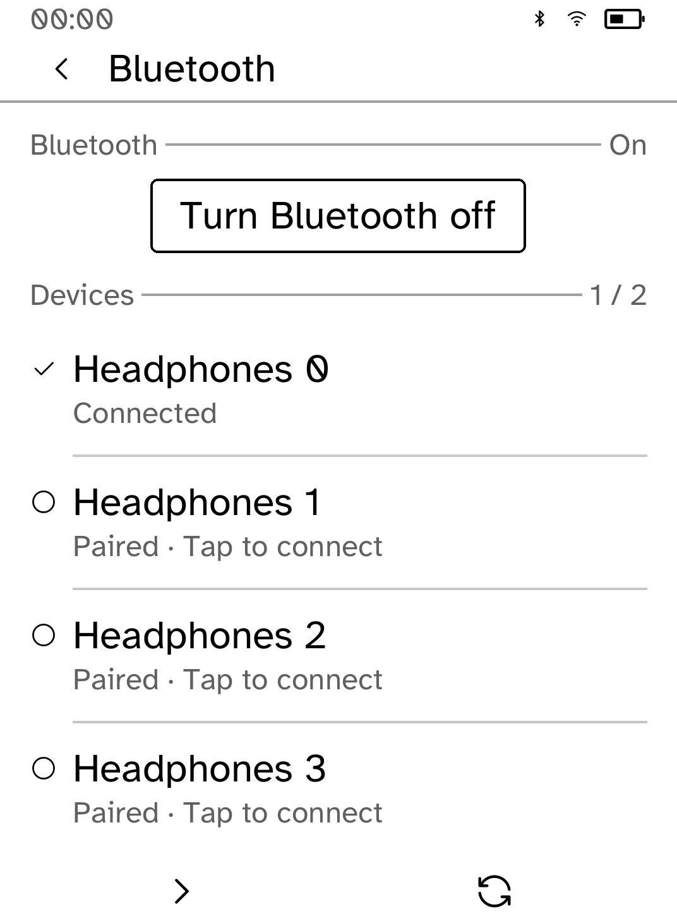
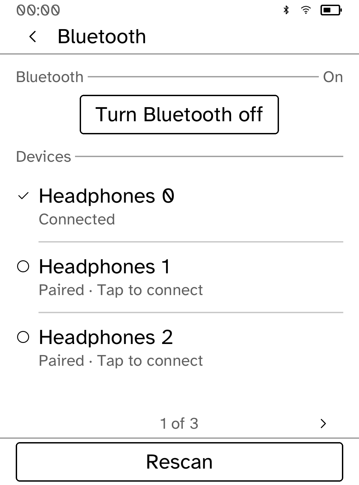
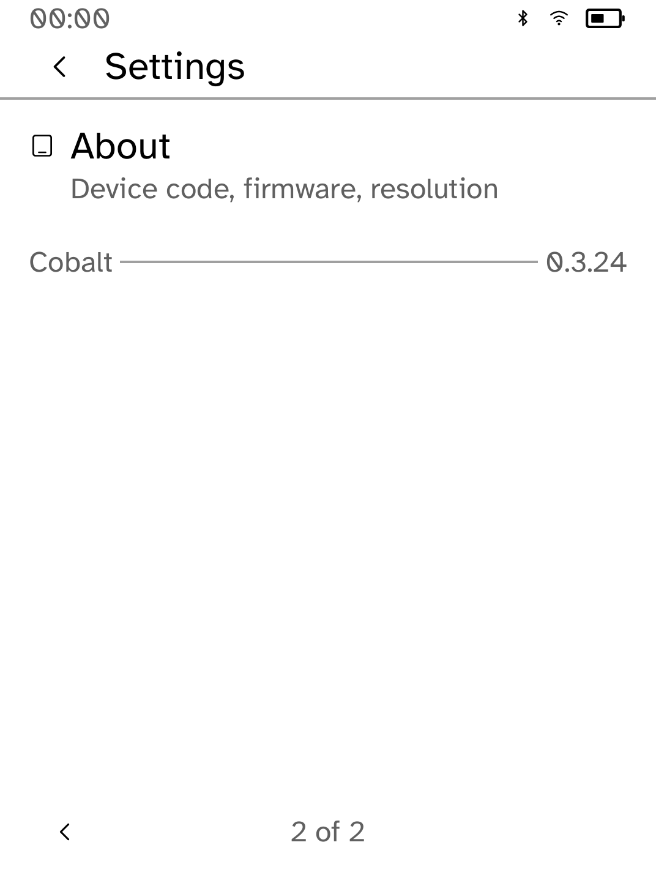
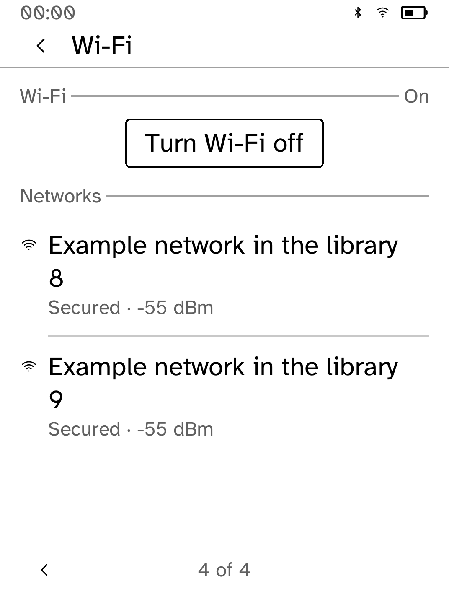
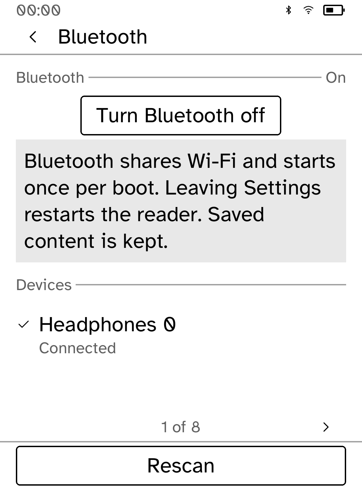

# Settings: measured lists at large text sizes

These are actual in-process Cobalt renderer snapshots, **not interactive
simulator captures or device photographs**. Before images use the original
Settings implementation at Beta `9715304831eae95566758fd0aa6b8e6fc87ee3ee`;
a test-only fixture supplied ten example Wi-Fi networks and eight headphones.
They contain no real networks, devices, passwords, or user data.

All comparisons use Clara BW 1072 × 1448 / 300 ppi metrics at the 170%
(Largest) interface size. The app's screen builders feed `kobo_ui::render_all`,
with the installed Cobalt font, `Chrome::for_screen`, and `ensure_way_back`.
The clock, radio indicators, and 50% battery are synthetic status values.
Pixels are unretouched: original images were directly PNG-encoded from the
renderer, and after images were saved as grey8 PGM and converted losslessly
to PNG with Pillow.

| Before | After |
| --- | --- |
|  |  |
|  |  |
|  |  |

The original fixed four-row slices overflowed at larger text sizes. Lists now
measure actual names, summaries, notices, and surrounding controls. Each
radio action is bound to its SSID or device address, so later pages and rescans
that reorder entries still select the device or network originally shown. Bluetooth's Rescan is reserved at the bottom. Page
arrows work with taps or the reader's page buttons and clamp after rescans.
The home sections stay grouped, and the lower About destination remains
reachable on the next page.




The Bluetooth restart warning retains the radio-sharing explanation, restart
consequence, and assurance about saved content in fewer words so it also fits.



## Verification and limits

Regression tests cover every home destination and all thirteen fixture radio
items at all nine text sizes in portrait and landscape, using actual layout
hit testing. They check the exact Wi-Fi SSID/Bluetooth address requested,
password cancellation without joining, long labels, connected status, error
and restart notices, repeated edge page turns, list shrink after rescan, and reordered/removed scan entries.
Device requests are observed in an in-memory context; no real radio is changed.

The executor denies the interactive simulator's AF_UNIX socket, including a
reviewed elevated launch. Interactive `kobo drive`, hardware touch behavior,
and a physical Settings/About photograph remain pending. No runtime or
simulator transport was changed.

## Reproduce after snapshots

```sh
COBALT_REVIEW_OUT="$PWD/target/ui-review" COBALT_REVIEW_PHASE=after \
  python3 examples/settings/screenshots/ui-review/capture.py
python3 - <<'PY'
from pathlib import Path
from PIL import Image
for source in Path('target/ui-review/settings/after').glob('*.pgm'):
    Image.open(source).save(source.with_suffix('.png'))
PY
```

Normal tests write no screenshots and need no direct renderer dependencies.
The Python 3.11+ script copies the current Settings source and the ignored
`src/review_capture.rs` fixture into a temporary Cargo package, adding only
the capture module. Its renderer dependencies and lockfile stay outside the
workspace. It uses the workspace version, SDK, font and renderer sources;
`render.rs` in this directory is its capture helper. Run a workspace Cargo
build first to populate the dependency cache used by its offline build.
