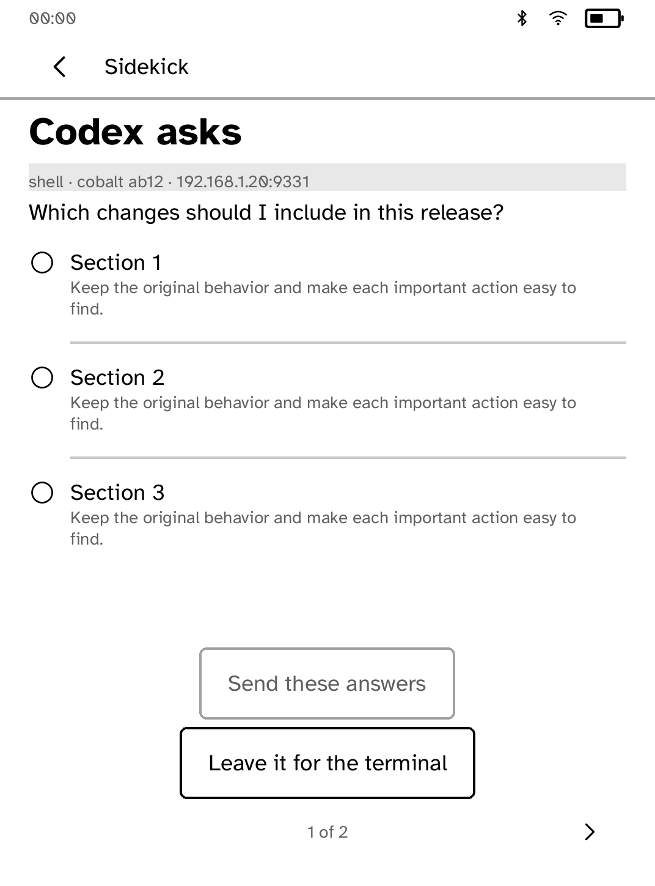
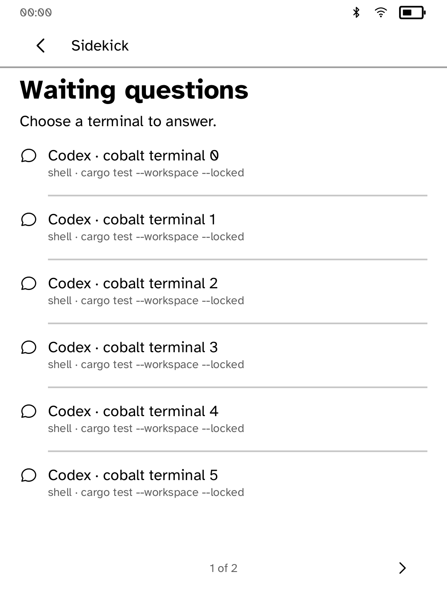
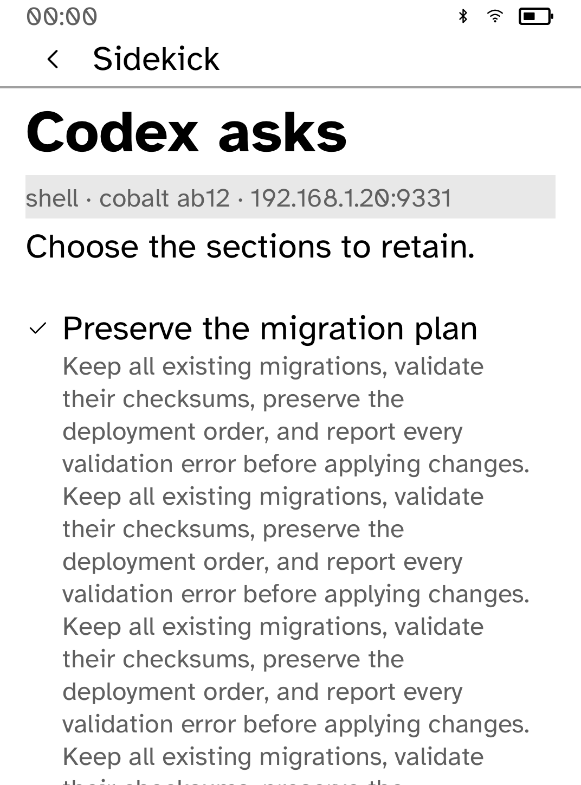
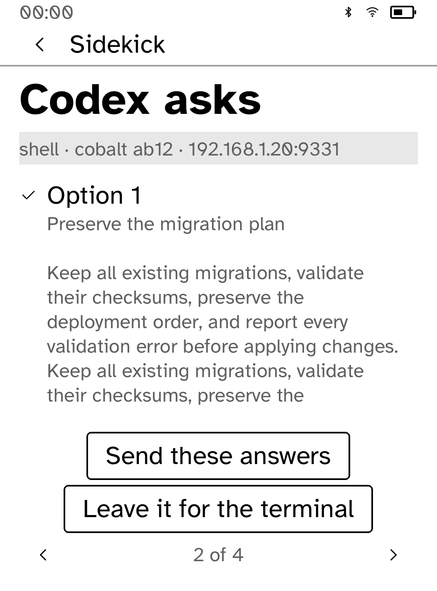
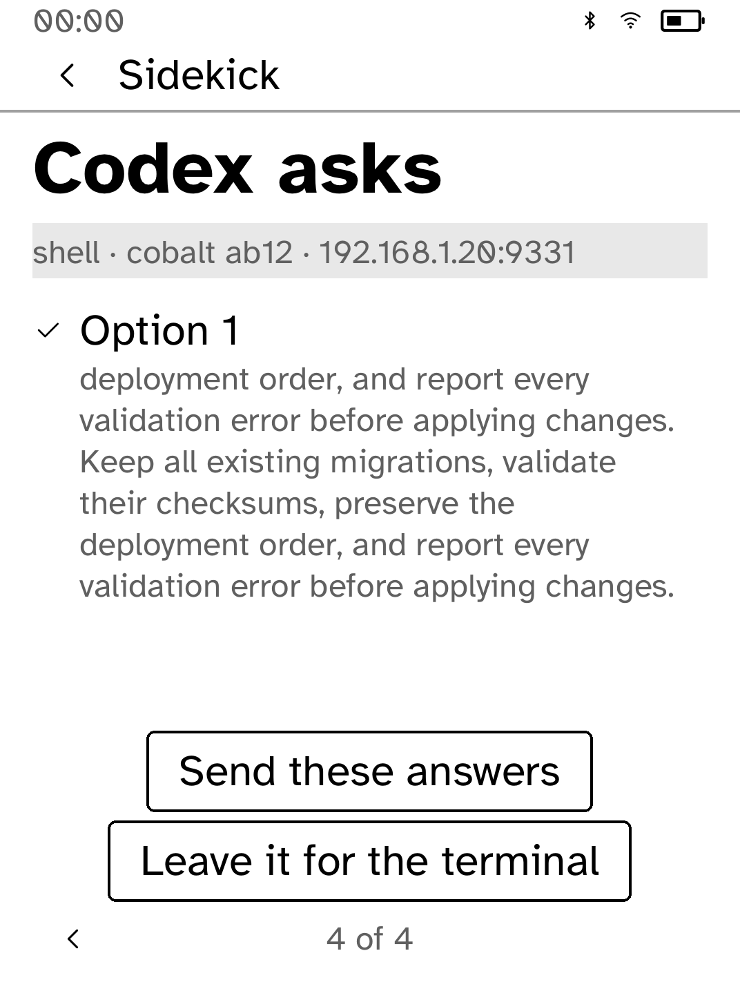
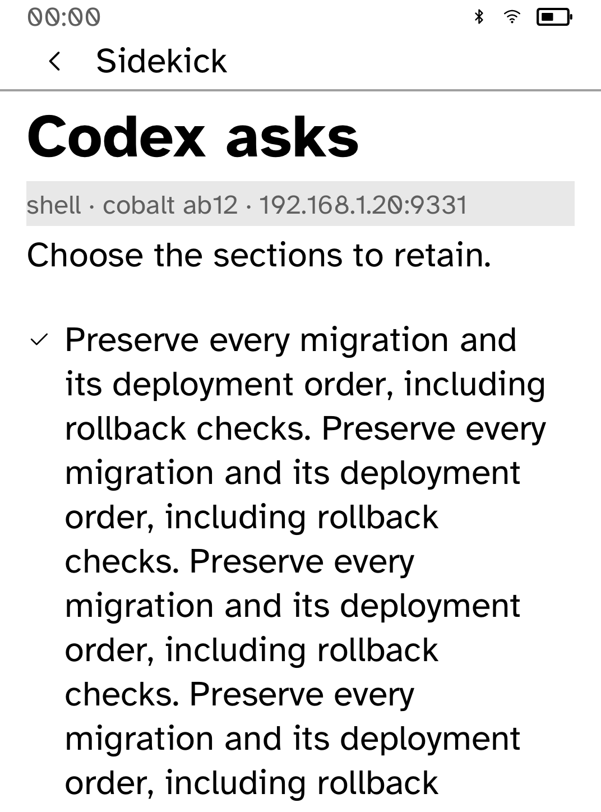
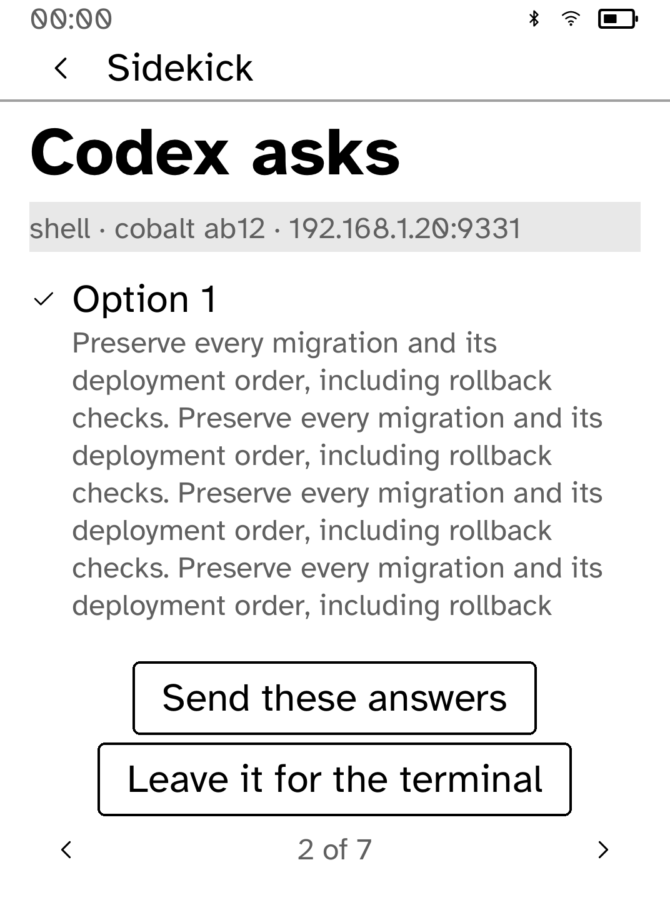
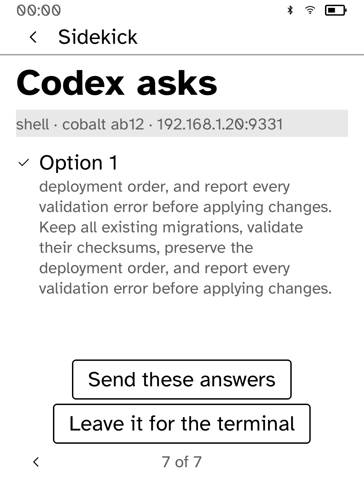

# Keep Sidekick decisions and waiting questions reachable

Long requests, five-choice multi-select prompts and a ten-terminal waiting board overflowed the original panel. Requests and choices now paginate against their exact composed layout; Send, Allow/Deny and Leave remain reachable. Page turns preserve selected answers and never send a decision. Incomplete pairing codes stay editable instead of being saved and sent.

A single oversized choice also gets measured continuation pages. Each part is
identified by the same option number and selected checkmark. The full choice
name and description remain readable, including long names and unbroken UTF-8
text; submission still sends the original label exactly.

## Evidence boundary

These PNGs are genuine **in-process app-renderer snapshots**, not interactive simulator screenshots or physical Kobo photographs. They use the original app screen builders, bundled typeface and `kobo-ui` renderer at Clara BW 1072 × 1448. The status strip is a deterministic fixture (00:00, 50% battery, connected radios). No pixels were redrawn or generated.

The interactive Cobalt simulator was built and its launch attempted, but this cloud environment rejects the Unix-domain socket bind with `Operation not permitted`, including the approved elevated launch. Interactive touch/network/refresh and physical hardware validation remain untested. Native callback/hit-test checks are stated separately.

Baseline is beta `9715304831eae95566758fd0aa6b8e6fc87ee3ee`. Each capture directory has source/provenance and layout diagnostics. The after source hash identifies the changed file; its recorded revision may be the parent commit because captures were made before committing.

## Before and after

### Five choices, 100% text

Before:


After:



### Long request, 170% text

Before:


After:


### Ten waiting terminals, 100% text

Before:


After:



## Validation

39 app tests; strict Clippy; formatting; static ARM build. Full contributor validation also passed for Store-distributed apps, including static ARM verification and a local Beta-shaped package/catalog. The documented public smoke-test seed was supplied locally because the baseline omitted that test fixture; no production key was used or committed.

The oversized-choice regression checks all nine text sizes with actual
`Context::set_screen` wire/glyph validation, layout diagnostics and action hit
tests. Full `AppRunner` callback flows at 100% and 170% additionally cover
previous/next bounds, off-page selections, exact outgoing labels, a failed
answer followed by retry, repeated Send/choice/Back actions, and fresh-question
reset. Single-select continuations send exactly one unchanged answer label.

## Oversized-choice follow-up evidence

`oversized-before/` is the original beta
`9715304831eae95566758fd0aa6b8e6fc87ee3ee`, using its original `screen()` method.
`oversized-after/` is the corrected app. Every captured after page has zero
layout errors. These are the same native-renderer snapshots and evidence
limitations described above.

### Long choice description, 170% text

Before, original beta:



After, first and last choice continuation (the question itself occupies page 1):





The distinct `oversized-draft-before/` directory records the **intermediate
draft commit** `eb35446fb23c0970cb2a6ecca9e54f3cabd91147`, not original beta.
It reproduces the independently reported bug after ordinary pagination was
added: the 170% choice description ended at y=1718, with the choice, Send and
Leave offscreen. Its diagnostics record five errors. It is preserved so the
follow-up fix can be checked against the exact failing implementation.

### Oversized choice name, 170% text

Before, original beta:



After, the complete name and description span six choice pages, all with
reachable selection, Send and Leave controls:





## Reproduce renderer evidence

From the repository root with Python 3.11+ and Rust installed:

```sh
python3 examples/sidekick/screenshots/ui-review/capture.py --out target/ui-review/sidekick
```

To reproduce the original frame, run this same capture script with `--source-root` pointing to a separate checkout of the baseline commit. The helper selects the original or updated screen signature, adds only a temporary test probe, then deletes that probe. It does not start the app main function or modify app behavior.

The portable scene now captures every oversized-choice page at 100% and 170%.
Use a separate output directory per source revision; each includes its own
source revision, source hash and per-page diagnostics.
