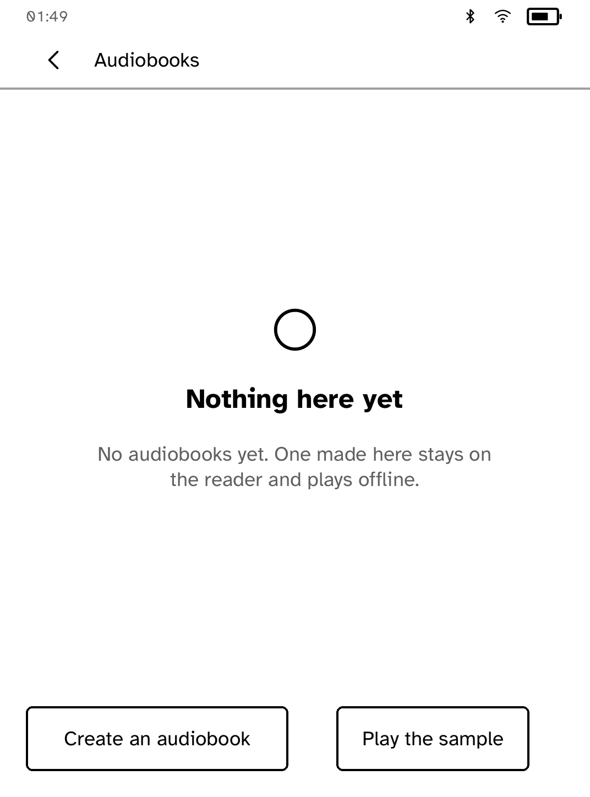
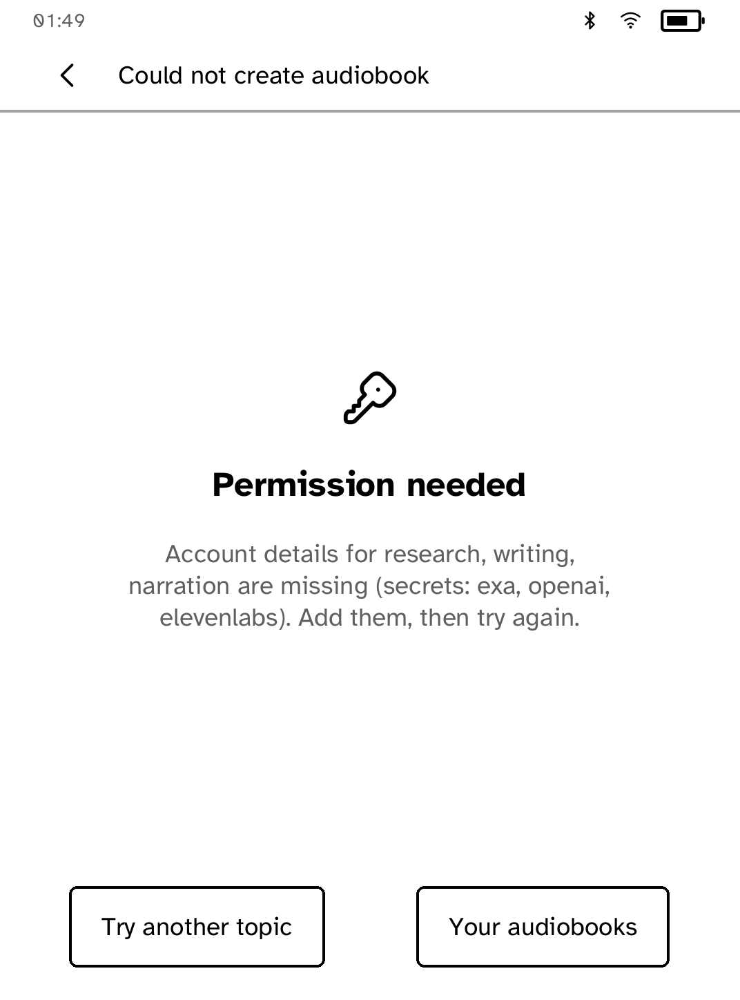
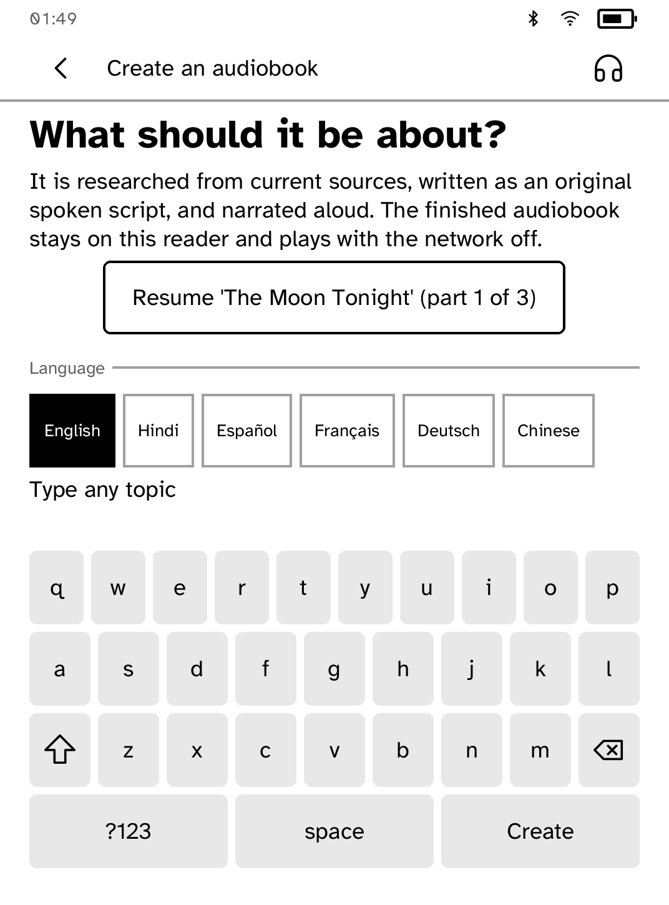

# Audiobook Studio

Turn a topic into an original narrated audiobook and listen on your Kobo.

<table>
<tr>
<td width="50%" valign="top"><br>The shelf, with a free sample</td>
<td width="50%" valign="top"><br>Missing accounts, named before anything is spent</td>
</tr>
<tr>
<td width="50%" valign="top"><br>Narrating part 1 of 3</td>
<td width="50%" valign="top"><br>Resuming an interrupted book</td>
</tr>
<tr>
<td width="50%" valign="top"><br>The player</td>
</tr>
</table>

## Features

- Type a topic. Exa researches it, OpenAI writes an original script and
  ElevenLabs narrates it.
- Finished books are saved as `.mp3z` files in `/mnt/onboard/Audiobooks`, so
  they also appear in the Kobo's My Books.
- The shelf opens first, and every saved book plays offline.
- The player has cover art, position, 30-second skips, play and pause, and
  volume.
- Plays through Bluetooth headphones or speakers. If none is connected, **Play**
  opens a device picker, and the book starts once one connects.
- While a book is being made, the screen shows elapsed time every five seconds
  and save progress in bytes.
- A free sample plays without any accounts.

## Setup

Install three API keys on the reader:

```sh
kobo secret set exa        --from PATH --device IP
kobo secret set openai     --from PATH --device IP
kobo secret set elevenlabs --from PATH --device IP
```

The app checks all three before making any paid request and names any that
are missing. The runtime attaches each key only to its provider's endpoints,
and the app never sees them.

## Permissions

- `network`: calls Exa, OpenAI and ElevenLabs.
- `audio`: plays the audiobook.
- `bluetooth-audio`, `bluetooth-control`: finds and connects headphones or
  speakers.

## Development

```sh
cargo test -p kobo-audiobook
kobo run --sim --app audiobook      # in the browser simulator
python3 scripts/check-apps-sim.py audiobook
kobo deploy --device <ip>       # onto a reader over Wi-Fi
```
The screenshots come from `scripts/quality/check-audiobook-sim.py`, which runs against local test servers.

---

Part of [Cobalt](../../README.md). See [all apps](../../README.md#apps).
