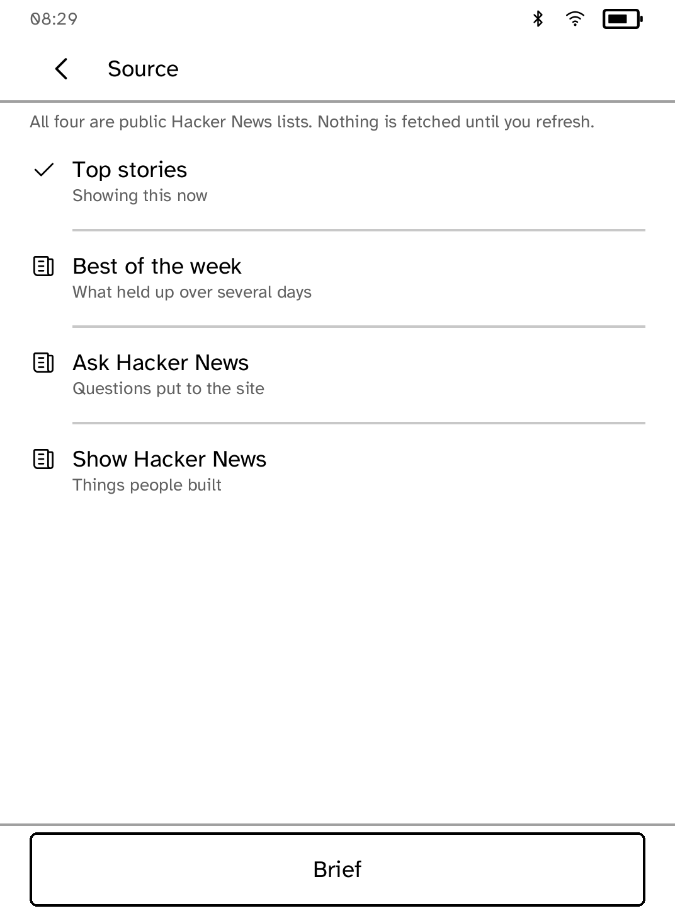
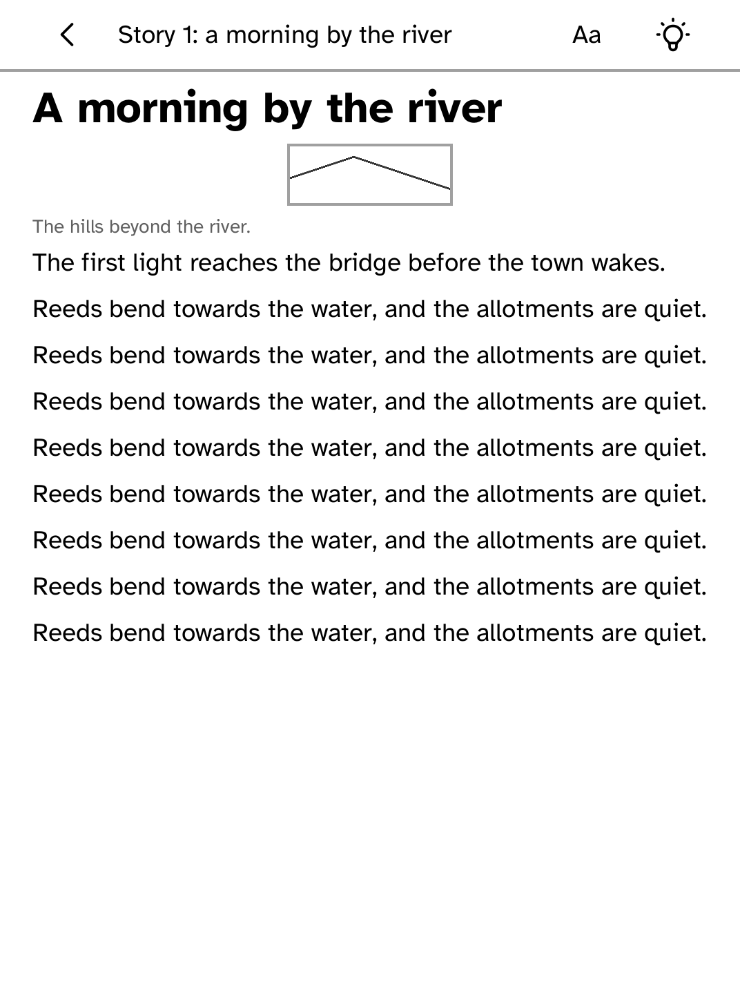

# Daily brief

A brief that is ready before you open it.

This exists to demonstrate the one lifecycle e-readers actually need, and the
one a mobile framework would call backgrounding. It is not a feed reader with
extra steps: the whole point is what happens when you *leave*.


*Captured from the Clara BW simulator against a private fixture index. The
device capture is taken with the hardware acceptance run.*

## What it demonstrates

Tap Refresh and it starts fetching. Go back to the launcher and open something
else. The fetch keeps running, because leaving an application no longer stops
it: the runtime keeps the process, the work in flight and the memory, and tells
the application it is no longer being looked at. Come back and the brief is
finished and drawn, with no reload and no second fetch.

## Why it saves the moment it goes to the background

`KoboApp::on_background` is the last certain moment. A reader closes an
e-reader by shutting a cover and may not open it for a week, and the device may
run its battery flat in between. So the brief is written then, and on every
arrival, rather than on the way out.

## Why the two counts sit side by side

How many headlines, and how many places they came from. A brief drawn from one
site is a different thing from one drawn from six, and that was invisible when
the sites were only a line under each title. Given a full line each they read
as a list of findings rather than the one-line summary they are, so they go in
a `band`. That is the SDK's two-or-three column escape from the downward flow,
and it stacks itself back up if the panel is ever too narrow to give both slots
a readable width.

## Where the stories come from

The brief is drawn from one of four public Hacker News lists: the front page,
the best of the week, the questions, or the things people built. The **Source**
control names them and says which one is showing; choosing another one clears
the stories that came from the old list rather than leaving them under a new
heading, and says so.



Above the stories, the brief says which list it is and when it was fetched. A
brief with no time on it cannot be told from this morning's.

## When there is no network

The brief that was fetched last stays on the panel, and a refresh that cannot
happen says so, keeps it, and offers another attempt. Nothing is emptied
because a request failed.

## Reading a story

Tapping a story opens it in the shared document reader, with its figures,
captions and the type controls every other reader on the device has. The page
is saved as it is read, so opening it again costs nothing and works with the
radio off. A question or a show-and-tell has no address of its own, so what the
poster wrote is what is read, and nothing is requested at all.



Six headlines are one panel at most text sizes and two at the largest. That is
the reader's choice of type rather than this becoming a feed: every story stays
reachable either way.

## Running it

```sh
kobo run --sim --app brief              # in the browser simulator
kobo deploy --device <ip>               # onto a reader over Wi-Fi
```

---

Built with the [Cobalt SDK](../../README.md), which
[installs on a Kobo](../../README.md#install-it-on-your-kobo) with one
command over USB. The other apps:
[Launcher](../launcher/README.md) ·
[Audiobook Studio](../audiobook/README.md) ·
[Gutenbird](../gutenbird/README.md) ·
[Hacker News](../hn/README.md) ·
[RSS Reader](../rss/README.md) ·
[AI Chat](../chat/README.md) ·
[Coding Agents Sidekick](../sidekick/README.md) ·
[Terminal](../terminal/README.md) ·
[UI Components Showcase](../gallery/README.md) ·
[Settings](../settings/README.md) ·
[Todo](../todo/README.md) ·
[Tic-tac-toe](../tictactoe/README.md) ·
[Magnet Sensor](../magnet/README.md)
