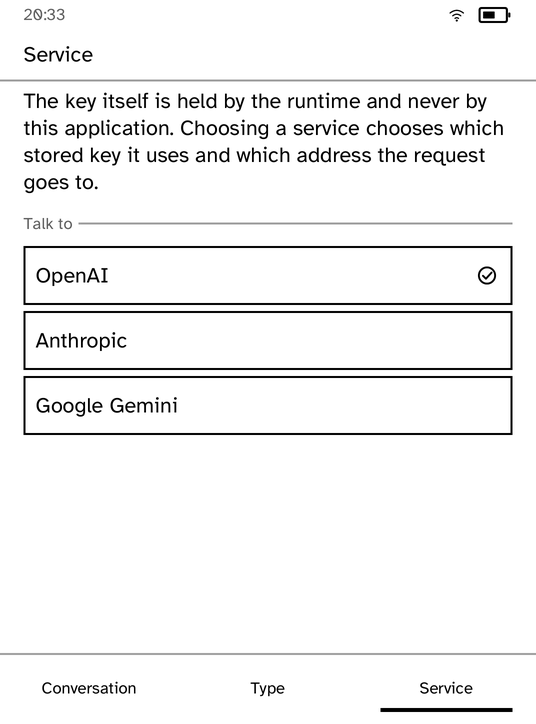
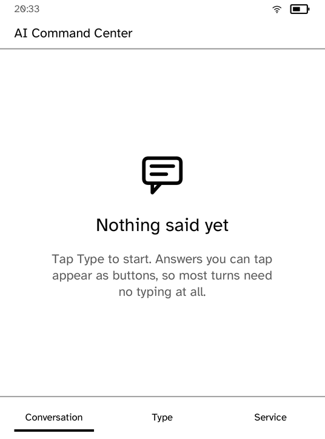
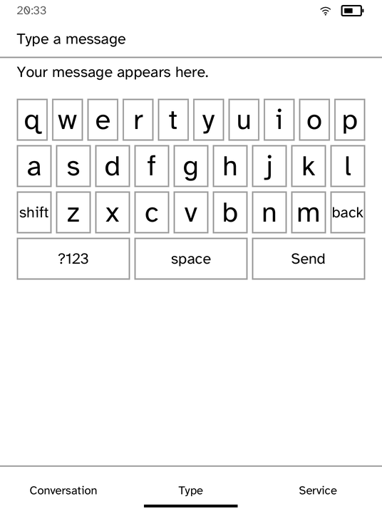

# Chat

A chat client for a device with no keyboard worth the name.

Three screens and one rule. The rule is that the reader should have to type as
little as possible: typing here means hunting for keys on a panel that takes
tens of milliseconds a repaint. When a question genuinely has tappable
answers, the reply carries them, and they are drawn with the same
`ScreenBuilder::choose` a native screen would use — but not every turn,
because a conversation that answers every remark with a menu is a form.

| A real answer, over the radio | Choosing the service |
| --- | --- |
|  |  |

| Nothing said yet | The keyboard |
| --- | --- |
|  |  |

*Captured from a Kobo Clara BW over Wi-Fi with `kobo shot --device`, except the
answer, which is a frame of the recorded tour: the question was typed on the
panel with the keyboard above it. The reply is a real one either way. The key
was installed with `kobo secret set openai`, and this application never saw it.*

## The key

This application never holds it. `Task::Post` carries the *name* of a secret;
the runtime resolves that against its own directory and attaches the
`Authorization` header itself. Nothing here reads it, holds it, logs it, or
could put it in a crash dump, and a test asserts the request body contains
nothing key-shaped.

Install one before you use this:

```sh
kobo secret set openai --from ~/.openai --device <ip>
```

Choosing a service on the third screen chooses which stored key is used and
which address the request goes to, so the same application talks to OpenAI,
Anthropic or Gemini without any of them being a special case in the code.

## Why nothing moves

There is no spinner and no animation, here or anywhere in this system. Waiting
is stated once with `ScreenBuilder::activity` and the panel then holds that
image at zero power until there is something new to say.

## Running it

```sh
kobo run --sim --app chat               # in the browser simulator
kobo deploy --device <ip>               # onto a reader over Wi-Fi
```

---

Built with the [Cobalt SDK](../../README.md). The other apps:
[Launcher](../launcher/README.md) ·
[Audiobook Studio](../audiobook/README.md) ·
[Gutenbird](../gutenbird/README.md) ·
[Hacker News](../hn/README.md) ·
[RSS Reader](../rss/README.md) ·
[Daily Brief](../brief/README.md) ·
[Coding Agents Sidekick](../sidekick/README.md) ·
[Terminal](../terminal/README.md) ·
[UI Components Showcase](../gallery/README.md) ·
[Settings](../settings/README.md) ·
[Todo](../todo/README.md) ·
[Tic-tac-toe](../tictactoe/README.md) ·
[Magnet Sensor](../magnet/README.md)
