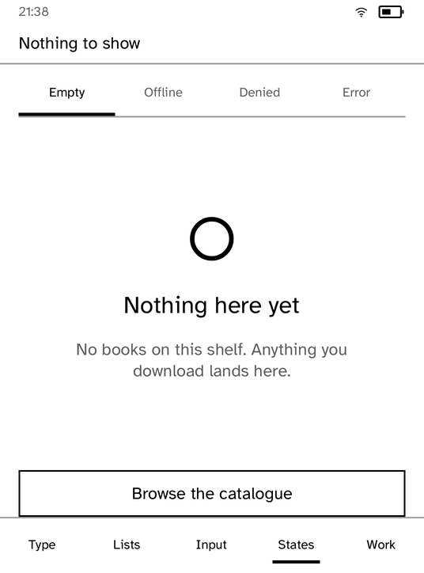

# UI Components Showcase

Every UI primitive, on one device, so each can be checked by eye.

This is a test instrument as much as a demonstration. If a primitive looks
wrong here it looks wrong everywhere, and the layout tests only prove that
sizes are right, not that the result is worth reading.

| Type and structure | A standard state |
| --- | --- |
|  |  |

*Captured from a Kobo Clara BW over Wi-Fi with `kobo shot --device`.*

## Why this is the conformance screen

Every node in `kobo-ui` has an instance here. Adding a node to the vocabulary
without adding it to this gallery is how a primitive ends up shipped and never
looked at: it passes its own unit test, it never appears on a panel, and the
first person to reach for it finds out that it is nine pixels too tall.

The conformance test measures every page against the status band the runtime
draws above it. Without that band the content starts sixty pixels higher than
it does on the device, and the slack is enough to hide a page that overflows.

The gallery is also the fastest way to see a rendering change. `kobo drive`
taps through its tabs and captures each one, so a change to the layout engine
can be diffed as pictures rather than as numbers.

## Running it

```sh
kobo run --sim --app gallery            # in the browser simulator
kobo deploy --device <ip>               # onto a reader over Wi-Fi
```

---

Built with the [Cobalt SDK](../../README.md), which
[installs on a Kobo](../../README.md#install-it-on-your-kobo) with one
command over USB. The other apps:
[Launcher](../launcher/README.md) ·
[Audiobook Studio](../audiobook/README.md) ·
[Gutenbird](../gutenbird/README.md) ·
[Hacker News](../hn/README.md) ·
[RSS Reader](../rss/README.md) ·
[Daily Brief](../brief/README.md) ·
[AI Chat](../chat/README.md) ·
[Coding Agents Sidekick](../sidekick/README.md) ·
[Terminal](../terminal/README.md) ·
[Settings](../settings/README.md) ·
[Todo](../todo/README.md) ·
[Tic-tac-toe](../tictactoe/README.md) ·
[Magnet Sensor](../magnet/README.md)
