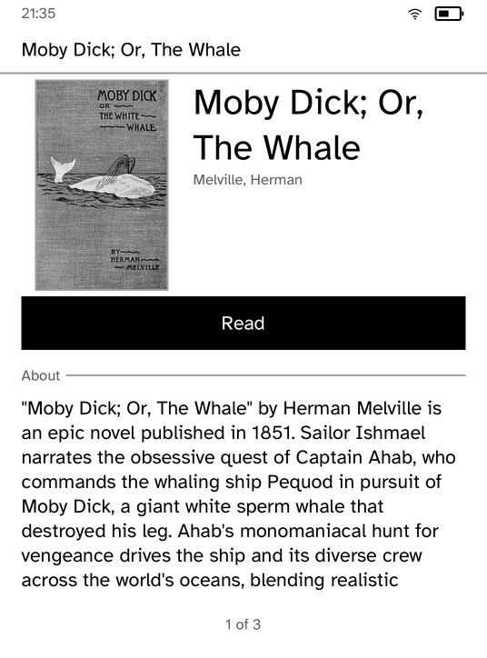

# Gutenbird

The Project Gutenberg library, on the device.

Search sixty thousand public domain books, and read one without leaving the
application.

| The shelf | A book |
| --- | --- |
|  |  |

*Captured from a Kobo Clara BW over Wi-Fi with `kobo shot --device`. Those are
the real covers, fetched over the reader's own radio and decoded on the
device.*

## Why plain text rather than EPUB

Gutenberg publishes every book in several formats, and this reads the plain
text one. `kobo-doc` can read an EPUB now, so this is no longer a matter of
what can be parsed: it is that an EPUB is only useful whole, and a
half-downloaded zip is not a half-downloaded book. The plain text can be read
from the first byte, which is what lets the first page appear in about a second
on a radio this slow. What is lost is italics and a table of contents.

## Why the book arrives in pieces

The transport carries half a megabyte at most, and a Victorian novel is more
than that. Gutenberg honours `Range`, so the book is asked for in chunks: the
first arrives in about a second and the reader starts reading, and the rest is
topped up a few pages ahead of where they are. A page turn never waits for the
radio unless the reader is genuinely at the end of what has arrived, and the
foot of the page says so when they are.

## Why the reading screen is not built here

It was, once: forty lines that turned pages and nothing else. Type size, front
light, bookmarks and marked passages are not Gutenbird's to invent. Every
application that shows a book wants the same ones, and a reader who learns them
in one should find them in the next. They live in `kobo-read`.

## Three things the panel found that the tests did not

The shelf above is six books because six is what fits. It used to be six in two
columns of three, and the third row was cut in half by the nav bar, so the
shelf showed four books and a mistake. Then a page position was added under the
grid and the second row of captions was printed straight through it, because a
tile's height was derived from the width of the grid and not from the room left
under it.

The third was on the book screen. The summary is paged, and the pagination
moved a lone "About" heading forward onto the next page to keep it with the
text under it. That emptied the page it came from, the empty page was dropped,
and the page behind it inherited a cover and a Read button it had never been
measured against: the summary ran off the bottom of the panel and through the
"1 of 2" beneath it. A heading is no longer moved off a page it is alone on,
and a summary too long for the room left is now divided at a word boundary
rather than moved whole.

All three are measured against what is actually drawn, and all three have
regression tests that fail on the real typeface with a real status bar, which
is the only configuration in which any of them was ever visible.

## Running it

```sh
kobo run --sim --app gutenbird          # in the browser simulator
kobo deploy --device <ip>               # onto a reader over Wi-Fi
```
