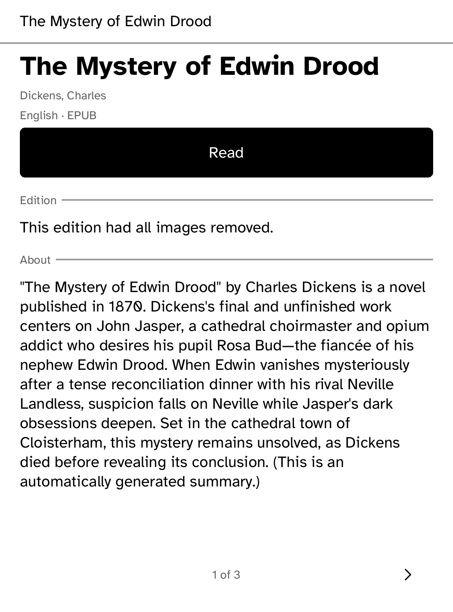
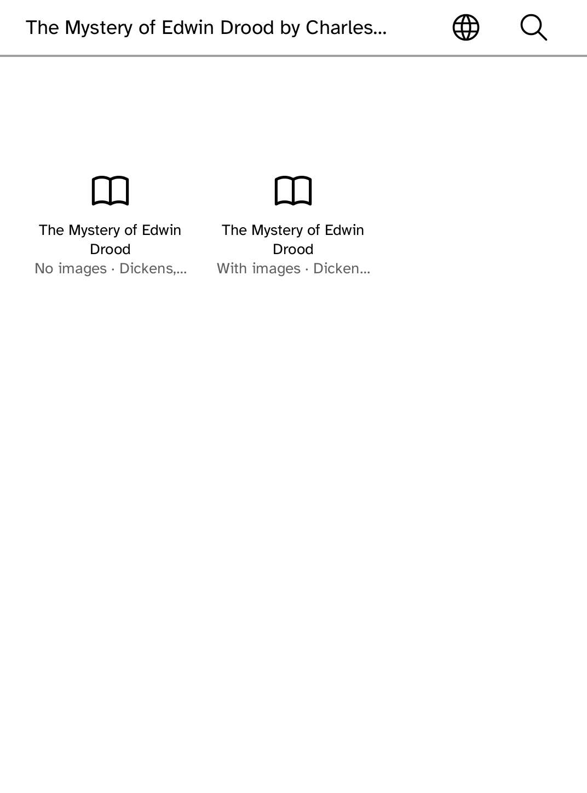
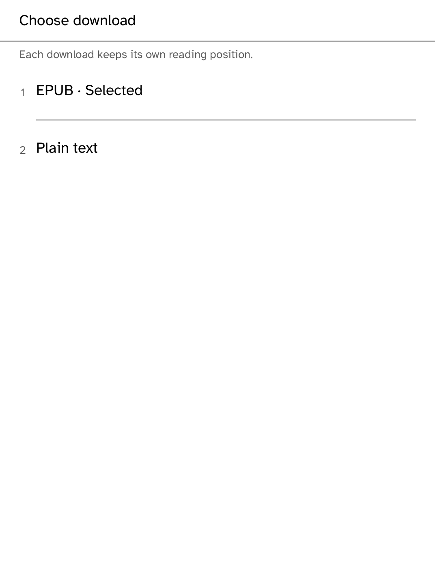
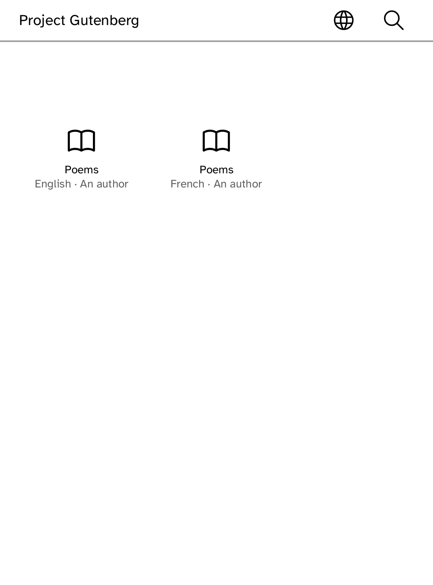

# Gutenbird

An OPDS client, on the device.

Project Gutenberg, Standard Ebooks, Open Library, the OPDS conformance
catalogs -- and any other library that speaks the Open Publication
Distribution System, added by its address. Search, browse, and read a book
without leaving the application.

| The shelf | A book |
| --- | --- |
|  |  |

*Captured from a Kobo Clara BW over Wi-Fi with `kobo shot --device`. Those are
real covers, fetched over the reader's own radio and decoded on the device.*

## Why OPDS rather than one website's API

This used to read Gutendex, a JSON front end to Project Gutenberg's own
metadata -- one service, run by one person, answering in a shape nobody else
answers in. OPDS is the shape the rest of the open web answers in: Project
Gutenberg publishes one, and so do Standard Ebooks, Open Library, every
Calibre server and every library running Library Simplified. Speaking OPDS
turns this from an application that reads Gutenberg into an application that
reads libraries, of which Gutenberg is one. See `docs/OPDS.md` for what that
took and what the real catalogs turned out to actually do.

## Why an EPUB is worth the wait

This used to stream Gutenberg's plain text, because a zip archive cannot be
read until its last byte has arrived and the text could be shown from the
first one. `kobo-doc` can read an EPUB now, and an EPUB carries its own
italics, headings and table of contents -- everything the plain text path
threw away in exchange for a first page a few seconds sooner. So an EPUB is
preferred whenever a catalog offers one: fetched in pieces into a shelf blob
with real progress on screen, parsed once whole, and only then handed to the
reader. Plain text remains the fallback. When a catalog offers more than one readable
download, **Choose download** lets you select the format before reading.

## Why the interface never says which version of OPDS answered

There are two incompatible wire formats in the world at once, Atom for 1.2 and
JSON for 2.0, and a reader adding a catalog should never have to know which
one it speaks. `kobo_opds` reads both into one model, and nothing on this
panel is allowed to ask which parser produced it: no badge, no screen that
exists for one version and not the other. The parity tests in
`crates/kobo-opds` and in this application's own test suite exist to keep it
that way.

## Why the reading screen is not built here

Type size, front light, bookmarks and marked passages are not Gutenbird's to
invent. Every
application that shows a book wants the same ones, and a reader who learns them
in one should find them in the next. They live in `kobo-read`.

## Running it

```sh
kobo run --sim --app gutenbird          # in the browser simulator
kobo deploy --device <ip>               # onto a reader over Wi-Fi
```

---

Built with the [Cobalt SDK](../../README.md), which
[installs on a Kobo](../../README.md#install-it-on-your-kobo) with one
command over USB. The other apps:
[Launcher](../launcher/README.md) ·
[Audiobook Studio](../audiobook/README.md) ·
[Hacker News](../hn/README.md) ·
[RSS Reader](../rss/README.md) ·
[Daily Brief](../brief/README.md) ·
[AI Chat](../chat/README.md) ·
[Coding Agents Sidekick](../sidekick/README.md) ·
[Terminal](../terminal/README.md) ·
[UI Components Showcase](../gallery/README.md) ·
[Settings](../settings/README.md) ·
[Todo](../todo/README.md) ·
[Tic-tac-toe](../tictactoe/README.md) ·
[Magnet Sensor](../magnet/README.md)


### Book descriptions

When a catalog embeds a labeled metadata record in its description field,
Gutenbird shows the synopsis under **About** rather than repeating the title,
author and download counters. Edition notices, such as missing illustrations,
remain in their own **Edition** section. Summary provenance is retained, and
ordinary descriptions are unchanged.




The detail header shows the language and the format selected for **Read**,
using the same acquisition choice as the downloader. Common language codes
are expanded; regional/script tags are retained beside the name, and unknown
codes are shown unchanged.

**Choose download** lists the available EPUB and plain-text links, with sample
labels, catalog-provided titles and sizes where supplied. Selecting a link
returns to the book details; **Read** uses that download's offline copy and
saved position. Switching formats does not overwrite the other copy. Downloads
that exceed the device limit, require purchase or are unavailable are excluded.
A catalog response containing multiple editions opens a shelf of choices,
even when all titles match. Image-edition notices appear as **No images** or
**With images**; other editions use the catalog's download title or an edition
number. The full notice remains in the book details. An oversized download is
refused before fetching, with guidance to choose another download or edition.






Entries with the same title remain separate when their language, authors,
publisher or edition date differ. A missing language is not assumed to match
a known language. This keeps distinct catalog choices available rather than
silently opening the first matching title.


When same-title entries differ, shelf captions lead with the language,
publisher or edition date that distinguishes them. Missing metadata is stated
rather than guessed. Ordinary titles keep their author/source caption.


