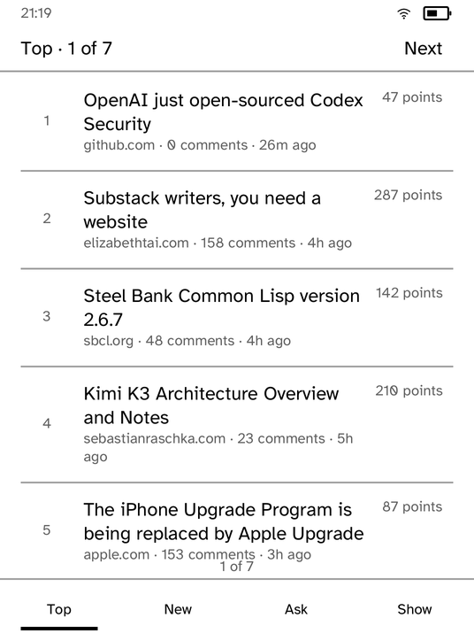
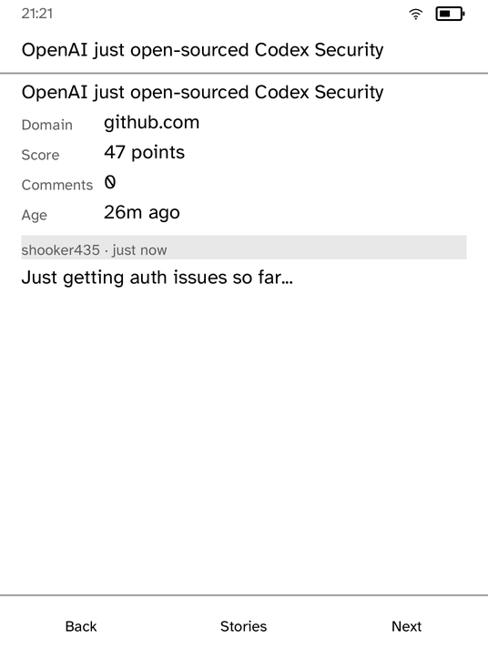

# Hacker News

Hacker News, on a panel with no scrollbar and no keyboard.

Four tabs along the bottom (Top, New, Ask, Show) and a comment thread behind
every story. Nothing animates, nothing scrolls, and nothing moves under a
finger that is already reaching for it.

| The stories | A thread |
| --- | --- |
|  |  |

*Captured from a Kobo Clara BW over Wi-Fi with `kobo shot --device`.*

## Why Algolia rather than the official API

Hacker News' own Firebase API returns one item per request. A story with four
hundred replies is four hundred and one requests, which on a device whose radio
is the largest single draw on the battery is not a design, it is a way to
flatten a charge. Algolia's `items/:id` returns the entire thread, nested, in
one. That single fact is the reason this application is possible at all.

## What happens to a thread that does not fit

The transport carries half a megabyte and a busy thread is comfortably more. A
real one measured while writing this was 734 KB for 925 comments. Algolia
ignores `Range`, so the trick that lets Gutenbird read a novel in pieces does
not work here: asking for the second half returns the whole document again and
the ceiling rejects it.

So the request comes back `TaskError::TooLarge`. Rather than showing a dead
end, this asks a different question: `search_by_date` over that story's
comments, thirty at a time, which is bounded by construction. The nesting is
gone in that answer, so the screen says the nesting is gone.

## The bug this screen found

The list above is paginated, and for a while it packed one row too many onto
each page: the last story's byline and the "1 of 6" beneath it were printed
through each other. Every paginator counted a row separator as a rule plus a
gap, and the engine draws the rule *inside* the gap and steps by two gaps, so
every page was eight pixels short per row. A thousand tests agreed with it,
because they all recomputed the same wrong arithmetic and all measured with a
fallback typeface under which the page fit either way. It took a photograph of
the panel.

## Running it

```sh
kobo run --sim --app hn                 # in the browser simulator
kobo deploy --device <ip>               # onto a reader over Wi-Fi
```
