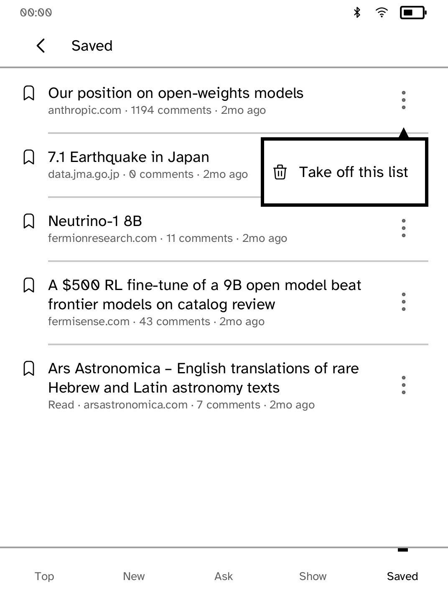

# Saved-menu dismissal review

These are **native renderer snapshots, not interactive simulator or device
screenshots**. The app's own public-API test fixtures and native callbacks feed
the real Cobalt renderer/fonts at Clara BW metrics. Device status is the SDK's
representative measuring strip. No live Hacker News requests were made.

The app-specific fix distinguishes dismissing a saved-story menu from navigating
back from a discussion. Its old generic Back handler cleared both `problem` and
`trouble` when dismissing the menu. The new early dismissal preserves the list
page, status notice and failure state.

[PR #237](https://github.com/BandarLabs/Cobalt/pull/237) separately makes the shared
runtime offer Back whenever a screen has an overlay. That covers the generic
routing issue; this app change does not claim to introduce that runtime fix.
With #237 alone, HN would receive Back but still clear its status/failure state.
The explicit menu `owns_back` flag is compatible with current Beta routing and
becomes redundant once #237 lands. After dismissal, the plain list releases
Back again.

<table><tr>
<td><br>Original open-menu state</td>
<td><br>Updated open-menu state</td>
</tr></table>

The [list after native dismissal](after-dismissed-menu.png) is also captured.
The menu's appearance did not need changing. The pictures illustrate the
states; dismissal semantics are established by the callback and hit-test
assertions, not by a visual difference. The captured open menu changed from
`owns_back: false` to `true`, and the dismissed list has `false` again. A test
repeats opening/dismissing three times, hit-tests outside the popover and checks
that the list, page and notice survive. All 64 app tests, formatting and strict
clippy pass. The pre-existing popover `ToneBudget` warning remains; there are no
layout errors, and the shared renderer is unchanged.

## Reproduce

After building the checkout's locked dependencies:

```sh
python3 examples/hn/screenshots/ui-review/capture.py --root . --app hn \
  --scenario examples/hn/screenshots/ui-review/scenario.rs --scope-tests \
  --output target/hn-native-review
```

For baseline evidence, use detached revision
`9715304831eae95566758fd0aa6b8e6fc87ee3ee` as `--root`. The harness copies app
logic, adapts module/fixture paths, and appends the scenario inside the existing
test module so the original fixture helpers are reused. Hashes and ownership
values are in `provenance.json`.

Interactive simulator proof remains pending: the environment denies the
simulator's Unix-domain socket with EPERM even after reviewed escalation.
Native callback and layout tests do not exercise process transport, transformed
touch coordinates, the runtime's actual exit path, live traffic or E Ink.
