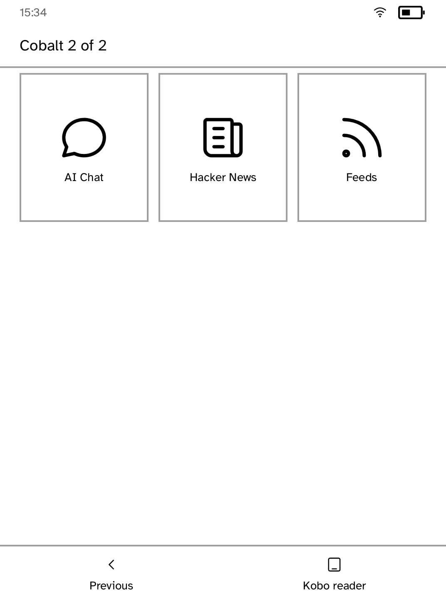

# Launcher

The framework launcher.

This is deliberately an ordinary application written against `kobo-sdk`. It
gets no privileged drawing path, no private widgets and no hardware access the
counter example could not also ask for. The only thing that will eventually
distinguish it is a permission to enumerate and start other applications. If
the launcher cannot be expressed with the public SDK, the SDK is not good
enough yet, so keeping it honest here is the point.

| Home | Apps destination |
| --- | --- |
|  |  |

*Captured from a Kobo Clara BW over Wi-Fi with `kobo shot --device`.*

## Home and the way back

Returning to the stock reader is a first-class, always-visible destination
rather than something hidden in a menu. The reader is not an application and
cannot be one: it owns the framebuffer, input, power and Wi-Fi while it runs,
and its lifecycle belongs to vendor init. Showing it again means ending this
session and restarting it.

Home keeps it as the fourth destination, beside Home, Apps, and Settings. A
recently opened app gets a compact Resume mark; otherwise Home opens directly
onto the app grid. Apps remains the complete paged catalogue.

The transient Starting screen uses a centered content-width Back action. Its
navigation bar remains full-width because destinations, unlike one-off verbs,
need a persistent edge-to-edge touch band.

## Why the applications are paged rather than scrolled

Nothing scrolls on this panel. The full catalogue is paginated against the
room actually measured for it. Its caption position and passive right-margin
rail make the page apparent without pretending the rail is a slider.

A direction is only offered when there is a page on that side of this one, so
"Previous" and "More apps" never name the same destination and the last page
never promises applications that are not there.

## Running it

```sh
kobo run --sim --app launcher           # in the browser simulator
kobo deploy --device <ip>               # onto a reader over Wi-Fi
```

On a reader, `/mnt/onboard/.adds/cobalt/start.sh` starts the session and this
is the first screen it shows.

---

Built with the [Cobalt SDK](../../README.md), which
[installs on a Kobo](../../README.md#install-it-on-your-kobo) with one
command over USB. The other apps:
[Audiobook Studio](../audiobook/README.md) ·
[Gutenbird](../gutenbird/README.md) ·
[Hacker News](../hn/README.md) ·
[RSS Reader](../rss/README.md) ·
[Daily Brief](../brief/README.md) ·
[AI Chat](../chat/README.md) ·
[Coding Agents Sidekick](../sidekick/README.md) ·
[Terminal](../terminal/README.md) ·
[UI Components Showcase](../gallery/README.md) ·
[Settings](../settings/README.md) ·
[Todo](../todo/README.md) ·
[Tic-tac-toe](../tictactoe/README.md) ·
[Magnet Sensor](../magnet/README.md)
