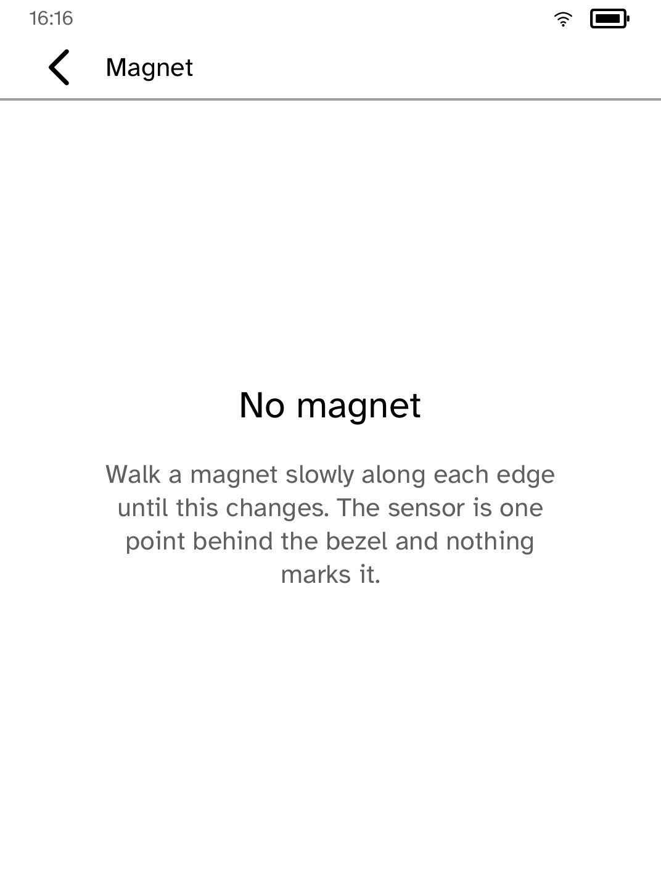
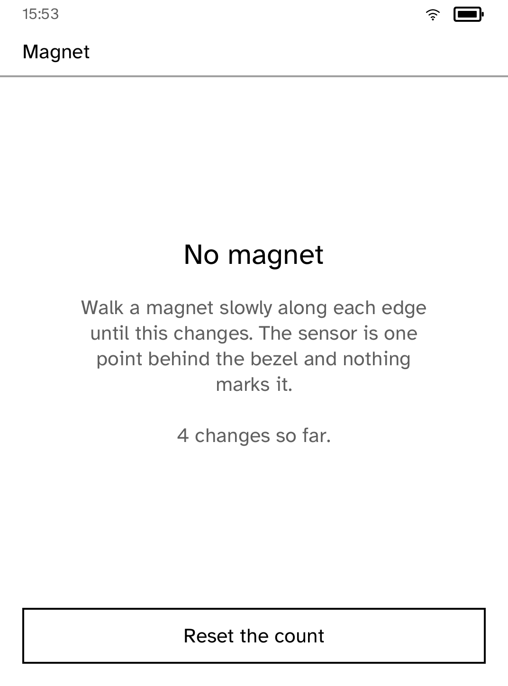

# Magnet Sensor

Where the magnet is, and nothing else.

The reader has a hall sensor behind one edge of the bezel. It is the thing a
sleep cover closes against. This application shows everything the SDK exposes:
ask once for the state, then wait to be told when it changes.

| Nothing there | After a few sweeps |
| --- | --- |
|  |  |

*Captured from a Kobo Clara BW over Wi-Fi with `kobo shot --device`.*

## Using it

Hold a magnet against an edge and walk it slowly along. The screen goes from
"No magnet" to a horseshoe glyph the moment the sensor answers. Take the magnet
away and the glyph goes with it.

That is also what makes it a calibration screen. The sensor is one point behind
a featureless bezel and nothing on the case says where, so the only way to find
it is to sweep and watch. Mark the spot in pencil once you have it.

## Why there is a count

A magnet moved slowly past the threshold can bounce, and a run that reads six
changes where your hand made one is telling you something a gesture built on
this sensor needs to know before it is written. The count resets from the
screen, because the number is only useful against the sweep you have just done.

It counts movement, not answers. The first reading establishes the state rather
than changing it, and a restated state is not an edge.

## What the SDK gives you

```rust
fn on_start(&mut self, context: &mut Context) {
    context.device().read_cover();
}

fn on_cover_change(&mut self, context: &mut Context, magnet_present: bool) {
    self.present = magnet_present;
    context.set_screen(self.screen());
}
```

Two facts about the hardware leak through, because pretending otherwise would
produce applications that are quietly wrong:

- **Edges are not the state.** A magnet already sitting against the bezel when
  this opened produced no event and never will, which is why `read_cover` is
  asked once at the start. It is the same reason the runtime queries the key
  state when it opens the sensor rather than waiting for the first change.
- **Only the foreground application is told.** A magnet arriving is something
  that happened in front of the reader. A backgrounded application has no
  standing to react to it and asks again when it returns.

## What it deliberately does not do

It does not say "cover closed". The sensor cannot tell a cover from a fridge
magnet, and an application that reports the one thing when it measured the
other is inventing a reading. The runtime says what it measured; deciding what
that means is the application's job, and this application declines to.

---

Built with the [Cobalt SDK](../../README.md), which
[installs on a Kobo](../../README.md#install-it-on-your-kobo) with one
command over USB. The other apps:
[Launcher](../launcher/README.md) ·
[Audiobook Studio](../audiobook/README.md) ·
[Gutenbird](../gutenbird/README.md) ·
[Hacker News](../hn/README.md) ·
[RSS Reader](../rss/README.md) ·
[Daily Brief](../brief/README.md) ·
[AI Chat](../chat/README.md) ·
[Coding Agents Sidekick](../sidekick/README.md) ·
[Terminal](../terminal/README.md) ·
[UI Components Showcase](../gallery/README.md) ·
[Settings](../settings/README.md) ·
[Todo](../todo/README.md) ·
[Tic-tac-toe](../tictactoe/README.md)
