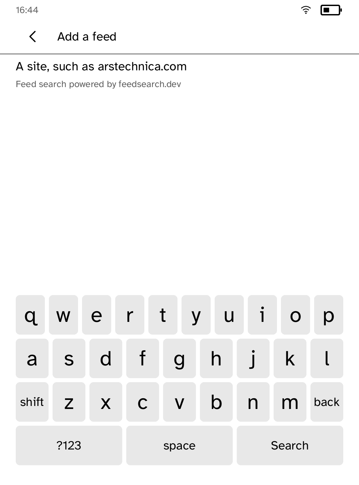

# RSS Reader

The sites you read, on the device.

Type an address, pick the feed it finds, and read the articles without leaving
the application.

Feeds starts in standalone mode. Settings can switch the same app to Miniflux:
enter an HTTPS server, then install its token with `kobo secret set miniflux`.
The runtime attaches only that dedicated secret as `X-Auth-Token`; neither mode
stores token bytes.

| The articles | Finding a feed |
| --- | --- |
|  |  |

*Captured from a Kobo Clara BW over Wi-Fi with `kobo shot --device`.*

## Why a search service rather than guessing the address

Almost nobody knows the address of a site's feed. They know the address of the
site. Turning one into the other means fetching the page, parsing its HTML,
reading `<link rel="alternate">`, then trying `/feed`, `/rss.xml`, `/atom.xml`
and a dozen more: several round trips over a radio that costs battery, and an
HTML parser aimed at whole pages rather than fragments.

[Feedsearch](https://feedsearch.dev) does that work once, server-side, and has
done it before for most sites anybody types. One request returns every feed a
domain has, already ranked. That is the whole reason this application can be a
few hundred lines rather than a browser.

Their terms ask for a visible attribution wherever their results are shown,
which is why it is on both the search screen and the results screen.

## Reading offline

Because the feed is the readable copy. Most publishers put the whole post in
`content:encoded`, and the ones that do not put a summary there. Either way it
is prose with a little markup, which is exactly what an E Ink panel wants.
Following the link instead would mean fetching a modern web page: a megabyte of
layout, script and advertising wrapped around the same words.

Subscribed standalone feeds retain a bounded readable cache per feed, plus
read/unread and starred state keyed by the entry GUID/id or its safe canonical
link. Relative RSS, Atom, and JSON Feed links resolve only against the safe
subscription URL requested. Redirect-relative and `xml:base` resolution are
unavailable: `TaskOutcome` provides neither a final URL nor response metadata.
Miniflux keeps a separate bounded cache for each list mode, exact full articles
by entry ID, and durable read/star changes for the next sync. All Miniflux
state is namespaced by the canonical HTTPS server and any configured
reverse-proxy prefix, so changing servers never displays an old server's entry
or sends its queued action to the new one. Unauthorized tokens, offline
devices, unreachable servers, and malformed successful entry responses leave
cached reading intact; a valid empty Miniflux list replaces that cache.

### Conditional requests

The current SDK cannot implement ETag or Last-Modified conditional GET
correctly. `TaskOutcome` is exactly `Completed(Vec<u8>)`, `Failed`, or
`Cancelled`: it carries no response status, headers, or redirected final URL.
The app therefore does not fake validators. Runtime task response metadata is
the concrete blocker; until it exposes those fields, each sync fetches the
requested feed URL normally.

### Miniflux migration

There is no `rss-miniflux` state migration. Git shows that the old catalog
entry first appeared in `790ba72` (2026-09-01), after `v0.3.1`; the released
`v0.3.2`, `v0.3.3`, `v0.3.4`, `beta-v0.3.3`, `beta-v0.3.4`, and current public
catalog contain no such ID. It was never published, so no installed app state
exists to migrate.

## Running it

```sh
kobo run --sim --app rss                # in the browser simulator
kobo deploy --device <ip>               # onto a reader over Wi-Fi
```

## Deterministic drives

The scripts exercise the standalone discovery surface and the Miniflux mode
switch without relying on a network service:

```sh
kobo dev
kobo drive --ideal --script examples/rss/drive-standalone.kobo --shots examples/rss/screenshots

kobo dev
kobo drive --ideal --script examples/rss/drive-miniflux.kobo --shots examples/rss/screenshots
```

---

Built with the [Cobalt SDK](../../README.md), which
[installs on a Kobo](../../README.md#install-it-on-your-kobo) with one
command over USB. The other apps:
[Launcher](../launcher/README.md) ·
[Audiobook Studio](../audiobook/README.md) ·
[Gutenbird](../gutenbird/README.md) ·
[Hacker News](../hn/README.md) ·
[Daily Brief](../brief/README.md) ·
[AI Chat](../chat/README.md) ·
[Coding Agents Sidekick](../sidekick/README.md) ·
[Terminal](../terminal/README.md) ·
[UI Components Showcase](../gallery/README.md) ·
[Settings](../settings/README.md) ·
[Todo](../todo/README.md) ·
[Tic-tac-toe](../tictactoe/README.md) ·
[Magnet Sensor](../magnet/README.md)
