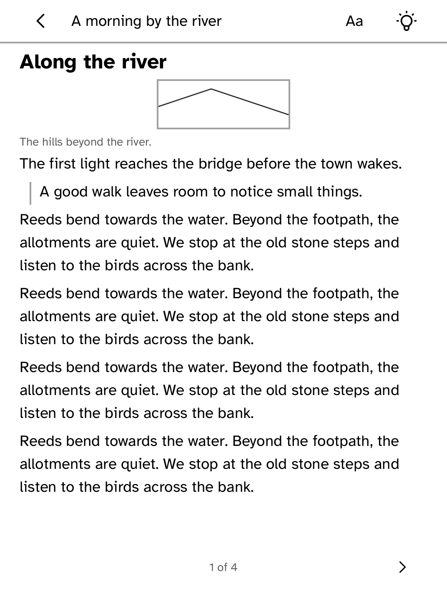
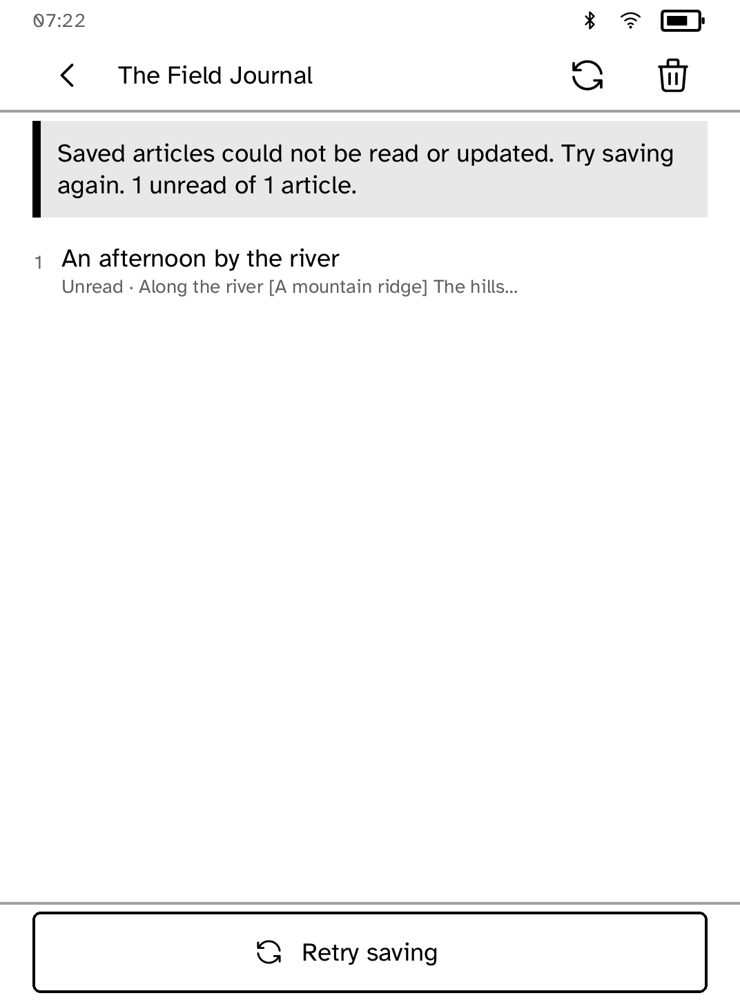
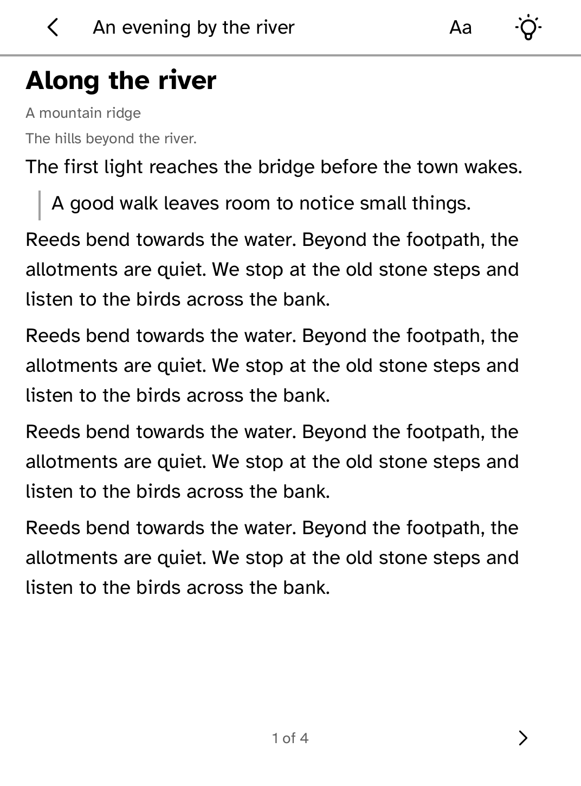
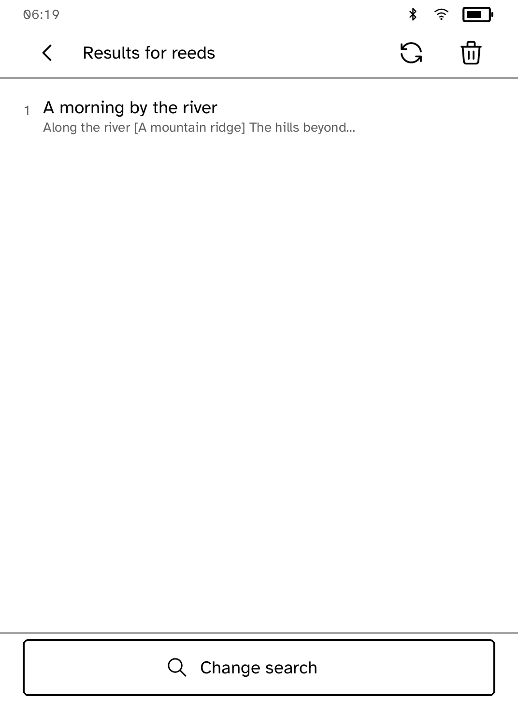
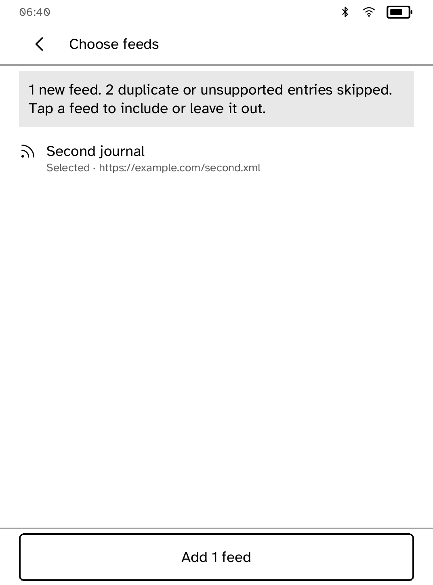
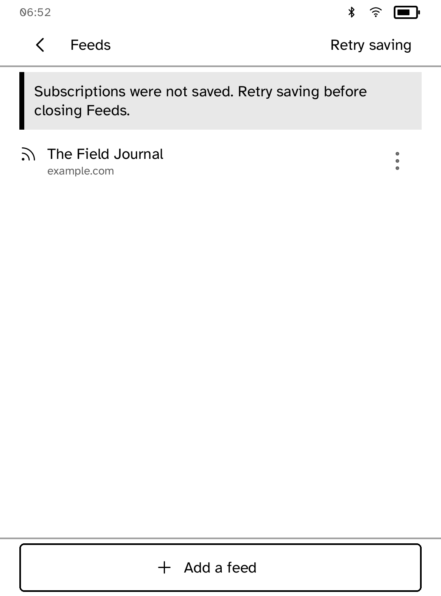
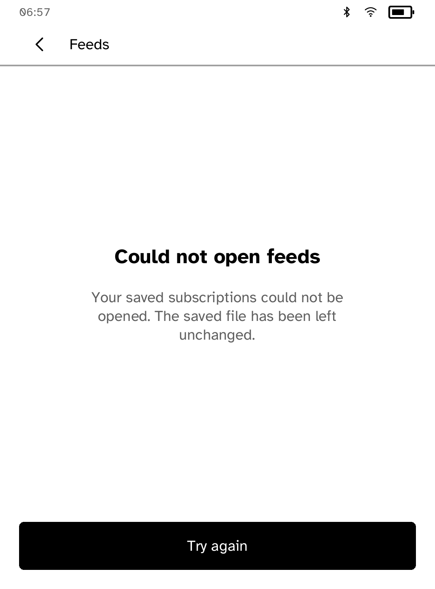
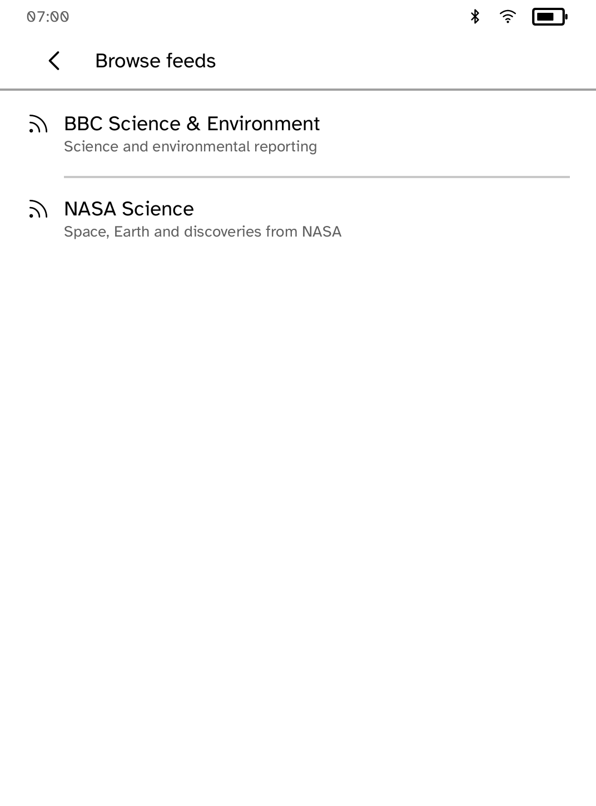
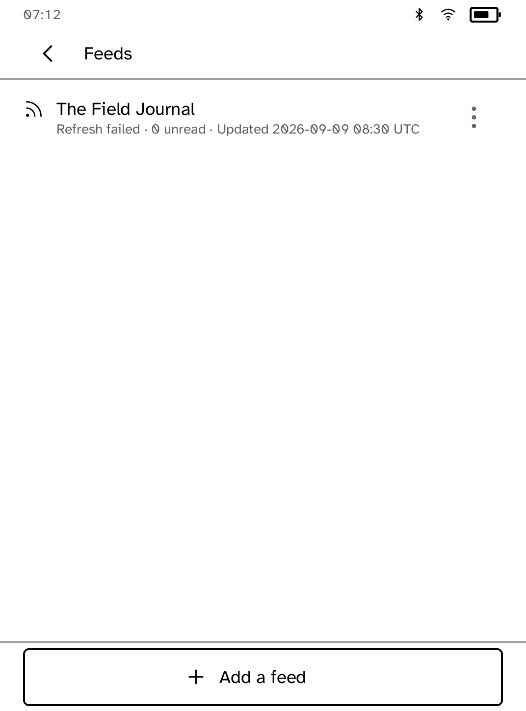

# RSS Reader

Follow your favourite sites and read their saved articles offline.
Find a feed by website name, paste its HTTPS address, or browse the starter feeds.

| Saved articles | Reading an article |
| --- | --- |
|  |  |

*Captured from the Clara BW simulator with an original, locally saved feed.*

## Find and add a feed

Enter a website name to discover its feeds through Feedsearch, or paste a full
HTTPS feed address to fetch it directly. Direct addresses are not sent to the
discovery service. RSS, Atom and JSON Feed responses show a preview with the
feed name and article count; select the result to add it.

If discovery fails, choose **Try again** to repeat the same request or
**Change address** to edit it. A valid search with no matches is shown separately
from a failed response. A page that is not a feed asks for the feed address or
website name instead of adding an unusable subscription.

## Read articles

HTML and plain-text articles use the shared document reader, with font controls,
saved reading positions and page turns. HTML articles include supported inline
images and captions. Feeds may supply a full article or a summary; Feeds displays
the content they provide.

Articles and images are saved locally for offline reading. Refresh keeps the
current articles available while it checks for new ones. If the request fails,
the saved articles remain available. Leaving a loading screen cancels its request.

If new articles cannot be saved, choose **Retry saving** from the article list
before closing Feeds. Retry saves the latest received refresh without downloading
it again. Until saving succeeds, reopening the app uses the previous saved copy.



## Running it

```sh
kobo run --sim --app rss                # in the browser simulator
kobo deploy --device <ip>               # onto a reader over Wi-Fi
```

---

Built with the [Cobalt SDK](../../README.md), which
[installs on a Kobo](../../README.md#install-it-on-your-kobo) with one
command over USB. The other apps:
[Launcher](../launcher/README.md) ·
[Audiobook Studio](../audiobook/README.md) ·
[Gutenbird](../gutenbird/README.md) ·
[Hacker News](../hn/README.md) ·
[Daily Brief](../brief/README.md) ·
[AI Chat](../chat/README.md) ·
[Coding Agents Sidekick](../sidekick/README.md) ·
[Terminal](../terminal/README.md) ·
[UI Components Showcase](../gallery/README.md) ·
[Settings](../settings/README.md) ·
[Todo](../todo/README.md) ·
[Tic-tac-toe](../tictactoe/README.md) ·
[Magnet Sensor](../magnet/README.md)

Reading state is bounded to 1,000 article versions and 192 KiB. Reaching the
limit reports unsaved progress instead of discarding older bookmarks or notes.
A changed article body starts a new reading state so an old position cannot
point into unrelated text. A failed save shows a warning while reading and can be retried from the article
list without losing the latest position.

Images are opened from verified local copies first. Missing copies are fetched
one at a time without account credentials, validated and saved. The current
bounds are 16 image references per article, 512 KiB per image and 64 image
records held in memory. As you open more articles, idle image records leave memory;
their saved files remain available for offline reading. Active images and pending
or failed saves stay in memory. Disk cache cleanup remains in progress. Simulator fixtures verify both locally
saved images and HTTPS acquisition with full-storage recovery.

If image storage fails, choose **Retry saving** on the article list before
closing Feeds. Downloaded images stay visible for the current session. The HTTPS
simulator fixture checks failed saves, retry without another download, and
offline reopening after a process restart.

If a saved image is missing or damaged, Feeds tries to download it again. While
offline, the article remains readable with the image description supplied by the
feed. Reopen the article after reconnecting to fetch the image and save a new
copy. A damaged image does not cause the article or its reading progress to be
discarded.

| Image unavailable offline | Image restored after reconnecting |
| --- | --- |
|  |  |

## Search saved articles

Open a feed and choose **Search articles**. Searches match all entered words
across article titles, authors and saved text, ignoring case. No network request
is needed. **Change search** edits the query; **Clear** restores the full list.
Search currently covers the open feed, not every subscription at once.



## Import subscriptions

From **Add a feed**, choose **Import OPML** to select an `.opml` file already
in the app’s shelf folder. The preview lists each new feed’s name and address and counts skipped duplicate
or unsupported entries. Tap a feed to include or leave it out before choosing
**Add feeds**. Only HTTPS feed addresses are accepted. Import files are limited
to 256 KiB; choose a selection that fits within the 40-subscription capacity.
The subscription list changes only after the save is acknowledged; failed saves
can be retried from the preview. The computer-side file-transfer flow is still
in progress.



Saved articles remain available while a refresh checks for new ones. The import
preview and offline reading flow are exercised at both default and 170% interface
text size in the simulator.

## Saving your subscriptions

Subscription changes are saved one at a time. If saving fails, Feeds keeps your
latest changes open and shows **Retry saving** on the feed list. Retry before
closing the app. The previous saved list remains intact until a write succeeds.
Imported feeds appear in the list only after their own save is acknowledged.



If saved subscriptions cannot be opened, Feeds leaves the file unchanged and
shows **Try again**. It does not replace unreadable data with an empty list.
After the file becomes readable, retry loads the existing subscriptions.



## Browse public feeds

From **Add a feed**, choose **Browse** for BBC Science & Environment and NASA
Science. Choose a feed to fetch its preview, then select the result to subscribe.
Nothing is fetched just by opening the list. If a feed is unavailable, retry its
preview or go back; it will not be added automatically.



## Unread articles

Each feed’s article list shows its unread count. Opening an article marks that
saved version as read and saves its reading position. Revised article content
appears as unread again. The count is not shown while saved reading status is
unavailable; save failures remain visible with the retry controls.

## Refresh history

The feed list shows the last successful refresh in UTC. A failed refresh keeps
that time and adds **Refresh failed**; open the feed for the reason. Reading
saved articles does not change the refresh time. History survives reopening the
app. If history cannot be saved, **Retry saving** appears on the feed list.



The feed list also remembers unread counts for saved articles. These counts
advance only after the reading-state save is acknowledged, and remain available
after reopening Feeds. A feed without saved article metadata has no guessed count.
