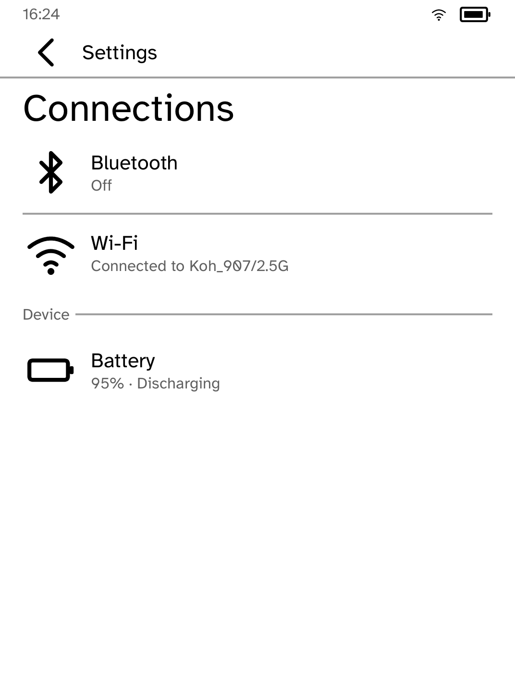
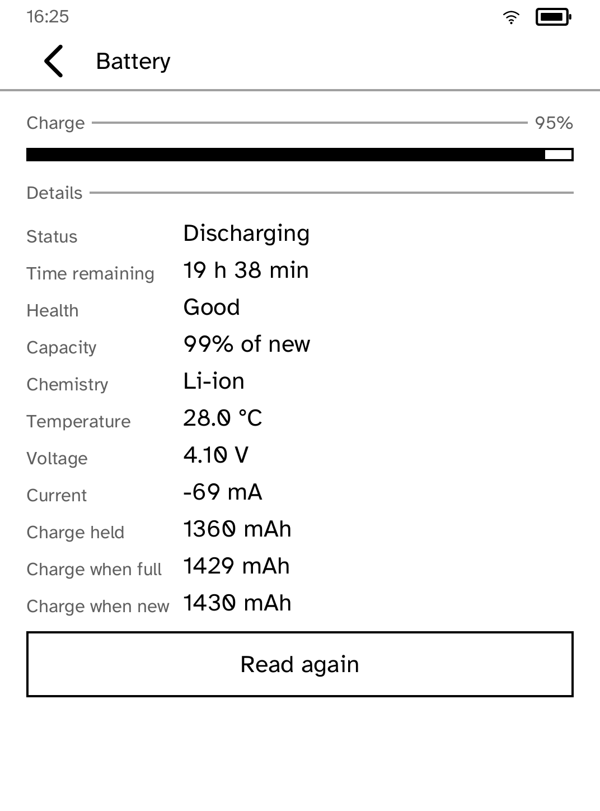
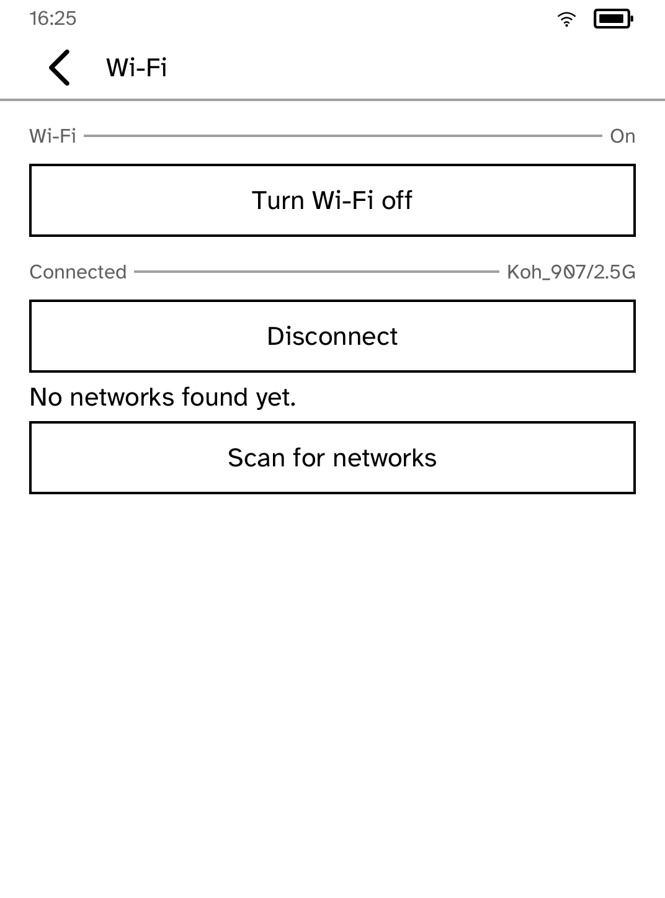
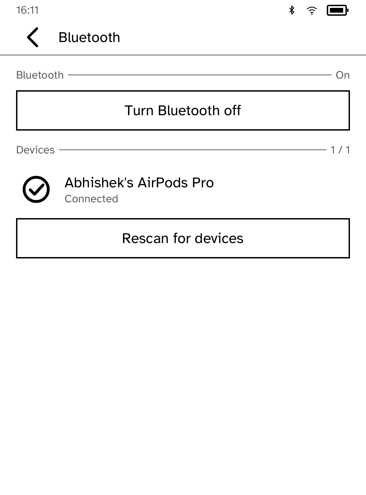

# Settings

The three pieces of hardware an application cannot reach on its own: the radio,
the Bluetooth chip and the battery.

| Connections | Battery |
| --- | --- |
|  |  |

| Wi-Fi | Bluetooth |
| --- | --- |
|  |  |

*Captured from a Kobo Clara BW over Wi-Fi with `kobo shot --device`.*

## Why the front screen states everything

Every row says what it is and what it is doing, on the row. "Bluetooth / Off",
"Wi-Fi / Connected to Koh_907", "Battery / 95% and discharging". A settings
screen whose rows are only nouns makes you open all three to find the one you
wanted, and on a panel that takes most of a second to redraw, that is three
seconds spent learning nothing.

## Battery

The panes are honest about what they measured. Charge, status and time
remaining come from the same sysfs gauge the reader itself uses; capacity,
chemistry, temperature, voltage, current and the three charge figures come from
the fuel gauge and are reported as read.

An earlier version claimed the battery was "not supported on this hardware" and
then showed a full reading the moment you opened it, which is the worst of both:
wrong on the summary and right on the detail. Availability is now decided by the
same read that produces the numbers, so the two cannot disagree.

`Read again` exists because current and temperature move while you watch, and a
settings screen that silently goes stale is worse than one that admits it is a
snapshot.

## Bluetooth

Devices are listed by the name the device gave, which is less obvious than it
sounds. `bluez` is reached through `dbus-send`, whose output indents a variant
one level deeper than its parent, so the indentation in front of a string
property depends on how deeply it is nested. Parsing it with a fixed number of
spaces worked in isolation and failed inside `GetManagedObjects`, where every
name silently fell back to the MAC address while `paired` and `connected` beside
it stayed correct.

There is no `bluetoothd` on this firmware unless the reader itself has turned
Bluetooth on. Off means off, and the pane says so rather than presenting an
empty list that looks like nothing is nearby.

## Wi-Fi

Turning the radio off is offered, and so is disconnecting, which on a reader
being driven over Wi-Fi ends the session you are using to look at the screen. A
scan is only a scan; it does not join anything.

## What it does not do

No brightness, no time zone, no account, no firmware. Those belong to the
reader and it already has screens for them, and a second set that drifts out of
step with the first is worse than none.
