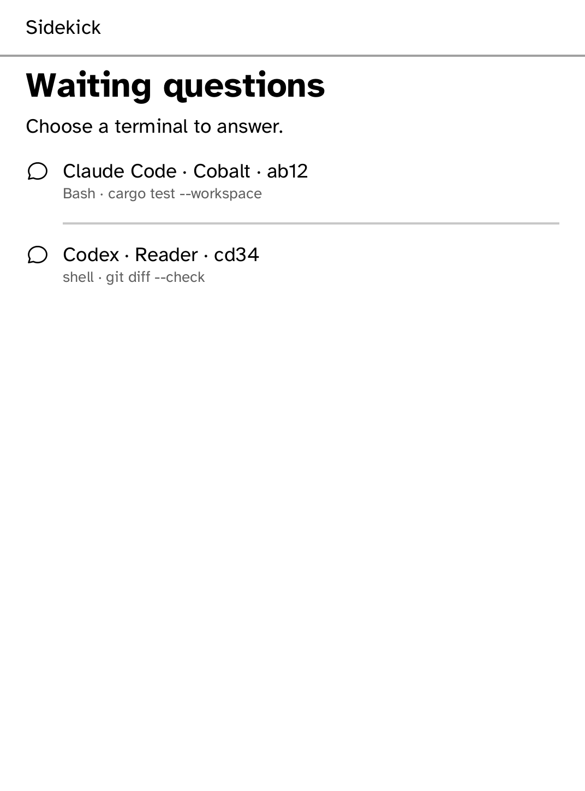
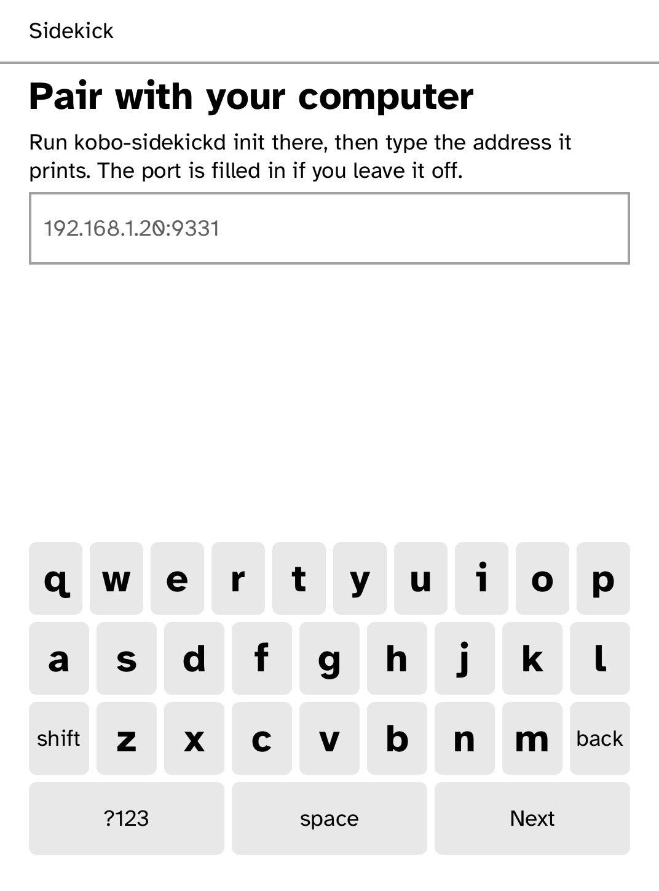

# Sidekick

Answer your coding agents' permission prompts from your Kobo.

<table>
<tr>
<td width="50%" valign="top"><br>A command waiting for approval</td>
<td width="50%" valign="top"><br>A question with its own answers</td>
</tr>
<tr>
<td width="50%" valign="top"><br>Several terminals waiting</td>
<td width="50%" valign="top"><br>Paired and watching</td>
</tr>
<tr>
<td width="50%" valign="top"><br>Pairing with a computer</td>
</tr>
</table>

When Claude Code or Codex stops to ask "may I run this?", Sidekick shows the
question on your Kobo. The [sidekick daemon](../../crates/kobo-sidekickd) on
your computer catches it through the agent's own hooks.

## Features

- Shows the full command, which agent is asking, and from which terminal on
  which computer.
- Answer **Allow**, **Deny** or **Leave it for the terminal**. Pressing Back
  also leaves it for the terminal.
- Questions that come with their own options, such as choosing an approach,
  show each option with its description. Questions that allow several choices
  let you tick them, then send.
- When several questions are waiting, a board lists them all. Each answer
  returns to the terminal that asked.
- The screen redraws only when a question arrives.

| Agent | Status |
| --- | --- |
| Claude Code | Permission requests and `AskUserQuestion` |
| Codex | Permission requests |
| Gemini CLI, OpenCode, GitHub Copilot CLI, Cursor CLI | Detected, not yet supported |

## Setup

On the computer:

```sh
kobo-sidekickd init                  # certificate, pairing code and address
kobo trust set sidekick --device IP  # lets the reader verify the daemon
kobo-sidekickd setup                 # adds hooks to the agents it finds
kobo-sidekickd run
```

`setup` registers every agent it finds, or only the one you name. `--dry-run`
shows what it would change, `--print` prints the JSON to add by hand, and
`agents` lists what it found. It keeps a `.bak` of each file, leaves other
settings and hooks in place, and will not rewrite a file it cannot parse.

On the Kobo, open Sidekick and enter the address and six-character pairing
code that `init` printed. They are remembered.

## Security

The connection uses TLS with the certificate you installed, and every request
carries the pairing code, so no one else on the network can see or answer
questions. If the daemon is unreachable, the agents' own terminal prompts work
as usual.

## Permissions

- `network`: connects to the daemon on your computer.

## Development

```sh
cargo test -p kobo-sidekick
kobo run --sim --app sidekick      # in the browser simulator
python3 scripts/check-apps-sim.py sidekick
kobo deploy --device <ip>       # onto a reader over Wi-Fi
```

---

Part of [Cobalt](../../README.md). See [all apps](../../README.md#apps).
