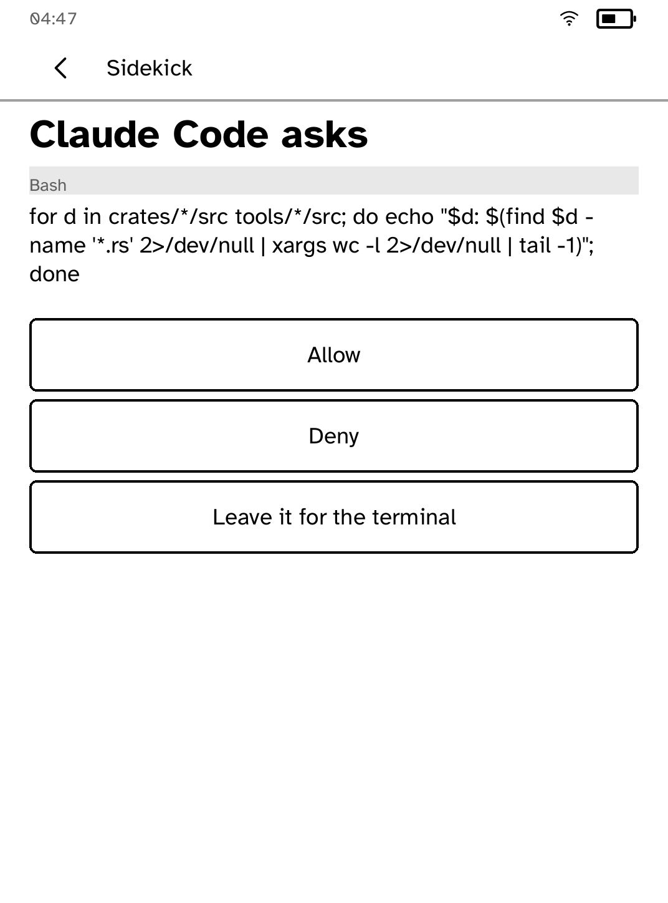
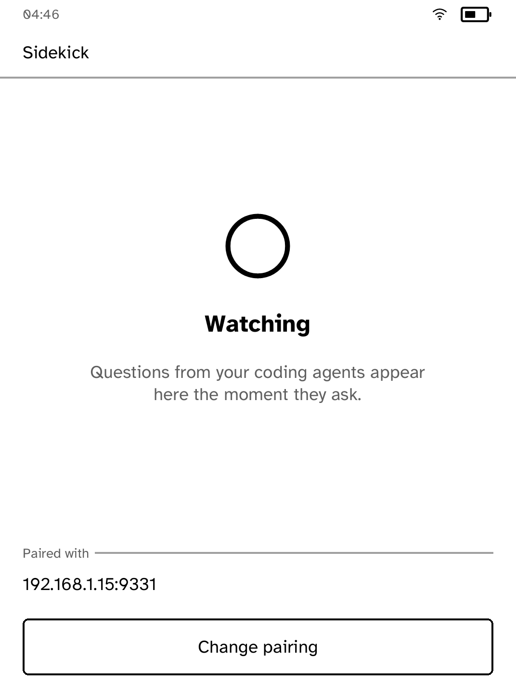

# Coding Agents Sidekick

The permission prompt, moved to the armchair.

A coding agent on the desk stops to ask "may I run this?" and the asking goes
wherever this reader is. The [sidekick daemon](../../crates/kobo-sidekickd)
on the computer catches the question through the agent's own hook system --
Claude Code and Codex both call the event `PermissionRequest` -- and holds
it; this application collects it over one long-polled fetch, prints the
command in full, and offers the answers under a thumb: **Allow**, **Deny**,
and **Leave it for the terminal**.

| A permission, as Claude Code asked it | Nothing to decide |
| --- | --- |
|  |  |

Some questions come with their own answers instead. An agent asking which
approach to take, or offering to allow this command every time from now on,
sends the options it would have shown at the keyboard; each becomes a row
with the label it was given and the sentence underneath. The reader shows
what the terminal would have shown rather than a decision it invented.


The design rule is that the panel earns its repaints. An empty poll asks
again without drawing anything; a question repaints once and the panel then
holds it at zero power for as long as the decision takes, which is the one
thing this screen does better than the phone it replaces.

## Setting it up

On the computer, once:

```sh
kobo-sidekickd init                  # certificate, pairing code, address
kobo trust set sidekick --device IP  # the reader learns to verify the daemon
kobo-sidekickd setup                 # finds your agents and writes their hooks
kobo-sidekickd run
```

`setup` with no argument registers every agent it finds; name one to do just
that one, `--dry-run` to see what it would touch, `--print` to get the JSON
to paste yourself, and `agents` to list what it found. It keeps a `.bak`,
leaves every unrelated setting where it was, joins another tool's hook
rather than replacing it, and refuses outright to rewrite a configuration
file it could not parse.

On the reader, open Sidekick and type the two things `init` printed: the
address, then the six-character pairing code. Both are remembered; pairing is
typed once.

## What the screens hold

Three screens after pairing, and nothing on any of them that is not needed:

- **Watching** -- a splash saying questions will appear, who the reader is
  paired with, and the last answer given, so a glance says the tap counted.
- **Asking** -- who asks, the tool, the command as a quote, and the answers.
  Usually Allow and Deny; a question that brought its own answers shows one
  row each, with the sentence the agent wrote underneath. Back is not an
  escape hatch here: dismissing a question sends "leave it for the
  terminal", said out loud rather than left dangling on the daemon.
- **Sending** -- stated once with `activity`, because a tap with no visible
  answer on a slow panel reads as a tap that was missed.

A question that takes several answers ticks rather than answers, and sends
what is ticked with a button of its own. An agent asking four questions at
once has them put one at a time, so the panel never holds more than one
thing to decide.

## Trust

The connection is TLS against a root the owner installed with `kobo trust
set`; the runtime verifies the daemon exactly as it verifies any public
host. The pairing code rides every request so nobody else on the network can
watch the questions or answer them. And the failure mode is honest: when the
daemon is unreachable, the agents' own terminal prompts work exactly as they
did before this application existed.

---

Built with the [Cobalt SDK](../../README.md). The other apps:
[Launcher](../launcher/README.md) ·
[Audiobook Studio](../audiobook/README.md) ·
[Gutenbird](../gutenbird/README.md) ·
[Hacker News](../hn/README.md) ·
[RSS Reader](../rss/README.md) ·
[Daily Brief](../brief/README.md) ·
[AI Chat](../chat/README.md) ·
[Terminal](../terminal/README.md) ·
[UI Components Showcase](../gallery/README.md) ·
[Settings](../settings/README.md) ·
[Todo](../todo/README.md) ·
[Tic-tac-toe](../tictactoe/README.md) ·
[Magnet Sensor](../magnet/README.md)
