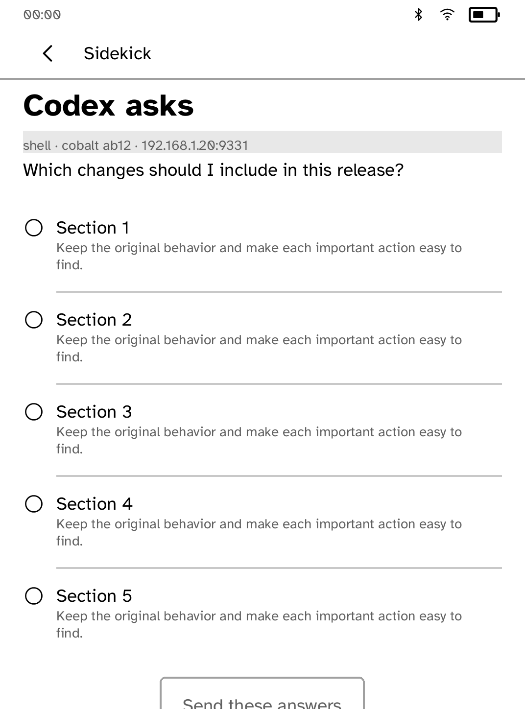
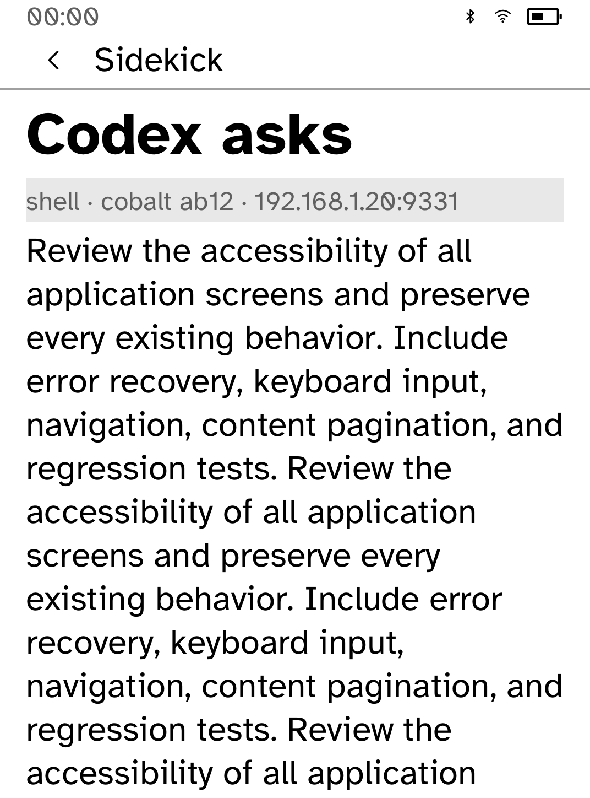
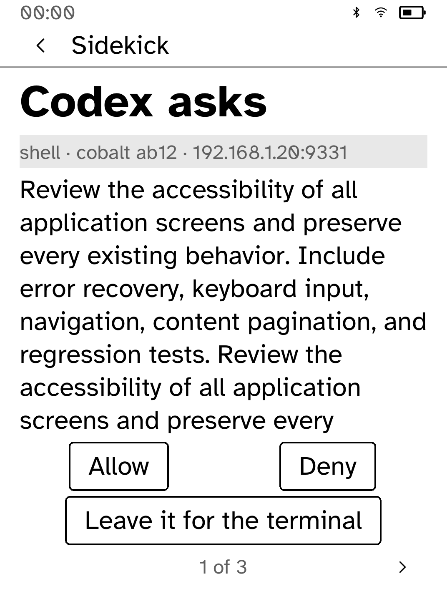
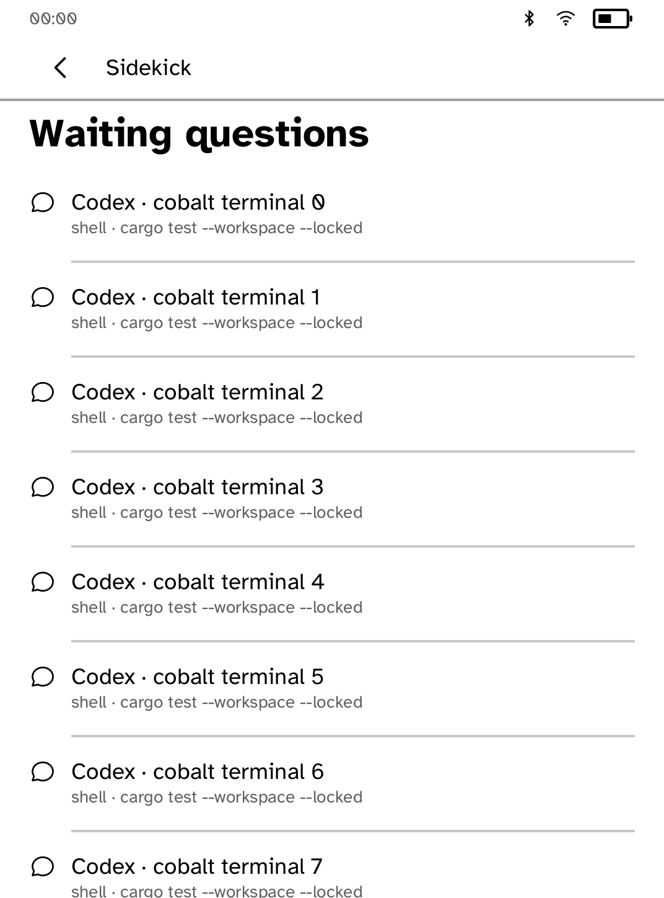

# Keep Sidekick decisions and waiting questions reachable

Long requests, five-choice multi-select prompts and a ten-terminal waiting board overflowed the original panel. Requests and choices now paginate against their exact composed layout; Send, Allow/Deny and Leave remain reachable. Page turns preserve selected answers and never send a decision. Incomplete pairing codes stay editable instead of being saved and sent.

## Evidence boundary

These PNGs are genuine **in-process app-renderer snapshots**, not interactive simulator screenshots or physical Kobo photographs. They use the original app screen builders, bundled typeface and `kobo-ui` renderer at Clara BW 1072 × 1448. The status strip is a deterministic fixture (00:00, 50% battery, connected radios). No pixels were redrawn or generated.

The interactive Cobalt simulator was built and its launch attempted, but this cloud environment rejects the Unix-domain socket bind with `Operation not permitted`, including the approved elevated launch. Interactive touch/network/refresh and physical hardware validation remain untested. Native callback/hit-test checks are stated separately.

Baseline is beta `9715304831eae95566758fd0aa6b8e6fc87ee3ee`. Each capture directory has source/provenance and layout diagnostics. The after source hash identifies the changed file; its recorded revision may be the parent commit because captures were made before committing.

## Before and after

### Five choices, 100% text

Before:



After:


### Long request, 170% text

Before:



After:



### Ten waiting terminals, 100% text

Before:



After:


## Validation

36 app tests; strict Clippy; formatting; static ARM build. Full contributor validation also passed for Store-distributed apps, including static ARM verification and a local Beta-shaped package/catalog. The documented public smoke-test seed was supplied locally because the baseline omitted that test fixture; no production key was used or committed.

## Reproduce renderer evidence

From the repository root with Python 3.11+ and Rust installed:

```sh
python3 examples/sidekick/screenshots/ui-review/capture.py --out target/ui-review/sidekick
```

To reproduce the original frame, run this same capture script with `--source-root` pointing to a separate checkout of the baseline commit. The helper selects the original or updated screen signature, adds only a temporary test probe, then deletes that probe. It does not start the app main function or modify app behavior.
