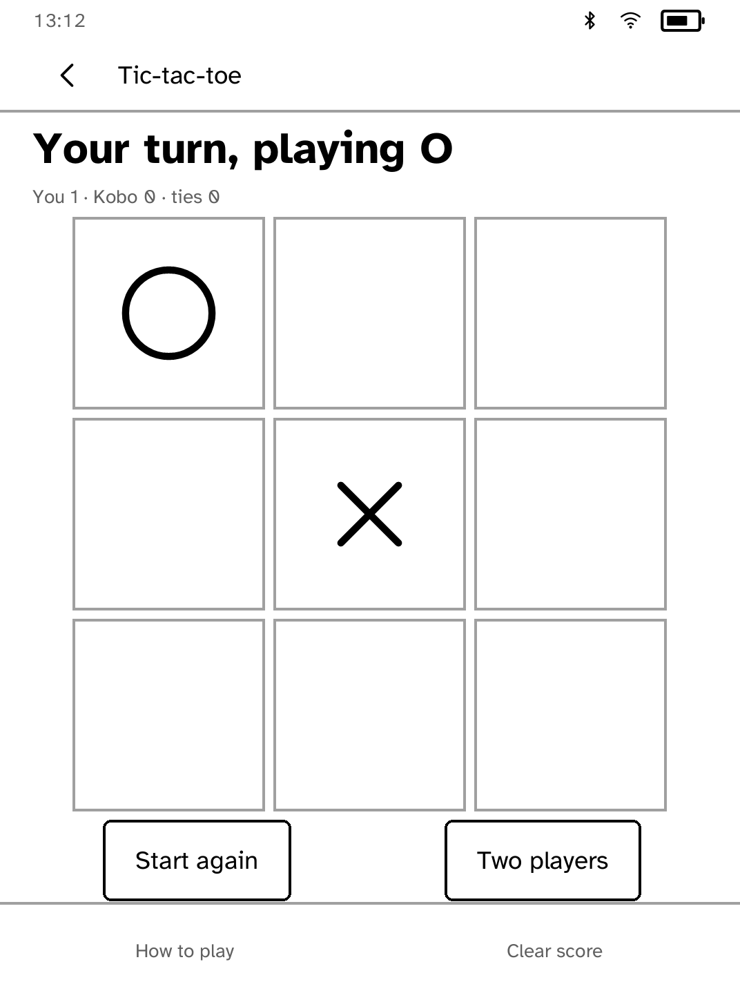

# Tic-tac-toe

Two players, one panel, three in a row.

This exists to prove a point about the SDK as much as to be a game: it is
written entirely against the public builders, and the board is not a board
primitive. It is a `grid`, which is the same thing a keypad or an on-screen
keyboard is. If a game needs the framework to grow a new node type, the
framework is not general enough yet.


*Captured from the Clara BW simulator by the committed route below. The device
capture is taken with the hardware acceptance run.*

## The rules

The ones people actually play at a table: whoever is holding the device taps,
and the mark alternates. Nought goes first. The three squares that won it are
marked on the board, because a line of noughts among nine cells is not obvious
at a glance and "O wins" over a board that still looks live is the kind of
thing somebody argues with.

## The session

A table keeps score out loud. The line under the heading keeps it here: how
many each side has won and how many were tied. **Next game** clears the board
and keeps that count; **Clear score** starts the afternoon again. Both survive
closing the application. A half-finished board deliberately does not: nobody
comes back to one.

## One player

**Against the Kobo** hands the crosses to the device. The opponent is a plain
one, and deliberately so: it takes a win when it has one, blocks a loss when it
must, and otherwise plays the middle, then a corner, then a side. It can be
beaten, which is the point of playing it.



## Why it is the floor

Tic-tac-toe gets nothing. When the SDK's vocabulary was expanded from a handful
of nodes to nearly thirty, this application was deliberately left untouched: if
a proposed component turns out to be needed *here*, in a game that is a
three-by-three grid and a line of text, then the component is wrong and the
primitive it should have been built from is missing.

That makes it a useful canary. A change to the layout engine that this cannot
survive is a change that has broken something fundamental, and the committed
route in `drive.txt` is what says so: it plays a game out to a win, checks the
score, starts the next one, hands the crosses to the Kobo and clears the score,
tapping squares by name rather than by coordinate so that a line of text added
above the board does not break it.

It earned that keep once already. Marking the winning line showed that a glyph
in a chosen cell was drawn in paper over a light fill, so the three noughts
that had just won came out as three empty squares; the toolkit now inverts a
cell mark only where the cell is drawn on ink.

## Running it

```sh
kobo run --sim --app tictactoe          # in the browser simulator
kobo deploy --device <ip>               # onto a reader over Wi-Fi
```

---

Built with the [Cobalt SDK](../../README.md), which
[installs on a Kobo](../../README.md#install-it-on-your-kobo) with one
command over USB. The other apps:
[Launcher](../launcher/README.md) ·
[Audiobook Studio](../audiobook/README.md) ·
[Gutenbird](../gutenbird/README.md) ·
[Hacker News](../hn/README.md) ·
[RSS Reader](../rss/README.md) ·
[Daily Brief](../brief/README.md) ·
[AI Chat](../chat/README.md) ·
[Coding Agents Sidekick](../sidekick/README.md) ·
[Terminal](../terminal/README.md) ·
[UI Components Showcase](../gallery/README.md) ·
[Settings](../settings/README.md) ·
[Todo](../todo/README.md) ·
[Magnet Sensor](../magnet/README.md)
