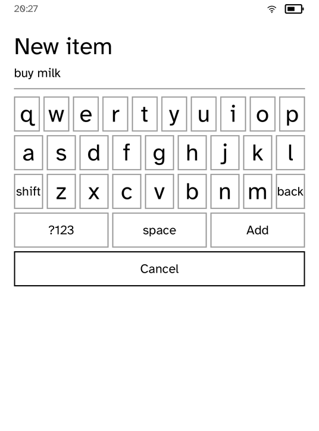

# Todo

A list of things to do, which is where a platform's state model shows.

It replaced a counter, because a counter demonstrates that a number can go up
and nothing else. This exercises the four things an application on this device
actually has to get right.

| The list | Adding an item |
| --- | --- |
|  |  |

*Captured from a Kobo Clara BW over Wi-Fi with `kobo shot --device`.*

## What it demonstrates

- **State that outlives the process.** The list is written through
  `kobo_sdk::AppStore`, so closing the application and opening it again shows
  the same list. Nothing here knows where that is stored, and there is no path
  it could name.
- **Actions that change one thing.** Tapping a row completes it. Only that row
  changes, so the runtime repaints that row rather than the screen, which on
  this panel is the difference between a flicker and a flash.
- **A state, drawn as the renderer sees fit.** A finished item is struck
  through and muted. The application never asks for a line through text; it
  says the item is done and the renderer decides what that looks like.
- **Typing, only where it is unavoidable.** Adding an item needs words, so the
  keyboard is raised for exactly that and put away again afterwards.

## Why the list is saved on every change

There is no save button and no "are you sure". E Ink devices are closed by
shutting a cover and are forgotten until the battery is flat, so any design
that relies on a clean exit loses data. Each write is atomic, so the worst a
power loss can cost is the change that was in flight.

## Running it

```sh
kobo run --sim --app todo               # in the browser simulator
kobo deploy --device <ip>               # onto a reader over Wi-Fi
```
